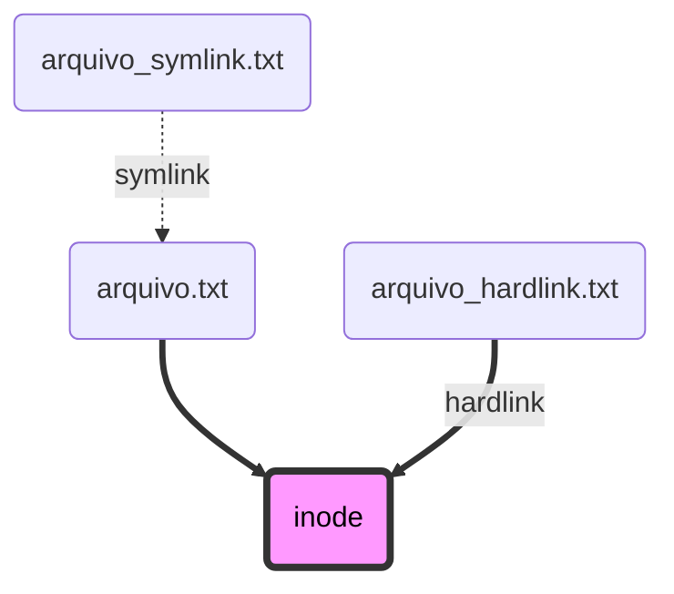

## Arquivos repetidos

Diga: a organização de arquivos abaixo lhe é familiar?

```
> tree C:\MeusProjetos\ /F

C:\MeusProjetos\
│
├──── Repo1\
│          src\
│          .editorconfig
│          lint.xml
│          build.sh
│          runtestcoverage.ps1
│          ...
│
├──── Repo2\
│          src\
│          .editorconfig
│          lint.xml
│          build.sh
│          runtestcoverage.ps1
│          ...
│
│ ...
```

Note que há arquivos iguais em conteúdo e com uma cópia deles em cada diretório de projeto. Alguns exemplos de arquivos repetidos são:

- Arquivos de estilo de código:
  - `.editorconfig` (várias linguagens)
  - `checkstyle.xml` (Java, Android)
  - `.eslintrc` (JavaScript, TypeScript)

- Arquivos de scripts:
  - `build.sh`
  - `runtestcoverage.ps1` (scripts gerais)
  - `CMakeLists.txt`
  - `Makefile` (compilação para C/C++)
  - `Jenkinsfile`

- Arquivos de segredos e configurações de execução:
  - `appsettings.json` (.NET)
  - `Web.config` (ASP NET Framework)
  - `.env` (npm)
  - outros

Se você tem vários repositórios com arquivos repetidos, fica cansativo alterar esses arquivos, pois o esforço precisa ser feito em cada repositório.

## Ponteiros?

Em programação, existe o conceito de ponteiro - algo que aponta para outra coisa. Geralmente, associamos ponteiros a memória, algo que aponta para um valor ou estrutura na memória RAM. Porém, o conceito de ponteiros existe também em sistemas de arquivos: são os links simbólicos, ***symlinks*, arquivos que apontam para outros arquivos.**

Os links simbólicos são uma tecnologia consolidada, tendo surgido já na década de 1960. Há suporte amplo no Linux, Mac OSX e Windows, mesmo em versões mais antigas.

## Ligações

Em um sistema de arquivos, cada elemento, arquivo ou pasta, é representado por um *inode*.

Um *inode* de arquivo é composto por metadados e o endereço no disco rígido. *Inodes* de diretórios são listas de outros *inodes*.

Existem dois tipos de ligações: os *hardlinks* e os *symlinks*.

Um ***hardlink*** é quando um arquivo aponta para o mesmo *inode* que outro arquivo. Ambos acessam o mesmo conteúdo no disco rígido. Quando um arquivo é excluído, o conteúdo do outro não é perdido.

Um ***symlink*** é quando um arquivo aponta para outro arquivo. Nesse caso, o arquivo ponteiro depende do arquivo original para acessar o conteúdo. Se o arquivo original for excluído ou mudar de local, o *symlink* torna-se inválido.

*Symlinks* podem ter caminhos absolutos ou relativos.

Exemplo de caminho absoluto: `/home/alexandre/Projetos/arquivo.txt`

Exemplo de caminho relativo: `../arquivo.txt`



## *Symlinks* para organização de arquivos

Considerando o cenário exposto no começo do artigo, podemos unificar arquivos de vários projetos, fazendo uso de *symlinks*.

Dentro da cada repositório, vamos criar links que apontarão para arquivos em uma pasta Configs, em um nível acima. A pasta Configs pode se tornar um repositório à parte, separado do Repo1 e do Repo2.

O diagrama abaixo exemplifica melhor. `-->` indica um *symlink*.

```
C:\MeusProjetos\
│
├──── Configs\
│          .editorconfig
│          build.sh
│
├──── Repo1\
│          .editorconfig --> ../Configs/.editorconfig
│          build.sh --> ../Configs/build.sh
│          ...
│
├──── Repo2\
│          .editorconfig --> ../Configs/.editorconfig
│          build.sh --> ../Configs/build.sh
│          ...
│
│ ...
```

No VS Code, *symlinks* têm uma setinha ao lado direito do nome do arquivo.



O comando para criar links simbólicos no Linux e no Mac OSX é:

```bash
ln -s ../Configs/arquivo_original.txt arquivo_symlink.txt
```

Na linha de comando do Windows:

```bat
REM requer elevação de Administrador
mklink arquivo_symlink.txt ..\Configs\arquivo_original.txt
```

No PowerShell:

```ps1
# requer elevação de Administrador
New-Item -ItemType SymbolicLink -Path arquivo_symlink.txt -Value ../Configs/arquivo_original.txt
```

## Git

O Git suporta ter arquivos *symlink* commitados nos repositórios.

No GitHub, eles aparecem com uma setinha e nome em azul.



Na navegação online e em pull requests, o conteúdo do arquivo aparece como um texto do caminho, absoluto ou relativo.



## Quando devo usar essa abordagem?

Organizar arquivos com *symlinks* é bom em situações com muitos projetos, que usam vários arquivos em comum.

Se há poucos arquivos em comum, ou se há poucos repositórios, tudo bem ter arquivos replicados!

Em alguns casos, como pipelines, é melhor escolher outras abordagens de reuso. O GitHub Actions, por exemplo, sugere adotar [*reusable workflows*](https://github.blog/2022-02-10-using-reusable-workflows-github-actions/).

Diretórios simbólicos podem ser uma boa alternativa a submódulos do Git.

## Detalhes importantes

1) Se você estiver usando Windows, é necessário habilitar links simbólicos durante a instalação do Git:



2) Alguns sistemas de arquivos não suportam links simbólicos, por exemplo, FAT32 e exFAT. Esses sistemas de arquivos são comuns em pen-drives e cartões SD.

3) *Symlinks* são diferentes de atalhos do Windows. Estes últimos são arquivos com extensão `.lnk` e que são abertos apenas pelo Windows Explorer e pelo Desktop.
