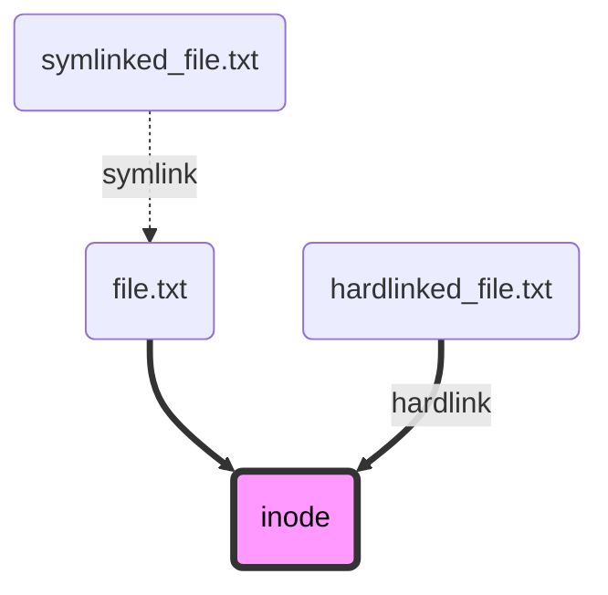

Tired of having repeated files across many projects? Know more about symlinks - files that point to other files.<!-- excerpt -->

[Ler em português](../links-simbolicos-em-multi-repos)

## Repeated files

Tell me: does the file organization below look familiar?

```
> tree C:\MyProjects\ /F

C:\MyProjects\
│
├──── Repo1\
│          src\
│          .editorconfig
│          lint.xml
│          build.sh
│          runtestcoverage.ps1
│          ...
│
├──── Repo2\
│          src\
│          .editorconfig
│          lint.xml
│          build.sh
│          runtestcoverage.ps1
│          ...
│
│ ...
```

Notice that there are files with the same name and content in each project directory. Some examples of repeated files are:

- Code style files:
  - `.editorconfig` (many languages)
  - `checkstyle.xml` (Java, Android)
  - `.eslintrc` (JavaScript, TypeScript)

- Scripts:
  - `build.sh`
  - `runtestcoverage.ps1` (general scripts)
  - `CMakeLists.txt`
  - `Makefile` (for C/C++ compilation)
  - `Jenkinsfile`

- Secrets and app configuration files:
  - `appsettings.json` (.NET)
  - `Web.config` (ASP NET Framework)
  - `.env` (npm)
  - others

If you have many repositories with repeated files, it becomes tiresome to change them, because the effort needs to be done for each repository.

## Pointers?

In programming, there is the concept of pointers - something that points to something else. Usually, we think on memory pointers, that point to a value or structure in RAM memory. However, this concept also exists in file systems: it's called symbolic links, ***symlinks*, files that point to other files.**

Symbolic links are a mature technology, that showed as early as in 1960's computers. They are fully supported on Linux, Mac OSX and Windows, even in older versions.

## Links

In a file system, each element, file or directory, is represented by an *inode*.

An inode of a file is composed by metadata and address in the hard drive. Directory inodes are lists of other inodes.

There are two types of links: *hardlinks* and *symlinks*.

A ***hardlink*** is when a file points to the same inode as other file. Both access the same content in the disk. When one of these files is deleted, the content of the other file is not lost.

A ***symlink*** is when a file points to another file. In this case, the pointer file depends on the target file to access its content. If the target file is deleted or moved, the symlink becomes invalid.

*Symlinks* can have absolute or relative paths.

Example of an absolute path: `/home/alexandre/Projects/file.txt`

Example of a relative path: `../file.txt`



## Symlinks for organization of files

Considering the scenario in the beginning of the article, we can unify files of many projects through the use of symlinks.

Inside each repository, let's create links that will point to files in a Configs folder, located one level above. The Configs folder can become a repository itself, separate from Repo1 and Repo2.

The diagram below shows better. `-->` indicates a symlink.

```
C:\MyProjects\
│
├──── Configs\
│          .editorconfig
│          build.sh
│
├──── Repo1\
│          .editorconfig --> ../Configs/.editorconfig
│          build.sh --> ../Configs/build.sh
│          ...
│
├──── Repo2\
│          .editorconfig --> ../Configs/.editorconfig
│          build.sh --> ../Configs/build.sh
│          ...
│
│ ...
```

On VS Code, symlinks have an arrow icon to the right of the file name.



The command to create symlinks on Linux and Mac OSX is:

```bash
ln -s ../Configs/original_file.txt symlinked_file.txt
```

On Windows command line:

```bat
REM requires admin elevation
mklink symlinked_file.txt ..\Configs\original_file.txt
```

On PowerShell:

```ps1
# requires admin elevation
New-Item -ItemType SymbolicLink -Path symlinked_file.txt -Value ../Configs/original_file.txt
```

## Git

Git supports symlink files committed in repositories.

On GitHub, they appear with an arrow and name coloured in blue.



On online navigation and in pull requests, the file content appears as the symlink's path, either absolute or relative.



## When should I use this approach?

Organizing files with symlinks is good in situations with many projects that share many common files.

If there are few files in common, or if there are not too many repos, it's OK to have repeated files!

In some cases, like pipelines, it's better to choose other reusability approaches. GitHub Actions, for example, suggests to adopt [*reusable workflows*](https://github.blog/2022-02-10-using-reusable-workflows-github-actions/).

Symbolic directories can be a good alternative to Git submodules, in some cases.

## Important details

1) If you are using Windows, you need to enable symbolic links during the Git installation:



2) Some file systems do not support symlinks, such as FAT32 and exFAT. These two are commonly found in pen-drives and SD cards.

3) Symlinks are different from Windows shortcuts. Windows shortcuts are files with the `.lnk` extension that can only be opened by Windows Explorer and Desktop.
