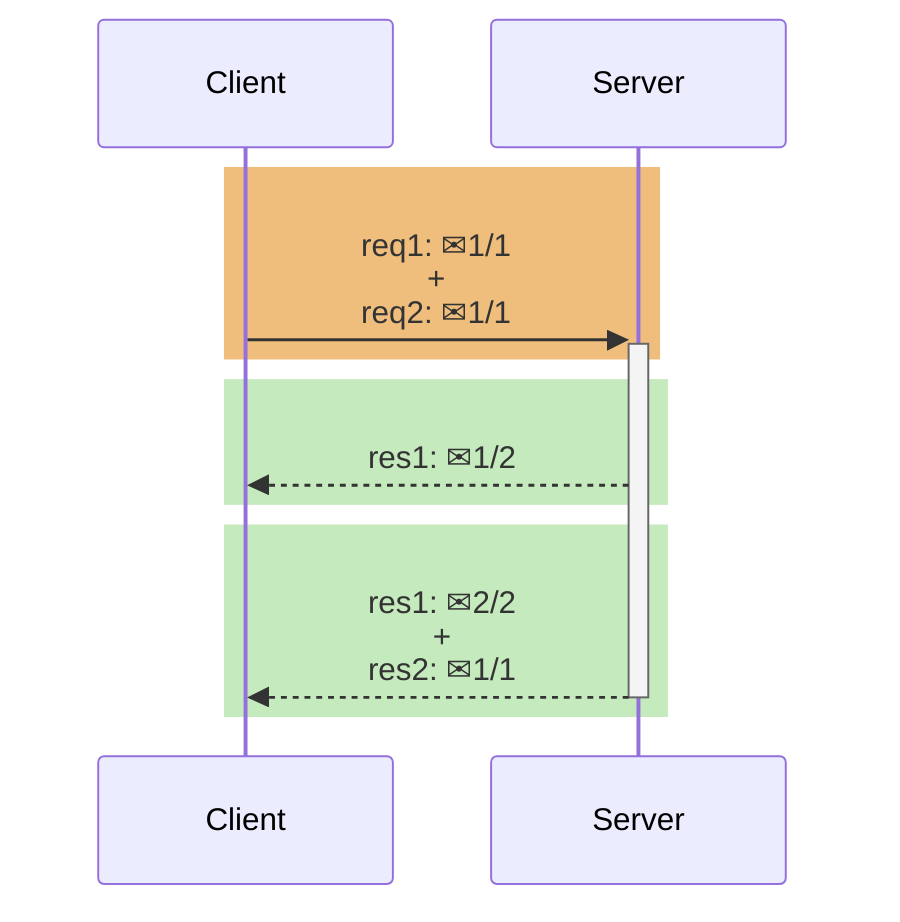
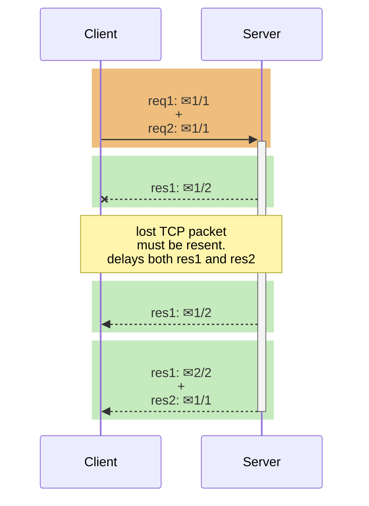
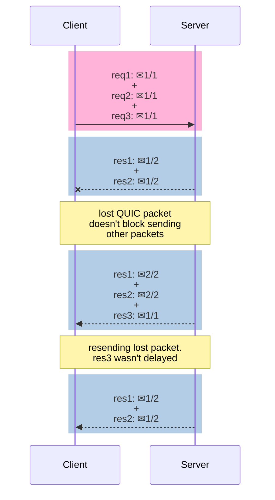

Understand better how HTTP works in each version.<!-- excerpt -->

[Ler em português](../http2-e-http3-explicados)

In the beginning of the 1990s, Tim Berners-Lee and his team at [CERN](https://home.cern) worked together to elaborate the basis of the World Wide Web, defining four building blocks for the Internet:

* A document format for hypertext (HTML)
* A data transmission protocol (HTTP)
* A web browser to view hypertext (the first browser, WorldWideWeb)
* A server to transmit the data (an early version of httpd)

HTTP reused for data transport the existing TCP/IP protocols, with HTTP message bytes residing in the [application layer](https://en.wikipedia.org/wiki/Application_layer), light blue in the image below.



## HTTP/0.9

It was the first HTTP draft. The only existing method was `GET`; there were no headers nor status codes; and the only data format available was HTML. Just like in HTTP/1.0 and HTTP/1.1, the HTTP messages were in an ASCII text structure.

Example of a HTTP/0.9 request:

```
GET /mypage.html
```

Response example:

```
<html>
  A very simple HTML page
</html>
```

## HTTP/1.0

This version gave to HTTP its current structure, similar to a [memorandum](https://www.learninghub.ac.nz/writing/writing/writing-a-memorandum/), also introducing new methods (`HEAD` and `POST`), MIME types, status codes and protocol versioning.

Example of a HTTP/1.0 request:

```
GET /mypage.html HTTP/1.0
User-Agent: NCSA_Mosaic/2.0 (Windows 3.1)
```

Response example:

```
200 OK
Date: Tue, 15 Nov 1994 08:12:31 GMT
Server: CERN/3.0 libwww/2.17
Content-Type: text/html

<HTML>
A page with an image
  
</HTML>
```

## HTTP/1.1

This version came up in early 1997, few months after its predecessor. The main changes were:

* Persistent TCP connections (keep-alive), saving machine and network resources. In the previous version, a new TCP connection was opened for each request and closed after the response.
* `Host` header, allowing more than one server under the same IP.
* Header conventions for encoding, cache, language and MIME type.

Example of a HTTP/1.1 request:

```
GET /api/fruit/orange HTTP/1.1
Host: www.fruityvice.com
Accept-Encoding: gzip, deflate, br
```

Response example:

```
HTTP/1.1 200 OK
Server: nginx/1.16.1
Date: Sun, 10 Mar 2024 20:44:25 GMT
Transfer-Encoding: chunked
Connection: keep-alive
X-Content-Type-Options: nosniff
X-XSS-Protection: 1; mode=block
Cache-Control: no-store, must-revalidate, no-cache, max-age=0
Pragma: no-cache
X-Frame-Options: DENY
Content-Type: application/json
Expires: 0

{"name":"Orange","id":2,"family":"Rutaceae","order":"Sapindales","genus":"Citrus","nutritions":{"calories":43,"fat":0.2,"sugar":8.2,"carbohydrates":8.3,"protein":1.0}}
```



## HTTP/2

In 2015, after many years of observation and studies on the performance of the Internet, the HTTP/2 was proposed and created, based on Google's SPDY.

Among its differences, were the multiplexing of many messages in a single TCP packet; binary format of the messages; and HPACK compression for headers.

In HTTP/1.1, two requests cannot ride together the same TCP connection - it is necessary that the first one ends for the subsequent to begin. This is called *head-of-line blocking*. In the diagram below, request 2 cannot be sent until response 1 arrives, considering that only one TCP connection is used.


With HTTP/2, this problem is solved with *streams*, each stream corresponds to a message. Many streams can be interleaved in a single TCP packet. If a stream can't emit its data for some reason, other streams can take its place in the TCP packet.

HTTP/2 streams are divided in *frames*, each one containing: the frame type, the stream that it belongs to, and the length in bytes. In the diagram below, a coloured rectangle is a TCP packet and a ✉ is a HTTP/2 frame inside it. The first and third TCP packets carry frames of different streams.



The image below shows how frames go inside a TCP packet. Stream 1 carries a HTTP response for a JavaScript file and stream 2 carries a HTTP response for a CSS file.



## HTTP/3

HTTP/3 was born from a new transport protocol, QUIC, created by Google in 2012. QUIC is encapsulated inside UDP, and compared to TCP, it proposes:

* fewer packet roundtrips to establish connection and TLS authentication;
* more resilient connections regarding packet losses;
* to solve the head-of-line blocking that exists in TCP and TLS.

HTTP/2 solves the HTTP head-of-line blocking, but, this problem also happens with TCP and TLS. TCP understands that the data it needs to send is a contiguous sequence of packets, and if any packet is lost, it must be resent, in order to preserve information integrity. *With TCP, subsequent packets cannot be sent until the lost packet successfully arrives to the destination.*

The diagram below explains visually how this happens in HTTP/2. The second packet only had frames of response 1, but its loss delays both response 1 and response 2 - that means that in this case, there is no parallelism.



To solve TCP's head-of-line blocking, QUIC decided to use UDP for its transport protocol, because UDP does not care for guarantees of arrival. The responsibility of data integrity, that in TCP is part of the transport layer, is moved in QUIC to the application layer, and the frames of a message can arrive out of order, without blocking unrelated streams.





The head-of-line blocking related to TLS (SSL) happens on TCP because the cryptography is usually applied over the entire message content, meaning that all data (all packets) needs to be received for the decryption to happen. With QUIC, the cryptography is individual for each QUIC packet, that is decrypted on arrival, without having to receive all packets beforehand.

TLS with TCP:

1) Input data: `A+B+C`
2) Encrypted data: `crypt(A+B+C) = D+E+F` 
3) Packets: `D, E, F`
4) Received: `decrypt(D+E+F)`
5) `A+B+C`

TLS with QUIC:

1) Input data: `A+B+C`
2) Encrypted data: `crypt(A) = X, crypt(B) = Y, crypt(C) = Z`
3) Packets: `X, Y, Z`
4) Received: `decrypt(X) + decrypt(Y) + decrypt(Z)`
5) `A+B+C`

## Comparison table

|   | HTTP/1.1 | HTTP/2 | HTTP/3 |
|---|:---:|:---:|:---:|
| **Transport**<br>**protocol** | TCP,<br>persistent connection | TCP,<br>persistent connection | UDP,<br>persistent connection |
| **Head-of-line**<br>**blocking** | HTTP/1.x HOL<br>TCP HOL<br>TLS HOL | TCP HOL<br>TLS HOL | - |
| **Message format** | ASCII text | binary | binary |
| **Header compression** | - | HPACK | QPACK |
| **Number of roundtrips**<br>**before start**<br>**(handshakes)** | **3**<br>1 from TCP<br>+2 from TLS 1.2\* | **2**<br>1 from TCP<br>+1 from TLS 1.3\* | **0**<br>0 from UDP<br>+0 from TLS 1.3 with 0-RTT\* |
| **Connection identification** | source IP and port | source IP and port | connection ID\*\*,<br>resistant to IP changes |
| **Cryptography** | optional;<br>applied over the entire message | optional;<br>applied over the entire message | embedded TLS 1.3;<br>applied over each QUIC packet |

\* TLS 1.2 requires 2 roundtrips for cryptographic handshake and TLS 1.3 requires only 1, with the option for 0-RTT (*zero roundtrip time resumption*), where there is no need of previous handshake. **However, 0-RTT enables [replay attacks](https://blog.cloudflare.com/introducing-0-rtt) and therefore is unsafe. This is an optional feature, that can be disabled.**

\*\* QUIC's connection ID can be used for fingerprinting, posing a risk to user privacy, according to a [research](/assets/misc/2024_03_research_A_QUIC_Look_at_Web_Tracking.pdf).

## Which is the best version?

The two best versions currently are HTTP/2 and HTTP/3.

HTTP/3 was designed for unstable connections, such as cellphone and satellite networks. To counter network instabilities, QUIC has a great degree of independence between the data streams and good resilience if packets are lost. Nevertheless, HTTP/3 has performance penalties, mainly for 1) the UDP protocol wasn't optimized by routers and operating systems over the last decades due to its low usage, making it comparatively slower than TCP; and 2) the packet-by-packet cryptography used by QUIC requires a greater number of mathematical operations, becoming less efficient than the entire message cryptography used in TCP. Also, there is the issue that the UDP protocol is restricted in some networks to protect against attacks like [UDP flood attack](https://www.cloudflare.com/learning/ddos/udp-flood-ddos-attack/) and [DNS amplification attack](https://blog.cloudflare.com/deep-inside-a-dns-amplification-ddos-attack).

On reliable and stable connections, HTTP/2 many times offers better performance than HTTP/3.

In cases where only HTTP/1.x is allowed, web browsers and many HTTP clients avoid the HOL blocking by opening multiple TCP connections, so the requests go in parallel. If there is a great number of parallel requests, this technique *may* make HTTP/1.x offer a better throughput, however, it is a less efficient way to solve the problem. An alternative solution is having more than one HTTP/2-3 connection at the same time ([C# example](https://learn.microsoft.com/en-us/dotnet/api/system.net.http.socketshttphandler.enablemultiplehttp2connections?view=net-8.0#system-net-http-socketshttphandler-enablemultiplehttp2connections)).

Generally speaking, it's recommended to run compatibility and performance tests to determine which version is the most appropriate, and furthermore, a server can accept both HTTP/2 and HTTP/3 connections, leaving to the client the decision of which version to use.

## Bibliography

* [MDN - Evolution of HTTP](https://developer.mozilla.org/en-US/docs/Web/HTTP/Basics_of_HTTP/Evolution_of_HTTP)
* [MDN - Connection management in HTTP/1.x](https://developer.mozilla.org/en-US/docs/Web/HTTP/Connection_management_in_HTTP_1.x)
* [David Wills - OSI reference model](https://davidwills.us/cmit265/osi.html)
* [Web Performance Calendar - Head-of-Line Blocking in QUIC and HTTP/3: The Details](https://calendar.perfplanet.com/2020/head-of-line-blocking-in-quic-and-http-3-the-details/) ([WebArchive](https://web.archive.org/web/20240311184108/https://calendar.perfplanet.com/2020/head-of-line-blocking-in-quic-and-http-3-the-details/)) **(recommended reading)**
* [Wikipedia - QUIC](https://en.wikipedia.org/wiki/QUIC)
* [Cloudflare - Introducing Zero Round Trip Time Resumption (0-RTT)](https://blog.cloudflare.com/introducing-0-rtt)
* [HTTP/3 explained - QUIC connections](https://http3-explained.haxx.se/en/quic/quic-connections)
* [Erik Sy*, Christian Burkert, Hannes Federrath, and Mathias Fischer - A QUIC Look at Web Tracking](https://svs.informatik.uni-hamburg.de/publications/2019/2019-02-26-Sy-PET_Symposium-A_QUIC_Look_at_Web_Tracking.pdf)

<script>
// gambiarra para escurecer retângulos coloridos no dark mode
function afterMermaidRenderCallback()
{
    if (!isDarkMode()) return;

    var rects = document.querySelectorAll("rect.rect");
    rects.forEach(rect => {
        var currentRectFill = rect.getAttribute("fill");
        // light orange --> dark yellow
        if (currentRectFill == "rgb(239, 190, 125)")
        {
            rect.setAttribute("fill", "rgb(93, 60, 24)");
        }
        // light green --> dark green
        else if (currentRectFill == "rgb(197, 234, 189)")
        {
            rect.setAttribute("fill", "rgb(6, 58, 33)");
        }
        // light pink --> dark pink
        else if (currentRectFill == "rgb(255, 179, 217)")
        {
            rect.setAttribute("fill", "rgb(53, 1, 44)");
        }
        // light blue --> dark blue
        else if (currentRectFill == "rgb(179, 205, 230)")
        {
            rect.setAttribute("fill", "rgb(0, 30, 69)");
        }
    });
}
</script>