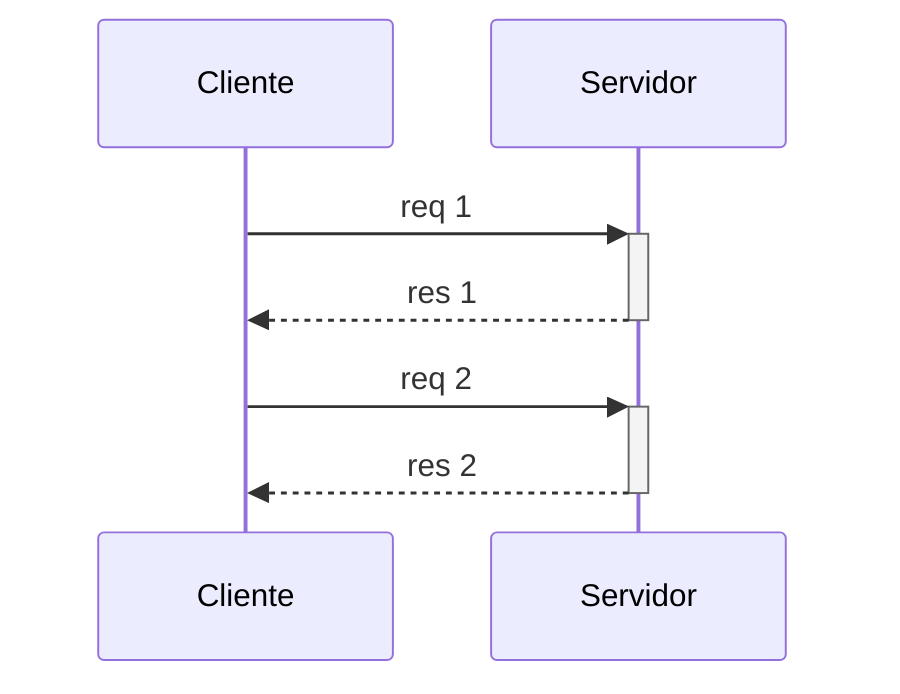
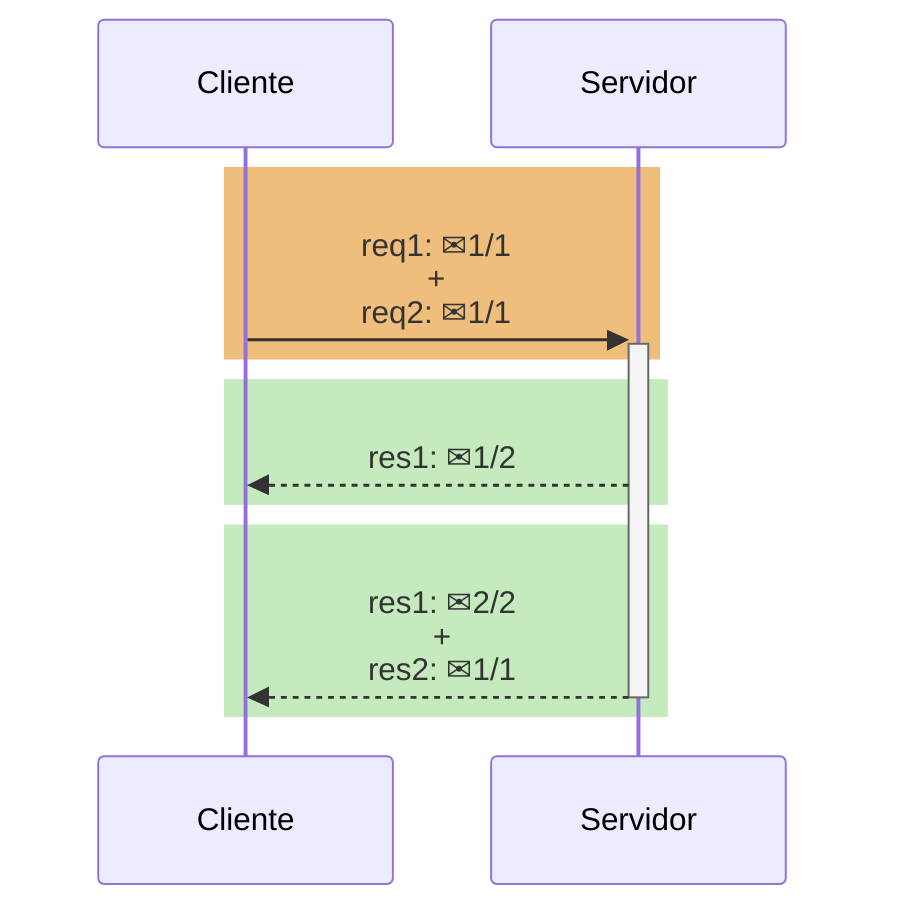
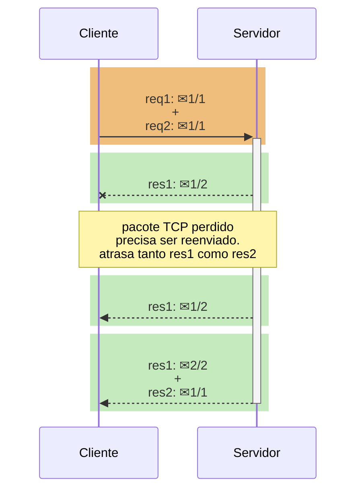
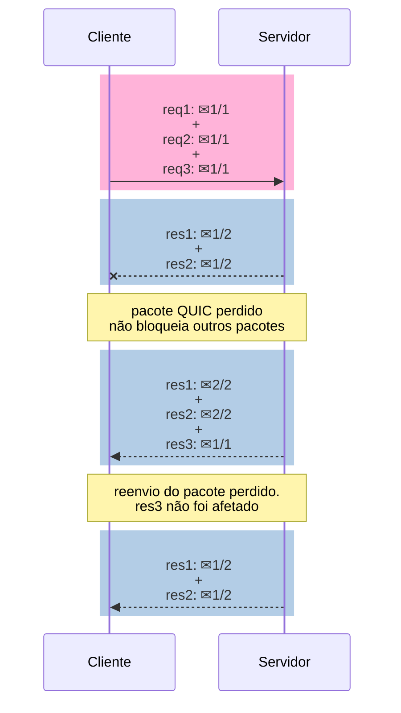

Entenda melhor como funciona o protocolo HTTP em cada uma de suas versões.<!-- excerpt -->

[Read in english](../http2-and-http3-explained)

No início da década de 1990, Tim Berners-Lee e sua equipe no [CERN](https://home.cern) trabalharam juntos para formar a base da World Wide Web, definindo quatro peças-chaves para a rede mundial de computadores:

* Um formato de documento para hipertexto (o HTML)
* Um protocolo de transmissão de dados (o HTTP)
* Um navegador de internet para exibir hipertexto (o primeiro navegador, WorldWideWeb)
* Um servidor para transmitir esses dados (uma versão inicial do httpd)

O HTTP, em questão, aproveitou os protocolos TCP/IP já existentes como meio de transporte de dados. Os bytes de uma mensagem HTTP ficam na [camada de aplicação](https://pt.wikipedia.org/wiki/Camada_de_aplica%C3%A7%C3%A3o), em azul claro na imagem abaixo.



## HTTP/0.9

Foi a primeira versão de rascunho do HTTP. O único método existente era o `GET`; não havia cabeçalhos nem status codes; e o único formato possível de resposta era o HTML. Assim como no HTTP/1.0 e no HTTP/1.1, as mensagens HTTP seguiam um formato de texto em ASCII.

Exemplo de requisição HTTP/0.9:

```
GET /mypage.html
```

Exemplo de resposta:

```
<html>
  A very simple HTML page
</html>
```

## HTTP/1.0

Esta versão deu ao HTTP a sua estrutura atual, parecida com a de um [memorando](https://brasilescola.uol.com.br/redacao/memorando.htm), com cabeçalhos e conteúdo, também introduzindo novos métodos (`HEAD` e `POST`), MIME types, status codes e versionamento do protocolo.

Exemplo de requisição HTTP/1.0:

```
GET /mypage.html HTTP/1.0
User-Agent: NCSA_Mosaic/2.0 (Windows 3.1)
```

Exemplo de resposta:

```
200 OK
Date: Tue, 15 Nov 1994 08:12:31 GMT
Server: CERN/3.0 libwww/2.17
Content-Type: text/html

<HTML>
A page with an image
  
</HTML>
```

## HTTP/1.1

Esta versão surgiu no início de 1997, poucos meses depois da predecessora. As principais mudanças foram:

* Reaproveitamento de conexões TCP (keep-alive), poupando recursos da máquina e de rede. Na versão anterior, uma conexão nova era criada para cada requisição e encerrada logo após a resposta.
* Cabeçalho `Host`, permitindo que mais de um servidor esteja alocado sob um mesmo IP.
* Convenções de cabeçalhos de encoding, cache, idioma e MIME type.

Exemplo de requisição HTTP/1.1:

```
GET /api/fruit/orange HTTP/1.1
Host: www.fruityvice.com
Accept-Encoding: gzip, deflate, br
```

Exemplo de resposta:

```
HTTP/1.1 200 OK
Server: nginx/1.16.1
Date: Sun, 10 Mar 2024 20:44:25 GMT
Transfer-Encoding: chunked
Connection: keep-alive
X-Content-Type-Options: nosniff
X-XSS-Protection: 1; mode=block
Cache-Control: no-store, must-revalidate, no-cache, max-age=0
Pragma: no-cache
X-Frame-Options: DENY
Content-Type: application/json
Expires: 0

{"name":"Orange","id":2,"family":"Rutaceae","order":"Sapindales","genus":"Citrus","nutritions":{"calories":43,"fat":0.2,"sugar":8.2,"carbohydrates":8.3,"protein":1.0}}
```



## HTTP/2

Em 2015, após muitos anos de observação e estudos sobre a performance da internet em geral, foi proposto e criado o HTTP/2, uma nova versão, baseada no SPDY do Google.

Dentre as principais mudanças, estão a multiplexação de várias mensagens dentro de um único pacote TCP; formato binário das mensagens; e compressão dos cabeçalhos, com HPACK.

No HTTP/1.1, duas requisições HTTP não podem trafegar juntas em uma mesma conexão TCP - é necessário que a primeira delas termine para que a subseqüente se inicie. Isso se chama bloqueio de cabeça de fila (*head-of-line blocking*, em inglês). No diagrama abaixo, a requisição 2 não pode começar até que a resposta 1 tenha chegado, considerando que apenas uma conexão TCP é usada.


```mermaid
sequenceDiagram
    Cliente->>+Servidor: req 1
    Servidor-->>-Cliente: res 1
    Cliente->>+Servidor: req 2
    Servidor-->>-Cliente: res 2
```

Com o HTTP/2, esse problema é resolvido através de *streams*: cada *stream* corresponde a uma mensagem. Vários *streams* podem estar entremeados dentro de um mesmo pacote TCP. Se um *stream* não puder emitir dados por algum motivo, outros podem aproveitar e entrar em seu lugar no pacote TCP.

Os *streams* são divididos em *frames*, cada um contendo: o tipo do *frame*, o *stream* ao qual pertence, e o comprimento em bytes. No diagrama abaixo, um retângulo colorido é um pacote TCP e um ✉ é um *frame* HTTP/2. O primeiro e o terceiro pacotes TCP carregam *frames* de *streams* diferentes.


```mermaid
sequenceDiagram
    rect rgb(239, 190, 125)
        Cliente->>+Servidor: req1: #9993;1/1<br>+<br>req2: #9993;1/1
    end
    rect rgb(197, 234, 189)
        Servidor-->>Cliente: res1: #9993;1/2
    end
    rect rgb(197, 234, 189)
        Servidor-->>-Cliente: res1: #9993;2/2<br>+<br>res2: #9993;1/1
    end
```

A imagem abaixo mostra como os *frames* entram em pacotes TCP. O *stream* 1 representa uma resposta HTTP de um arquivo JavaScript e o *stream* 2 representa uma resposta HTTP de um arquivo CSS, transmitidos via HTTP/2.



## HTTP/3

O HTTP/3 surgiu diante de um novo protocolo de transporte proposto pelo Google, o QUIC, em 2012. O QUIC é encapsulado dentro do UDP, e comparado ao TCP, propõe:

* menos *roundtrips* (idas-e-voltas) de pacotes para estabelecimento de conexão e estabelecimento de criptografia TLS;
* ter conexões mais resilientes quanto a perda de pacotes;
* resolver o bloqueio de cabeça de fila que existe no protocolo TCP e no TLS.

O HTTP/2 consegue resolver o bloqueio de cabeça de fila relacionado ao HTTP, porém, esse tipo de bloqueio também existe no protocolo TCP e no TLS. O TCP entende que os dados que deve enviar fazem parte de uma seqüência de pacotes contígüos, e se um desses pacotes for perdido, ele deve ser reenviado para o destinatário, a fim de que se preserve a integridade da informação. *No TCP, pacotes subseqüentes não podem ser enviados enquanto o pacote perdido não chegar com sucesso no destino.*

O diagrama abaixo explica visualmente como isso ocorre no HTTP/2. O segundo pacote tinha *frames* apenas da resposta 1, porém a perda dele atrasa tanto a resposta 1 como a resposta 2 - ou seja, não há paralelismo nesse caso.


```mermaid
sequenceDiagram
    rect rgb(239, 190, 125)
        Cliente->>+Servidor: req1: #9993;1/1<br>+<br>req2: #9993;1/1
    end
    rect rgb(197, 234, 189)
        Servidor--xCliente: res1: #9993;1/2
    end
    Note over Cliente,Servidor: pacote TCP perdido<br>precisa ser reenviado.<br>atrasa tanto res1 como res2
    rect rgb(197, 234, 189)
        Servidor-->>Cliente: res1: #9993;1/2
    end
    rect rgb(197, 234, 189)
        Servidor-->>-Cliente: res1: #9993;2/2<br>+<br>res2: #9993;1/1
    end
```

Para resolver o bloqueio de cabeça de fila do TCP, o QUIC opta por utilizar o UDP como protocolo de transporte, pois este é um protocolo sem garantias de recebimento. A responsabilidade de garantia de integridade, que no TCP fica na camada de transporte, passa no QUIC para a camada de aplicação, de modo que os *frames* de uma mensagem podem chegar fora de ordem, sem bloquear *streams* não-relacionados.


```mermaid
sequenceDiagram
    rect rgb(255, 179, 217)
        Cliente->>Servidor: req1: #9993;1/1<br>+<br>req2: #9993;1/1<br>+<br>req3: #9993;1/1
    end
    rect rgb(179, 205, 230)
        Servidor--xCliente: res1: #9993;1/2<br>+<br>res2: #9993;1/2
    end
    Note over Cliente,Servidor: pacote QUIC perdido<br>não bloqueia outros pacotes
    rect rgb(179, 205, 230)
        Servidor-->>Cliente: res1: #9993;2/2<br>+<br>res2: #9993;2/2<br>+<br>res3: #9993;1/1
    end
    Note over Cliente,Servidor: reenvio do pacote perdido.<br>res3 não foi afetado
    rect rgb(179, 205, 230)
        Servidor-->>Cliente: res1: #9993;1/2<br>+<br>res2: #9993;1/2
    end
```



O bloqueio de cabeça de fila relacionado ao TLS (criptografia SSL) ocorre no TCP porque a criptografia é geralmente aplicada sobre a mensagem inteira, de modo que todos os seus pacotes precisam chegar ao destino para então ocorrer a decriptação. No caso do QUIC, a criptografia é individual para cada pacote QUIC, que é decriptado na chegada, sem haver a necessidade de receber todos os pacotes primeiro.

TLS com TCP:

1) Dados de entrada: `A+B+C`
2) Dados encriptados: `crypt(A+B+C) = D+E+F` 
3) Pacotes: `D, E, F`
4) Recebimento: `decrypt(D+E+F)`
5) `A+B+C`

TLS com QUIC:

1) Dados de entrada: `A+B+C`
2) Dados encriptados: `crypt(A) = X, crypt(B) = Y, crypt(C) = Z`
3) Pacotes: `X, Y, Z`
4) Recebimento: `decrypt(X) + decrypt(Y) + decrypt(Z)`
5) `A+B+C`

## Tabela de comparação

|   | HTTP/1.1 | HTTP/2 | HTTP/3 |
|---|:---:|:---:|:---:|
| **Protocolo**<br>**de transporte** | TCP,<br> conexão persistente | TCP,<br> conexão persistente | UDP,<br>conexão persistente |
| **Bloqueio de**<br>**cabeça de fila**<br>**(*HOL blocking*)** | HTTP/1.x HOL<br>TCP HOL<br>TLS HOL | TCP HOL<br>TLS HOL | - |
| **Formato das mensagens** | texto em ASCII | binário | binário |
| **Compressão de cabeçalhos** | - | HPACK | QPACK |
| **Nº de idas-e-voltas**<br>**para iniciar**<br>**(handshakes)** | **3**<br>1 do TCP<br>+2 do TLS 1.2\* | **2**<br>1 do TCP<br>+1 do TLS 1.3\* | **0**<br>0 do UDP<br>+0 do TLS 1.3 com 0-RTT\* |
| **Identificação de conexão** | IP e porta de origem | IP e porta de origem | connection ID\*\*,<br>resistente a mudanças de IP |
| **Criptografia** | não obrigatória;<br>aplicada na mensagem inteira | não obrigatória;<br>aplicada na mensagem inteira | TLS 1.3 embutido;<br>aplicada por pacote QUIC |

\* O TLS 1.2 requer 2 *roundtrips* para *handshake* criptográfico e o TLS 1.3 requer apenas 1, com a opção de 0-RTT (*zero roundtrip time resumption*), em que não há necessidade de *handshake* prévio. **Porém, o 0-RTT possibilita [ataques de replay](https://blog.cloudflare.com/introducing-0-rtt) e por isso é inseguro. Ele é opcional e pode ser deixado desabilitado.**

\*\* O connection ID do QUIC pode ser usado para *fingerprinting*, colocando em risco a privacidade dos usuários, segundo [pesquisa](/assets/misc/2024_03_research_A_QUIC_Look_at_Web_Tracking.pdf).

## Qual é a melhor versão?

As duas melhores versões atualmente são o HTTP/2 e o HTTP/3.

O HTTP/3 foi desenhado para conexões instáveis, como redes de telefonia celular e de satélite. Para contornar instabilidades de rede, o QUIC tem grande independência dos fluxos de dados e resiliência caso pacotes sejam perdidos. Porém, o HTTP/3 tem desvantagens de performance, em razão de 1) o protocolo UDP não ter sido otimizado pelos sistemas operacionais e roteadores ao longo das últimas décadas, devido ao baixo uso dele em geral, tornando-o comparativamente mais lento do que o TCP; e 2) a criptografia pacote-por-pacote no QUIC requer um número maior de operações matemáticas, tornando-a menos eficiente do que a criptografia de mensagem inteira no TCP. Há ainda o problema de o protocolo UDP (usado pelo QUIC) ser restringido em algumas redes para proteger contra, por exemplo, [ataque de inundação de UDP](https://www.cloudflare.com/learning/ddos/udp-flood-ddos-attack/) e [ataque de amplificação de DNS](https://blog.cloudflare.com/deep-inside-a-dns-amplification-ddos-attack).

Em conexões confiáveis e plenas, o HTTP/2 muitas vezes oferece performance melhor do que o HTTP/3.

Para evitar o bloqueio de cabeça de fila no HTTP/1.x, muitos navegadores e HTTP clients abrem várias conexões TCP, para que as requisições corram em paralelo. Em cenários com muitas requisições e respostas pesadas em paralelo, essa técnica *pode* fazer com que o HTTP/1.x ofereça maior taxa de transferência (*throughput*) comparado ao HTTP/2 ou HTTP/3, porém, é uma forma menos eficiente de se resolver o problema. Uma solução alternativa é ter múltiplas conexões HTTP/2-3 ao mesmo tempo ([exemplo em C#](https://learn.microsoft.com/en-us/dotnet/api/system.net.http.socketshttphandler.enablemultiplehttp2connections?view=net-8.0#system-net-http-socketshttphandler-enablemultiplehttp2connections)).

De modo geral, recomenda-se realizar testes de compatibilidade e de performance para decidir qual é a versão mais indicada, além disso, um servidor pode aceitar conexões tanto de HTTP/2 como de HTTP/3, cabendo ao cliente decidir qual versão usar.

## Ferramenta de testes

Recomendo o [Pororoca](https://pororoca.io) (feito por mim, 😁).

## Bibliografia

* [MDN - Evolution of HTTP](https://developer.mozilla.org/en-US/docs/Web/HTTP/Basics_of_HTTP/Evolution_of_HTTP)
* [MDN - Connection management in HTTP/1.x](https://developer.mozilla.org/en-US/docs/Web/HTTP/Connection_management_in_HTTP_1.x)
* [David Wills - OSI reference model](https://davidwills.us/cmit265/osi.html)
* [Web Performance Calendar - Head-of-Line Blocking in QUIC and HTTP/3: The Details](https://calendar.perfplanet.com/2020/head-of-line-blocking-in-quic-and-http-3-the-details/) ([WebArchive](https://web.archive.org/web/20240311184108/https://calendar.perfplanet.com/2020/head-of-line-blocking-in-quic-and-http-3-the-details/)) **(leitura recomendada)**
* [Wikipédia - QUIC](https://en.wikipedia.org/wiki/QUIC)
* [Cloudflare - Introducing Zero Round Trip Time Resumption (0-RTT)](https://blog.cloudflare.com/introducing-0-rtt)
* [HTTP/3 explained - QUIC connections](https://http3-explained.haxx.se/en/quic/quic-connections)
* [Erik Sy*, Christian Burkert, Hannes Federrath, and Mathias Fischer - A QUIC Look at Web Tracking](https://svs.informatik.uni-hamburg.de/publications/2019/2019-02-26-Sy-PET_Symposium-A_QUIC_Look_at_Web_Tracking.pdf)

<script>
// gambiarra para escurecer retângulos coloridos no dark mode
function afterMermaidRenderCallback()
{
    if (!isDarkMode()) return;

    var rects = document.querySelectorAll("rect.rect");
    rects.forEach(rect => {
        var currentRectFill = rect.getAttribute("fill");
        // light orange --> dark yellow
        if (currentRectFill == "rgb(239, 190, 125)")
        {
            rect.setAttribute("fill", "rgb(93, 60, 24)");
        }
        // light green --> dark green
        else if (currentRectFill == "rgb(197, 234, 189)")
        {
            rect.setAttribute("fill", "rgb(6, 58, 33)");
        }
        // light pink --> dark pink
        else if (currentRectFill == "rgb(255, 179, 217)")
        {
            rect.setAttribute("fill", "rgb(53, 1, 44)");
        }
        // light blue --> dark blue
        else if (currentRectFill == "rgb(179, 205, 230)")
        {
            rect.setAttribute("fill", "rgb(0, 30, 69)");
        }
    });
}
</script>