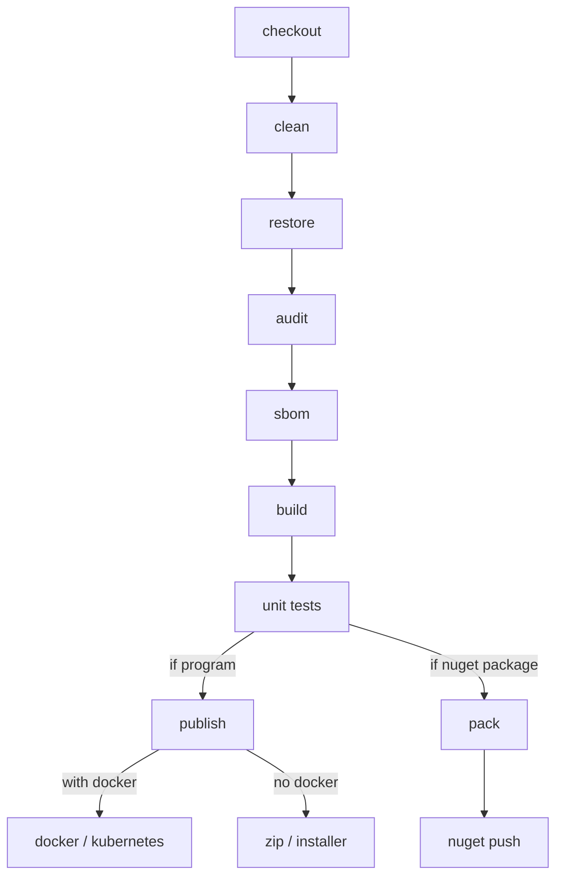

Learn how to make a pipeline for your .NET program or library, with GitHub Actions examples.<!-- excerpt -->

[Ler em português](../pipelines-para-dotnet)

## *Pipelines*

Pipelines are sequences of commands that are executed to ensure the integrity of the code and to produce a final artifact, such as an executable program or a library.

Having a pipeline means having a consistent process that mitigates the risk of human errors in the final product, and also saves the programmer's time, because he/she can take care of other tasks while the code is compiled, verified and packed.

<picture class="my-4">
  <source type="image/avif" srcset="/assets/img/posts/2024_04_conveyor_belt.avif" alt="Conveyor belt" />
  
</picture>

## Steps



### checkout

Fetches the code from the Git branch. If it's a (integration) CI process, the branch is the one that intends to be merged; if it's a CD (deployment), the code is from the release branch, such as *develop*, *master* or *release_candidate*.

Command line: `git clone`

### clean

Cleans the *bin* and *obj* folders, to guarantee that everything will start from zero, with no interferences from previous compilations.

Command line: `dotnet clean`

### restore

Guarantees that the references between projects in the solution are correct and downloads the required NuGet packages.

Command line: `dotnet restore`

### audit

Verifies if there are any NuGet packages in the project with security problems, checking in the [CVE](https://cve.mitre.org/) (*Common Vulnerabilities and Exposures*) and [GHSA](https://github.com/advisories) (*GitHub Advisory Database*) lists.

Command line: `dotnet list package --vulnerable --include-transitive`

### sbom

SBOM, *software bill of materials*, is a document that informs which components were used to produce a program or a library.

This document is of utmost importance for critical software, because with it, organizations can easily know which of its applications are in danger when a vulnerability in a library is reported. After the [2020 cyberattack on the USA government](https://www.eetimes.com/solarwinds-fallout-are-sboms-the-answer/), SBOMs became endorsed by the White House.

I recommend the [CycloneDX](https://github.com/CycloneDX/cyclonedx-dotnet) format, for being more succinct and easier to read.

Command line:

* In CycloneDX format: `dotnet CycloneDX`
* In SPDX format: `sbom-tool generate`

### build

Compiles the solution code.

Command line: `dotnet build`

### unit tests

Runs the solution's unit tests to ensure that they are passing.

In this step, we can produce a report that shows the coverage level of the unit tests against the code, revealing which classes, methods and lines were covered by the tests. [ReportGenerator](https://reportgenerator.io) is the main tool for these reports in .NET projects.

Command line:

* Unit tests: `dotnet test`
* Coverage report: `reportgenerator`

### publish

Generates the final program for execution. This step differs from build because here certain compilation options can be specified, like the target runtime, self-contained, single-file, and others.

Command line: `dotnet publish`

### pack

Makes a NuGet package, in case of a code that is meant to be a library.

Command line: `dotnet pack`

### nuget push

Upload a package to a NuGet server, private or public, so it can be used by other people.

Command line: `dotnet nuget push`

## Pipeline engines

There are many pipeline engines available, such as GitHub Actions, GitLab CI, Jenkins, Azure Pipelines, CircleCI and many others.

You can also have your pipeline as a script, to run locally in your machine. This is a good practice for being a safeguard when your remote pipeline is unavailable or offline, and you can test modifications before commiting them into the remote pipeline.

I personally recommend using [PowerShell](https://github.com/PowerShell/PowerShell) scripts for local pipelines, because it's a multiplatform and friendly language, with easy interaction with XML and JSON. Nevertheless, you can use other scripting languages, like Batch, Shell, Python and others you like.

## GitHub Actions example for .NET program

```yaml
name: Publish console / API / desktop program

on:
  workflow_dispatch: # manual trigger
    inputs:
      version:
        required: true
        type: string
      rid:
        required: true
        default: linux-x64 # where the program will run
        type: string
        # https://learn.microsoft.com/en-us/dotnet/core/rid-catalog

jobs:
  generate_program:

    runs-on: ubuntu-latest

    env:
      OUTPUT_FOLDER: ${{ '{{' }} format('./out/{0}/', inputs.rid) {{ '}}' }}
      VERSION_NAME: ${{ '{{' }} inputs.version {{ '}}' }}
      RID: ${{ '{{' }} inputs.rid {{ '}}' }}

    steps:
    - name: Checkout
      uses: actions/checkout@v4
      with:
        fetch-depth: 1

    - name: Install .NET SDK
      uses: actions/setup-dotnet@v4
      with:
        dotnet-version: 8.x # .NET version here

    - name: Install CycloneDX .NET
      run: dotnet tool install --global CycloneDX

    - name: Clean solution
      run: dotnet clean --nologo --verbosity quiet
    
    - name: Restore solution
      run: dotnet restore --nologo --verbosity quiet

    - name: Audit solution
      shell: pwsh
      run: |
        $projectPath = "./src/MyProject.Console/MyProject.Console.csproj"
        $jsonObj = (dotnet list $projectPath package --vulnerable --include-transitive --format json) | ConvertFrom-Json;
        $hasAnyVulnerability = ($jsonObj.projects[0].frameworks -ne $null);
        if ($hasAnyVulnerability) {
          dotnet list package --vulnerable --include-transitive;
          exit 1;
        }

    - name: Build solution
      run: dotnet build --no-restore --configuration Release --nologo --verbosity quiet

    - name: Run unit tests
      run: dotnet test --no-build --configuration Release --nologo --verbosity quiet --collect:"XPlat Code Coverage" --results-directory ./TestResults/

    - name: Unit tests coverage report
      uses: danielpalme/ReportGenerator-GitHub-Action@5.2.4
      with:
        reports: TestResults/**/coverage.cobertura.xml
        targetdir: TestResults
        reporttypes: JsonSummary;Html

    - name: Generate SBOM
      shell: pwsh
      run: dotnet CycloneDX ./src/MyProject.Console/MyProject.Console.csproj -o $env:OUTPUT_FOLDER -f sbom.json -sv $env:VERSION_NAME --json

    - name: Publish program
      shell: pwsh
      run: |
        dotnet publish ./src/MyProject.Console/MyProject.Console.csproj `
        --verbosity quiet `
        --nologo `
        --configuration Release `
        -p:PublishSingleFile=true `
        -p:Version=${env:VERSION_NAME} `
        --self-contained true `
        --runtime ${env:RID} `
        --output ${env:OUTPUT_FOLDER};

    - name: Set execution attributes (UNIX only)
      if: ${{ '{{' }} startsWith(inputs.rid, 'linux') {{ '||' }} startsWith(inputs.rid, 'osx') {{ '}}' }}
      shell: pwsh
      run: chmod +x "${env:OUTPUT_FOLDER}/MyProject.Console"

    - name: Make zip package
      shell: pwsh
      run: |
        $zipName = "MyProject.Console_${env:VERSION_NAME}_${env:RID}.zip";
        # if Linux or MacOSX, we should use zip instead of Compress-Archive,
        # to preserve the Unix file attributes.
        if ($IsWindows) {
          Compress-Archive -CompressionLevel Optimal -Path $env:OUTPUT_FOLDER -DestinationPath "./out/${zipName}"
        } else {
          cd $env:OUTPUT_FOLDER
          zip -9 -r ../${zipName} *
          cd ../..
        }
        Remove-Item $env:OUTPUT_FOLDER -Force -Recurse -ErrorAction Ignore
        echo "OUTPUT_FILE_NAME=${zipName}" | Out-File -FilePath $Env:GITHUB_ENV -Encoding utf8 -Append

    - name: Upload program to workflow results
      uses: actions/upload-artifact@v4
      with:
        compression-level: 0 # previous step already compresses
        name: ${{ '{{' }} env.OUTPUT_FILE_NAME {{ '}}' }}
        path: ${{ '{{' }} format('./out/{0}', env.OUTPUT_FILE_NAME) {{ '}}' }}
    
    - name: Upload SBOM to workflow results
      uses: actions/upload-artifact@v4
      with:
        name: sbom.json
        path: ./out/sbom.json
    
    - name: Upload coverage report to workflow results
      uses: actions/upload-artifact@v4
      with:
        name: coverage_report
        path: TestResults
    
    # other subsequent steps can be added here,
    # like docker and kubernetes,
    # or installer generation, in case of desktop programs.

```

## GitHub Actions example for NuGet package

```yaml
name: Publish NuGet package

on:
  workflow_dispatch: # manual trigger

jobs:
  generate_nuget_package:

    runs-on: ubuntu-latest

    steps:
    - name: Checkout
      uses: actions/checkout@v4
      with:
        fetch-depth: 1

    - name: Install .NET SDK
      uses: actions/setup-dotnet@v4
      with:
        dotnet-version: 8.x # .NET version here

    - name: Install CycloneDX .NET
      run: dotnet tool install --global CycloneDX

    - name: Clean solution
      run: dotnet clean --nologo --verbosity quiet
    
    - name: Restore solution
      run: dotnet restore --nologo --verbosity quiet

    - name: Audit solution
      shell: pwsh
      run: |
        $projectPath = "./src/MyProject.Console/MyProject.Console.csproj"
        $jsonObj = (dotnet list $projectPath package --vulnerable --include-transitive --format json) | ConvertFrom-Json;
        $hasAnyVulnerability = ($jsonObj.projects[0].frameworks -ne $null);
        if ($hasAnyVulnerability) {
          dotnet list package --vulnerable --include-transitive;
          exit 1;
        }

    - name: Build solution
      run: dotnet build --no-restore --configuration Release --nologo --verbosity quiet

    - name: Run unit tests
      run: dotnet test --no-build --configuration Release --nologo --verbosity quiet --collect:"XPlat Code Coverage" --results-directory ./TestResults/

    - name: Unit tests coverage report
      uses: danielpalme/ReportGenerator-GitHub-Action@5.2.4
      with:
        reports: TestResults/**/coverage.cobertura.xml
        targetdir: TestResults
        reporttypes: JsonSummary;Html

    - name: Read package version
      shell: pwsh
      run: |
        # PackageVersion needs to be declared in .csproj
        ([XML]$nugetCsprojXml = Get-Content ./src/MyProject.Library/MyProject.Library.csproj)
        $versionName = $nugetCsprojXml.Project.PropertyGroup.PackageVersion
        # adds to workflow environment variables
        echo "VERSION_NAME=${versionName}" | Out-File -FilePath $Env:GITHUB_ENV -Encoding utf8 -Append

    - name: Generate SBOM
      shell: pwsh
      run: dotnet CycloneDX ./src/MyProject.Library/MyProject.Library.csproj -o ./out/ -f sbom_MyProject_Library.json -sv $env:VERSION_NAME --json

    - name: Make NuGet package
      run: dotnet pack ./src/MyProject.Library/MyProject.Library.csproj --nologo --verbosity quiet --configuration Release
    
    - name: Upload package to NuGet server
      shell: pwsh
      run: |
        $filePath = "./src/MyProject.Library/bin/Release/MyProject.Library.${env:VERSION_NAME}.nupkg"
        dotnet nuget push $filePath --api-key $env:NUGET_API_KEY --source https://api.nuget.org/v3/index.json
        # if it's a private NuGet, specify other source.
        # web portal for testing NuGet uploads: https://int.nugettest.org
        # source for testing: https://apiint.nugettest.org/v3/index.json
      env:
        NUGET_API_KEY: ${{ '{{' }} secrets.MY_NUGET_API_KEY {{ '}}' }}

    - name: Upload NuGet package to workflow results
      uses: actions/upload-artifact@v4
      with:
        compression-level: 0 # .nupkg already is a compressed zip
        name: ${{ '{{' }} format('MyProject.Library.{0}.nupkg', env.VERSION_NAME) {{ '}}' }}
        path: ${{ '{{' }} format('./src/MyProject.Library/bin/Release/MyProject.Library.{0}.nupkg', env.VERSION_NAME) {{ '}}' }}

    - name: Upload SBOM to workflow results
      uses: actions/upload-artifact@v4
      with:
        name: sbom_MyProject_Library.json
        path: ./out/sbom_MyProject_Library.json
    
    - name: Upload coverage report to workflow results
      uses: actions/upload-artifact@v4
      with:
        name: coverage_report
        path: TestResults

```

## Image source

https://dyno.co.nz/products/telescopic-and-expandable-conveyors/telescopic-conveyor/