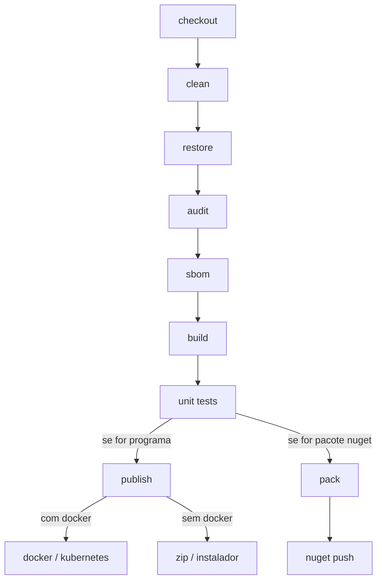

## *Pipelines*

As esteiras automatizadas, também conhecidas como *pipelines*, são seqüências de comandos executados para garantir a integridade do seu código e para gerar um artefato final, como um programa executável ou uma biblioteca.

Ter uma *pipeline* significa ter um processo consistente que minimiza o risco de erros humanos no produto final e economiza tempo do programador, pois ele pode se ocupar de outras tarefas enquanto o código é compilado, verificado e empacotado.



## Etapas



### checkout

Obtém o código da branch em questão, no Git. Se for um processo de integração (CI), pega o código da branch que pretende ser mergeada; se for um *deploy* (CD), pega o código da branch de publicação, como *develop*, *master* ou *release_candidate*.

Linha de comando: `git clone`

### clean

Limpa as pastas *bin* e *obj*, para garantir que tudo vai começar do zero, sem interferências de compilações anteriores.

Linha de comando: `dotnet clean`

### restore

Garante que as referências entre os projetos na solução estão corretas e faz o download dos pacotes NuGet necessários.

Linha de comando: `dotnet restore`

### audit

Verifica se há algum pacote NuGet do projeto com problemas de segurança, conferindo nas listas de vulnerabilidades [CVE](https://cve.mitre.org/) (*Common Vulnerabilities and Exposures*) e [GHSA](https://github.com/advisories) (*GitHub Advisory Database*).

Linha de comando: `dotnet list package --vulnerable --include-transitive`

### sbom

O SBOM, em inglês, *software bill of materials*, é um documento que informa quais componentes foram utilizados para a produção de um programa ou biblioteca.

Esse documento é de suma importância para *softwares* críticos, pois através dele, as organizações podem facilmente saber quais de suas aplicações estão em perigo quando uma vulnerabilidade em uma biblioteca é reportada. Após o [ciberataque ao governo dos EUA em 2020](https://www.eetimes.com/solarwinds-fallout-are-sboms-the-answer/), os SBOMs tornaram-se uma prática endossada pela Casa Branca.

Recomendo o formato [CycloneDX](https://github.com/CycloneDX/cyclonedx-dotnet), por ser mais sucinto e de leitura mais fácil.

Linha de comando:

* Em formato CycloneDX: `dotnet CycloneDX`
* Em formato SPDX: `sbom-tool generate`

### build

Compila o código da solução.

Linha de comando: `dotnet build`

### unit tests

Roda os testes unitários da solução para assegurar que estão passando.

Nessa etapa, podemos produzir um relatório que exibe o nível de cobertura dos testes unitários em relação ao código, mostrando quais classes, métodos e linhas foram abrangidos pelos testes. O [ReportGenerator](https://reportgenerator.io) é a principal ferramenta para esses relatórios em projetos .NET.

Linha de comando:

* Testes unitários: `dotnet test`
* Relatório de cobertura: `reportgenerator`

### publish

Gera o programa final, voltado para execução. Essa etapa difere do *build* porque nesta, pode-se especificar opções de compilação, como o *runtime* de destino, se é *self-contained*, se é *single-file*, entre outras.

Linha de comando: `dotnet publish`

### pack

Produz um pacote NuGet, no caso de um código que é feito para ser uma biblioteca.

Linha de comando: `dotnet pack`

### nuget push

Sobe o pacote para um servidor NuGet, privado ou público, para que possa ser utilizado por outras pessoas.

Linha de comando: `dotnet nuget push`

## Motores de *pipeline*

Existem vários motores de *pipeline* disponíveis, como o GitHub Actions, GitLab CI, Jenkins, Azure Pipelines, CircleCI e diversos outros.

Além desses, você pode ter sua pipeline como um script para rodar localmente na sua máquina. Essa é uma boa prática por ser uma salvaguarda caso sua pipeline remota esteja fora do ar e porque permite testar modificações antes de commitá-las.

Recomendo pessoalmente usar scripts [PowerShell](https://github.com/PowerShell/PowerShell) para pipelines locais, pois é uma linguagem multiplataforma e amigável, com fácil interação com XML e JSON. Contudo, você pode usar outras linguagens de script, como Batch, Shell, Python e outras que você preferir.

## Exemplo em GitHub Actions para programa .NET

```yaml
name: Publicar console / API / programa desktop

on:
  workflow_dispatch: # acionamento manual
    inputs:
      version:
        required: true
        type: string
      rid:
        required: true
        default: linux-x64 # onde o programa vai rodar
        type: string
        # https://learn.microsoft.com/en-us/dotnet/core/rid-catalog

jobs:
  gerar_programa:

    runs-on: ubuntu-latest

    env:
      OUTPUT_FOLDER: ${{ '{{' }} format('./out/{0}/', inputs.rid) {{ '}}' }}
      VERSION_NAME: ${{ '{{' }} inputs.version {{ '}}' }}
      RID: ${{ '{{' }} inputs.rid {{ '}}' }}

    steps:
    - name: Checkout
      uses: actions/checkout@v4
      with:
        fetch-depth: 1

    - name: Instalar .NET SDK
      uses: actions/setup-dotnet@v4
      with:
        dotnet-version: 8.x # versão do .NET aqui

    - name: Instalar CycloneDX .NET
      run: dotnet tool install --global CycloneDX

    - name: Limpar solução
      run: dotnet clean --nologo --verbosity quiet
    
    - name: Restaurar solução
      run: dotnet restore --nologo --verbosity quiet

    - name: Auditar solução
      shell: pwsh
      run: |
        $projectPath = "./src/MeuProjeto.Console/MeuProjeto.Console.csproj"
        $jsonObj = (dotnet list $projectPath package --vulnerable --include-transitive --format json) | ConvertFrom-Json;
        $hasAnyVulnerability = ($jsonObj.projects[0].frameworks -ne $null);
        if ($hasAnyVulnerability) {
          dotnet list package --vulnerable --include-transitive;
          exit 1;
        }

    - name: Compilar solução
      run: dotnet build --no-restore --configuration Release --nologo --verbosity quiet

    - name: Rodar testes unitários
      run: dotnet test --no-build --configuration Release --nologo --verbosity quiet --collect:"XPlat Code Coverage" --results-directory ./TestResults/

    - name: Relatório de cobertura de testes unitários
      uses: danielpalme/ReportGenerator-GitHub-Action@5.2.4
      with:
        reports: TestResults/**/coverage.cobertura.xml
        targetdir: TestResults
        reporttypes: JsonSummary;Html

    - name: Gerar SBOM
      shell: pwsh
      run: dotnet CycloneDX ./src/MeuProjeto.Console/MeuProjeto.Console.csproj -o $env:OUTPUT_FOLDER -f sbom.json -sv $env:VERSION_NAME --json

    - name: Publicar programa
      shell: pwsh
      run: |
        dotnet publish ./src/MeuProjeto.Console/MeuProjeto.Console.csproj `
        --verbosity quiet `
        --nologo `
        --configuration Release `
        -p:PublishSingleFile=true `
        -p:Version=${env:VERSION_NAME} `
        --self-contained true `
        --runtime ${env:RID} `
        --output ${env:OUTPUT_FOLDER};

    - name: Setar atributos de execução (UNIX apenas)
      if: ${{ '{{' }} startsWith(inputs.rid, 'linux') {{ '||' }} startsWith(inputs.rid, 'osx') {{ '}}' }}
      shell: pwsh
      run: chmod +x "${env:OUTPUT_FOLDER}/MeuProjeto.Console"

    - name: Empacotar programa
      shell: pwsh
      run: |
        $zipName = "MeuProjeto.Console_${env:VERSION_NAME}_${env:RID}.zip";
        # se for Linux ou MacOSX, devemos usar o zip ao invés do Compress-Archive,
        # para preservar os atributos de arquivos do Unix.
        if ($IsWindows) {
          Compress-Archive -CompressionLevel Optimal -Path $env:OUTPUT_FOLDER -DestinationPath "./out/${zipName}"
        } else {
          cd $env:OUTPUT_FOLDER
          zip -9 -r ../${zipName} *
          cd ../..
        }
        Remove-Item $env:OUTPUT_FOLDER -Force -Recurse -ErrorAction Ignore
        echo "OUTPUT_FILE_NAME=${zipName}" | Out-File -FilePath $Env:GITHUB_ENV -Encoding utf8 -Append

    - name: Subir programa para resultados do workflow
      uses: actions/upload-artifact@v4
      with:
        compression-level: 0 # não precisa comprimir pq passo anterior já comprime
        name: ${{ '{{' }} env.OUTPUT_FILE_NAME {{ '}}' }}
        path: ${{ '{{' }} format('./out/{0}', env.OUTPUT_FILE_NAME) {{ '}}' }}
    
    - name: Subir SBOM para resultados do workflow
      uses: actions/upload-artifact@v4
      with:
        name: sbom.json
        path: ./out/sbom.json
    
    - name: Subir relatório de cobertura para resultados do workflow
      uses: actions/upload-artifact@v4
      with:
        name: relatorio_de_cobertura
        path: TestResults
    
    # outras etapas subseqüentes podem ser adicionadas aqui,
    # como docker e kubernetes,
    # ou geração de instalador, no caso de programas desktop.

```

## Exemplo em GitHub Actions para pacote NuGet

```yaml
name: Publicar pacote NuGet

on:
  workflow_dispatch: # acionamento manual

jobs:
  gerar_pacote_nuget:

    runs-on: ubuntu-latest

    steps:
    - name: Checkout
      uses: actions/checkout@v4
      with:
        fetch-depth: 1

    - name: Instalar .NET SDK
      uses: actions/setup-dotnet@v4
      with:
        dotnet-version: 8.x # versão do .NET aqui

    - name: Instalar CycloneDX .NET
      run: dotnet tool install --global CycloneDX

    - name: Limpar solução
      run: dotnet clean --nologo --verbosity quiet
    
    - name: Restaurar solução
      run: dotnet restore --nologo --verbosity quiet

    - name: Auditar solução
      shell: pwsh
      run: |
        $projectPath = "./src/MeuProjeto.Console/MeuProjeto.Console.csproj"
        $jsonObj = (dotnet list $projectPath package --vulnerable --include-transitive --format json) | ConvertFrom-Json;
        $hasAnyVulnerability = ($jsonObj.projects[0].frameworks -ne $null);
        if ($hasAnyVulnerability) {
          dotnet list package --vulnerable --include-transitive;
          exit 1;
        }

    - name: Compilar solução
      run: dotnet build --no-restore --configuration Release --nologo --verbosity quiet

    - name: Rodar testes unitários
      run: dotnet test --no-build --configuration Release --nologo --verbosity quiet --collect:"XPlat Code Coverage" --results-directory ./TestResults/

    - name: Relatório de cobertura de testes unitários
      uses: danielpalme/ReportGenerator-GitHub-Action@5.2.4
      with:
        reports: TestResults/**/coverage.cobertura.xml
        targetdir: TestResults
        reporttypes: JsonSummary;Html
    
    - name: Ler versão do pacote
      shell: pwsh
      run: |
        # o PackageVersion deve estar declarado no .csproj
        ([XML]$nugetCsprojXml = Get-Content ./src/MeuProjeto.Biblioteca/MeuProjeto.Biblioteca.csproj)
        $versionName = $nugetCsprojXml.Project.PropertyGroup.PackageVersion
        # adiciona às variáveis de ambiente do workflow
        echo "VERSION_NAME=${versionName}" | Out-File -FilePath $Env:GITHUB_ENV -Encoding utf8 -Append

    - name: Gerar SBOM
      shell: pwsh
      run: dotnet CycloneDX ./src/MeuProjeto.Biblioteca/MeuProjeto.Biblioteca.csproj -o ./out/ -f sbom_meuprojeto_biblioteca.json -sv $env:VERSION_NAME --json

    - name: Gerar pacote
      run: dotnet pack ./src/MeuProjeto.Biblioteca/MeuProjeto.Biblioteca.csproj --nologo --verbosity quiet --configuration Release
    
    - name: Subir pacote para servidor NuGet
      shell: pwsh
      run: |
        $filePath = "./src/MeuProjeto.Biblioteca/bin/Release/MeuProjeto.Biblioteca.${env:VERSION_NAME}.nupkg"
        dotnet nuget push $filePath --api-key $env:NUGET_API_KEY --source https://api.nuget.org/v3/index.json
        # se for um servidor NuGet privado, usar outro source.
        # portal web para testes do NuGet: https://int.nugettest.org
        # source para testes: https://apiint.nugettest.org/v3/index.json
      env:
        NUGET_API_KEY: ${{ '{{' }} secrets.MINHA_NUGET_API_KEY {{ '}}' }}

    - name: Subir pacote para resultados do workflow
      uses: actions/upload-artifact@v4
      with:
        compression-level: 0 # não precisa comprimir pq .nupkg já é um zip
        name: ${{ '{{' }} format('MeuProjeto.Biblioteca.{0}.nupkg', env.VERSION_NAME) {{ '}}' }}
        path: ${{ '{{' }} format('./src/MeuProjeto.Biblioteca/bin/Release/MeuProjeto.Biblioteca.{0}.nupkg', env.VERSION_NAME) {{ '}}' }}

    - name: Subir SBOM para resultados do workflow
      uses: actions/upload-artifact@v4
      with:
        name: sbom_meuprojeto_biblioteca.json
        path: ./out/sbom_meuprojeto_biblioteca.json
    
    - name: Subir relatório de cobertura para resultados do workflow
      uses: actions/upload-artifact@v4
      with:
        name: relatorio_de_cobertura
        path: TestResults

```

## Fonte da imagem

https://dyno.co.nz/products/telescopic-and-expandable-conveyors/telescopic-conveyor/