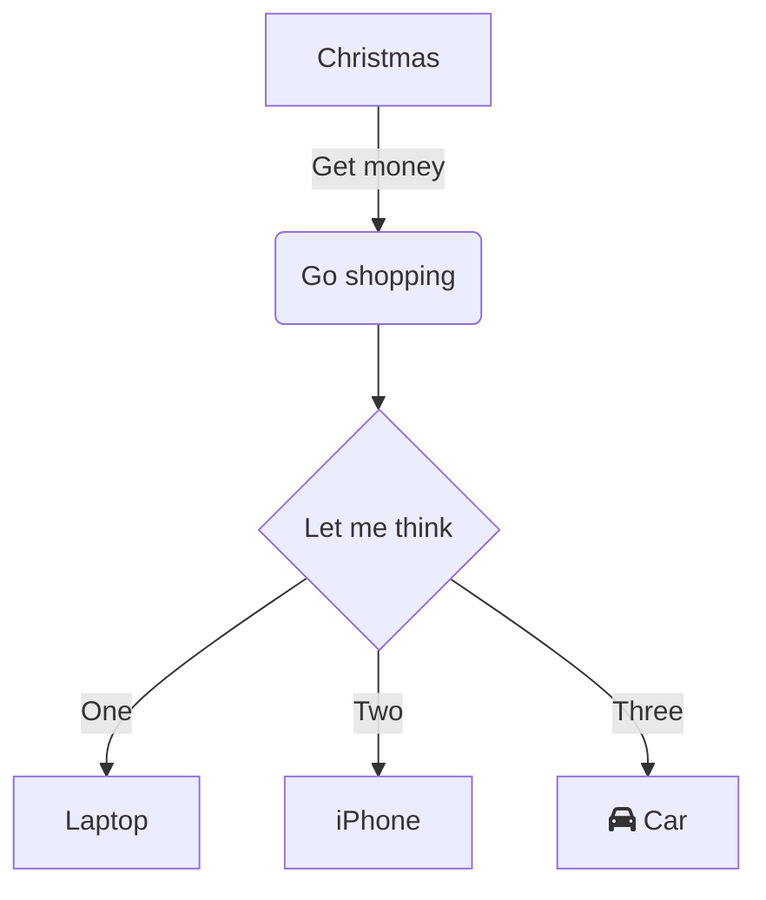

See how to integrate Shiki to your 11ty project, with support for Mermaid diagrams.<!-- excerpt -->

[Ler em português](../shiki-e-mermaid-no-11ty)

## 11ty, Shiki and Mermaid

[11ty](https://www.11ty.dev/) (Eleventy) is a static-site generator tool that uses templating engines to generate websites. Eleventy has a pipeline execution that makes it easy to add plugins and transformations to HTML, JS and CSS files.

[Shiki](https://shiki.style/) is a npm package that renders HTML code blocks with syntax highlighting for a specified language. Among its interesting features, it allows dual theming (light and dark switching), code focusing and diffing notations, and custom themes.

While I was making this blog, which uses 11ty, I wanted to have support for [Mermaid](https://mermaid.js.org) diagrams in my blog posts, alongside code blocks. In this post, let's see how to integrate Shiki and Mermaid into your 11ty project.

* [Shiki integration](#shiki-integration)
* [Mermaid integration](#mermaid-integration)
* [Final results](#final-results)
* [Copy code buttons](#copy-code-buttons)

## Shiki integration

### Add Shiki to your project

```sh [npm]
npm install -D shiki
```

### Shiki custom plug-in

Create a Javascript file to configure Shiki for your project, for example, at `src/libs/shiki.js`:

```javascript
module.exports = (eleventyConfig, options) => {
  // empty call to notify 11ty that we use this feature
  // eslint-disable-next-line no-empty-function
  eleventyConfig.amendLibrary('md', () => { });

  eleventyConfig.on('eleventy.before', async () => {
    const shiki = await import('shiki');

    // highlighter config
    const highlighter = await shiki.createHighlighter(
    {
      themes: ["light-plus", "dark-plus"],
      langs: [
        'shell', 'html', 'yaml',
        'sql', 'xml', 'javascript'
      ]
    });

    eleventyConfig.amendLibrary('md', (mdLib) =>
      mdLib.set({
        highlight: (code, lang) => {
          return highlighter.codeToHtml(code,
          {
            lang: lang,
            themes: {
              light: "light-plus",
              dark: "dark-plus"
            }
          });
        }
      })
    );
  });
};
```

### Call Shiki custom plug-in in `.eleventy.js`

```javascript
module.exports = function(eleventyConfig) {
  ...

  // IMPORTANT!
  // remove 11ty syntax highlighter plugin, if present:
  eleventyConfig.addPlugin(syntaxHighlight) // [!code --]

  // Add:
  eleventyConfig.addPlugin(require("./src/libs/shiki.js")); // [!code ++]

  ...
}
```

## Mermaid integration

If you want to use Shiki and also want to render Mermaid diagrams, you need to change the Shiki plug-in to render Mermaid as HTML divs, instead of code blocks.

### Add htmlencode to your project

```sh [npm]
npm install -D htmlencode
```

###  Modify Shiki plug-in

```javascript
const htmlencode = require('htmlencode'); // [!code ++]

module.exports = (eleventyConfig, options) => {
  // empty call to notify 11ty that we use this feature
  // eslint-disable-next-line no-empty-function
  eleventyConfig.amendLibrary('md', () => { });

  eleventyConfig.on('eleventy.before', async () => {
    const shiki = await import('shiki');

    // highlighter config
    const highlighter = await shiki.createHighlighter(
    {
      themes: ["light-plus", "dark-plus"],
      langs: [
        'shell', 'html', 'yaml',
        'sql', 'xml', 'javascript'
      ]
    });

    eleventyConfig.amendLibrary('md', (mdLib) =>
      mdLib.set({
        highlight: (code, lang) => {
          if (lang === "mermaid") { // [!code ++]
            const extra_classes = options?.extra_classes ? ' ' + options.extra_classes : ''; // [!code ++]
            return `<div class="mermaid${extra_classes}">${htmlencode.htmlEncode(code)}</div>`; // [!code ++]
          } // [!code ++]
          else { // [!code ++]
            return highlighter.codeToHtml(code,
            {
              lang: lang,
              themes: {
                light: "light-plus",
                dark: "dark-plus"
              }
            });
          } // [!code ++]
        }
      })
    );
  });
};
```

### Mermaid custom plug-in

Create a Javascript file to configure Mermaid for your project, for example, at `src/libs/mermaid.js`:

```javascript
module.exports = (eleventyConfig, options) => {
  let mermaid_config = {
    startOnLoad: false,
    theme: "default",
    loadOnSave: true
  };
  let src = options?.mermaid_js_src || "https://unpkg.com/mermaid/dist/mermaid.esm.min.mjs";

  eleventyConfig.addShortcode("mermaid_js_scripts", () => {
    return `<script type="module" async>
              import mermaid from "${src}";
              const config = ${JSON.stringify(mermaid_config)};
              mermaid.initialize(config);
              await mermaid.run({
                querySelector: '.mermaid'
              });
            </script>`
  });
  return {}
};
```
### Call Mermaid custom plug-in in `.eleventy.js`
```javascript
module.exports = function(eleventyConfig) {
  ...

  eleventyConfig.addPlugin(require("./src/libs/shiki.js"));
  eleventyConfig.addPlugin(require("./src/libs/mermaid.js")); // [!code ++]

  ...
}
```

### Include Mermaid script in pages

Add the `mermaid_js_scripts` shortcode to pages and templates that will have diagrams:

```
{{ '' }}
```

## Final results

Let's see it working.

SQL code block with syntax highlight:

```sql
SELECT * INTO dbo.NewProducts
FROM Production.Product
WHERE ListPrice > 25
AND ListPrice < 100;
```

Mermaid flowchart:

```
flowchart TD
    A[Christmas] -->|Get money| B(Go shopping)
    B --> C{Let me think}
    C -->|One| D[Laptop]
    C -->|Two| E[iPhone]
    C -->|Three| F[fa:fa-car Car]
```



If you want to check a full source code example for this blog project, visit our [GitHub repo](https://github.com/alexandrehtrb/alexandrehtrb.github.io). It includes switching between light and dark themes for both Shiki and Mermaid.

## Copy code buttons

Shiki doesn't provide copy code buttons by default, but we can add them through a client-side script. I use a slightly modified version of the script shown in [this blog post](https://junges.dev/2-how-to-add-github-copy-to-clipboard-button-on-your-docsblog).

### Reference the script in templates

Add the `<script>` tag below to templates and HTML files:

```html
<script src="/assets/scripts/addCopyCodeButtons.js"></script>
```

### Add script to insert copy code buttons

Create a Javascript file for a client-side script that will find all code blocks and add copy code buttons to them. The icons SVGs are declared inline in this example.

For example, create your file at `src/scripts/addCopyCodeButtons.js`:

```javascript
let blocks = document.querySelectorAll("pre.shiki");
const copyCodeIconSvg = '<svg height="16" viewBox="0 0 16 16" version="1.1" width="16"><path fill="#666666" d="M0 6.75C0 5.784.784 5 1.75 5h1.5a.75.75 0 0 1 0 1.5h-1.5a.25.25 0 0 0-.25.25v7.5c0 .138.112.25.25.25h7.5a.25.25 0 0 0 .25-.25v-1.5a.75.75 0 0 1 1.5 0v1.5A1.75 1.75 0 0 1 9.25 16h-7.5A1.75 1.75 0 0 1 0 14.25Z"></path><path fill="#666666" d="M5 1.75C5 .784 5.784 0 6.75 0h7.5C15.216 0 16 .784 16 1.75v7.5A1.75 1.75 0 0 1 14.25 11h-7.5A1.75 1.75 0 0 1 5 9.25Zm1.75-.25a.25.25 0 0 0-.25.25v7.5c0 .138.112.25.25.25h7.5a.25.25 0 0 0 .25-.25v-7.5a.25.25 0 0 0-.25-.25Z"></path></svg>';
const codeCopiedIconSvg = '<svg height="16" viewBox="0 0 16 16" version="1.1" width="16"><path fill="#28D751" d="M13.78 4.22a.75.75 0 0 1 0 1.06l-7.25 7.25a.75.75 0 0 1-1.06 0L2.22 9.28a.751.751 0 0 1 .018-1.042.751.751 0 0 1 1.042-.018L6 10.94l6.72-6.72a.75.75 0 0 1 1.06 0Z"></path></svg>';

blocks.forEach((block) => {
    if (!navigator.clipboard) {
        return;
    }

    let button = document.createElement("button");
    button.className = "button-copy-code";
    button.ariaLabel = button.title = "Copy";
    button.innerHTML = copyCodeIconSvg;
    block.appendChild(button);

    button.addEventListener("click", async () => {
        await copyCode(button, block);
    });
});

async function copyCode(button, block) {
    let copiedCode = block.cloneNode(true);
    copiedCode.removeChild(copiedCode.querySelector("button.button-copy-code"));

    const html = copiedCode.outerHTML.replace(/<[^>]*>?/gm, "");

    block.querySelector("button.button-copy-code").innerHTML = codeCopiedIconSvg;
    button.ariaLabel = button.title = "Copied!";
    setTimeout(function () {
        block.querySelector("button.button-copy-code").innerHTML = copyCodeIconSvg;
        button.ariaLabel = button.title = "Copy";
    }, 2000);

    const parsedHTML = htmlDecode(html);

    await navigator.clipboard.writeText(parsedHTML);
}

function htmlDecode(input) {
    const doc = new DOMParser().parseFromString(input, "text/html");
    return doc.documentElement.textContent;
}
```

### CSS for copy code buttons

Add the CSS code below to style the button position and visibility:

```css
pre[class*="shiki"] {
  position: relative;
  margin: 5px 0;
  padding: 1.75rem 0 1.75rem 1rem;
}

pre > .button-copy-code {
  position: absolute;
  top: 32px;
  right: 16px;
}

@media only screen and (max-device-width: 480px) {
  pre > .button-copy-code {
    display: none;
  }
}
```

## References

* [11ty docs](https://www.11ty.dev/docs/)
* [Shiki docs](https://shiki.style/guide/)
* [Mermaid docs](https://mermaid.js.org/intro/)
* [Junges.dev - How to add GitHub Copy to Clipboard button on your docs/blog ](https://junges.dev/2-how-to-add-github-copy-to-clipboard-button-on-your-docsblog)
