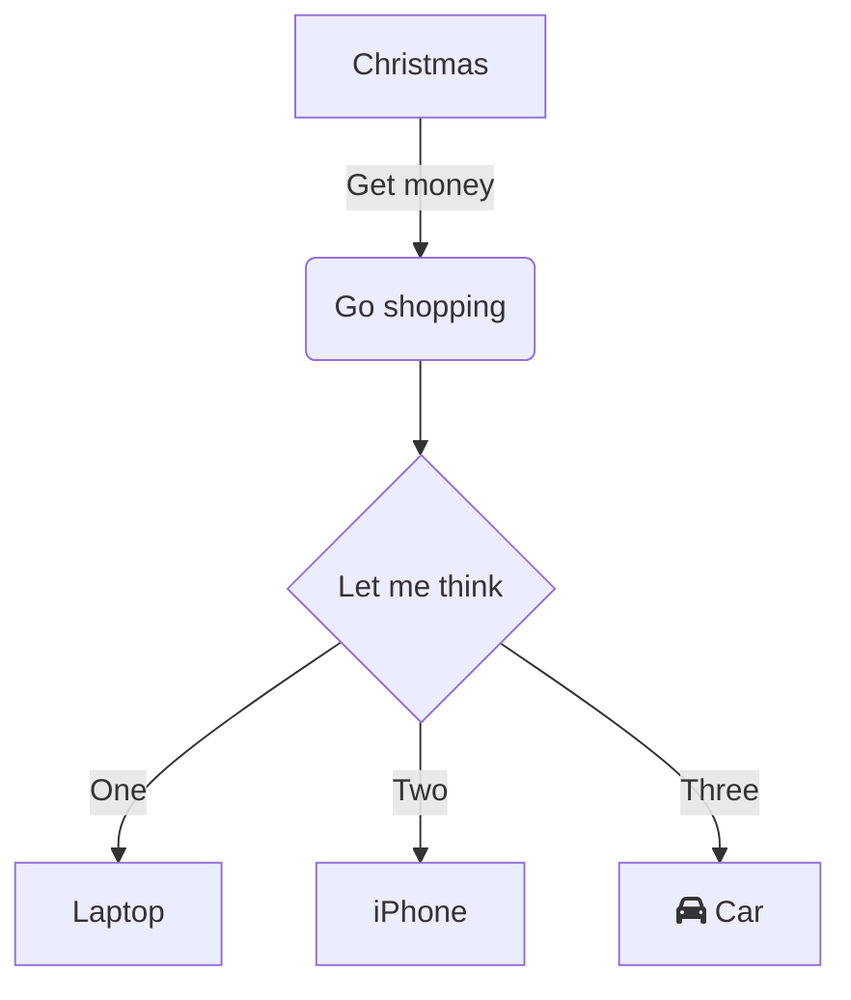

Veja como integrar o Shiki no seu projeto 11ty, com suporte a diagramas Mermaid.<!-- excerpt -->

[Read in english](../shiki-and-mermaid-in-11ty)

## 11ty, Shiki e Mermaid

O [11ty](https://www.11ty.dev/) (Eleventy) é um gerador de sites estáticos que usa templates. Ele tem uma pipeline de execução que torna fácil adicionar plug-ins e transformações a arquivos HTML, JS e CSS.

O [Shiki](https://shiki.style/) é um pacote npm que renderiza blocos de código HTML com coloração de sintaxe de acordo com a linguagem do código. Dentre suas vantagens, ele permite temas duais (que alternam entre claro e escuro), notações de código com diferenças e foco, e temas customizados.

Neste post, vamos ver como integrar o Shiki e diagramas [Mermaid](https://mermaid.js.org) em um projeto 11ty.

* [Integrando com o Shiki](#integrando-com-o-shiki)
* [Integrando com o Mermaid](#integrando-com-o-mermaid)
* [Resultados finais](#resultados-finais)
* [Botões para copiar código](#botões-para-copiar-código)

## Integrando com o Shiki

### Adicionar o Shiki ao projeto

```sh [npm]
npm install -D shiki
```

### Plug-in para o Shiki

Criar um arquivo Javascript para configuração do Shiki no seu projeto, por exemplo, no caminho `src/libs/shiki.js`:

```javascript
module.exports = (eleventyConfig, options) => {
  // empty call to notify 11ty that we use this feature
  // eslint-disable-next-line no-empty-function
  eleventyConfig.amendLibrary('md', () => { });

  eleventyConfig.on('eleventy.before', async () => {
    const shiki = await import('shiki');

    // highlighter config
    const highlighter = await shiki.createHighlighter(
    {
      themes: ["light-plus", "dark-plus"],
      langs: [
        'shell', 'html', 'yaml',
        'sql', 'xml', 'javascript'
      ]
    });

    eleventyConfig.amendLibrary('md', (mdLib) =>
      mdLib.set({
        highlight: (code, lang) => {
          return highlighter.codeToHtml(code,
          {
            lang: lang,
            themes: {
              light: "light-plus",
              dark: "dark-plus"
            }
          });
        }
      })
    );
  });
};
```

### Chamar plug-in do Shiki no `.eleventy.js`

```javascript
module.exports = function(eleventyConfig) {
  ...

  // IMPORTANTE!
  // remover plug-in de syntax highlight padrão do 11ty
  eleventyConfig.addPlugin(syntaxHighlight) // [!code --]

  // Adicionar:
  eleventyConfig.addPlugin(require("./src/libs/shiki.js")); // [!code ++]

  ...
}
```

## Integrando com o Mermaid

Se você quer usar o Shiki e também quer ter diagramas Mermaid, é necessário alterar o plug-in do Shiki para renderizar blocos Mermaid como divs HTML, ao invés de blocos de código.

### Adicionar o htmlencode ao projeto

```sh [npm]
npm install -D htmlencode
```

### Modificar o plug-in do Shiki

```javascript
const htmlencode = require('htmlencode'); // [!code ++]

module.exports = (eleventyConfig, options) => {
  // empty call to notify 11ty that we use this feature
  // eslint-disable-next-line no-empty-function
  eleventyConfig.amendLibrary('md', () => { });

  eleventyConfig.on('eleventy.before', async () => {
    const shiki = await import('shiki');

    // highlighter config
    const highlighter = await shiki.createHighlighter(
    {
      themes: ["light-plus", "dark-plus"],
      langs: [
        'shell', 'html', 'yaml',
        'sql', 'xml', 'javascript'
      ]
    });

    eleventyConfig.amendLibrary('md', (mdLib) =>
      mdLib.set({
        highlight: (code, lang) => {
          if (lang === "mermaid") { // [!code ++]
            const extra_classes = options?.extra_classes ? ' ' + options.extra_classes : ''; // [!code ++]
            return `<div class="mermaid${extra_classes}">${htmlencode.htmlEncode(code)}</div>`; // [!code ++]
          } // [!code ++]
          else { // [!code ++]
            return highlighter.codeToHtml(code,
            {
              lang: lang,
              themes: {
                light: "light-plus",
                dark: "dark-plus"
              }
            });
          } // [!code ++]
        }
      })
    );
  });
};
```

### Plug-in para o Mermaid

Criar um arquivo Javascript para configuração do Mermaid no seu projeto, por exemplo, no caminho `src/libs/mermaid.js`:

```javascript
module.exports = (eleventyConfig, options) => {
  let mermaid_config = {
    startOnLoad: false,
    theme: "default",
    loadOnSave: true
  };
  let src = options?.mermaid_js_src || "https://unpkg.com/mermaid/dist/mermaid.esm.min.mjs";

  eleventyConfig.addShortcode("mermaid_js_scripts", () => {
    return `<script type="module" async>
              import mermaid from "${src}";
              const config = ${JSON.stringify(mermaid_config)};
              mermaid.initialize(config);
              await mermaid.run({
                querySelector: '.mermaid'
              });
            </script>`
  });
  return {}
};
```
### Chamar plug-in do Mermaid no `.eleventy.js`
```javascript
module.exports = function(eleventyConfig) {
  ...

  eleventyConfig.addPlugin(require("./src/libs/shiki.js"));
  eleventyConfig.addPlugin(require("./src/libs/mermaid.js")); // [!code ++]

  ...
}
```

### Incluir script do Mermaid nas páginas

Adicionar o shortcode `mermaid_js_scripts` nas páginas e templates que vão ter diagramas:

```
{{ '' }}
```

## Resultados finais

Vamos ver funcionando.

Bloco de código SQL com coloração de sintaxe:

```sql
SELECT * INTO dbo.NewProducts
FROM Production.Product
WHERE ListPrice > 25
AND ListPrice < 100;
```

Diagrama de fluxo do Mermaid:

```
flowchart TD
    A[Christmas] -->|Get money| B(Go shopping)
    B --> C{Let me think}
    C -->|One| D[Laptop]
    C -->|Two| E[iPhone]
    C -->|Three| F[fa:fa-car Car]
```



Se quiser conferir um exemplo completo de código para este blog, visite nosso [repo no GitHub](https://github.com/alexandrehtrb/alexandrehtrb.github.io). Lá você encontra como alternar entre tema claro e escuro, tanto para o Shiki como para o Mermaid.

## Botões para copiar código

O Shiki não provê de fábrica botões para copiar código, porém, podemos adicioná-los através de um script do lado do cliente. Aqui, usaremos uma versão modificada do exemplo [deste post de blog](https://junges.dev/2-how-to-add-github-copy-to-clipboard-button-on-your-docsblog).

### Referenciar o script nos templates

Adicionar a tag `<script>` abaixo nos templates e arquivos HTML:

```html
<script src="/assets/scripts/addCopyCodeButtons.js"></script>
```

### Script para adicionar botões de copiar código

Vamos criar um script de lado de cliente que vai pegar todos os blocos de código e inserir botões de copiar neles. Os ícones estão declarados em linha neste exemplo, como SVGs.

Exemplo de arquivo no caminho `src/scripts/addCopyCodeButtons.js`:

```javascript
let blocks = document.querySelectorAll("pre.shiki");
const copyCodeIconSvg = '<svg height="16" viewBox="0 0 16 16" version="1.1" width="16"><path fill="#666666" d="M0 6.75C0 5.784.784 5 1.75 5h1.5a.75.75 0 0 1 0 1.5h-1.5a.25.25 0 0 0-.25.25v7.5c0 .138.112.25.25.25h7.5a.25.25 0 0 0 .25-.25v-1.5a.75.75 0 0 1 1.5 0v1.5A1.75 1.75 0 0 1 9.25 16h-7.5A1.75 1.75 0 0 1 0 14.25Z"></path><path fill="#666666" d="M5 1.75C5 .784 5.784 0 6.75 0h7.5C15.216 0 16 .784 16 1.75v7.5A1.75 1.75 0 0 1 14.25 11h-7.5A1.75 1.75 0 0 1 5 9.25Zm1.75-.25a.25.25 0 0 0-.25.25v7.5c0 .138.112.25.25.25h7.5a.25.25 0 0 0 .25-.25v-7.5a.25.25 0 0 0-.25-.25Z"></path></svg>';
const codeCopiedIconSvg = '<svg height="16" viewBox="0 0 16 16" version="1.1" width="16"><path fill="#28D751" d="M13.78 4.22a.75.75 0 0 1 0 1.06l-7.25 7.25a.75.75 0 0 1-1.06 0L2.22 9.28a.751.751 0 0 1 .018-1.042.751.751 0 0 1 1.042-.018L6 10.94l6.72-6.72a.75.75 0 0 1 1.06 0Z"></path></svg>';

blocks.forEach((block) => {
    if (!navigator.clipboard) {
        return;
    }

    let button = document.createElement("button");
    button.className = "button-copy-code";
    button.ariaLabel = button.title = "Copiar";
    button.innerHTML = copyCodeIconSvg;
    block.appendChild(button);

    button.addEventListener("click", async () => {
        await copyCode(button, block);
    });
});

async function copyCode(button, block) {
    let copiedCode = block.cloneNode(true);
    copiedCode.removeChild(copiedCode.querySelector("button.button-copy-code"));

    const html = copiedCode.outerHTML.replace(/<[^>]*>?/gm, "");

    block.querySelector("button.button-copy-code").innerHTML = codeCopiedIconSvg;
    button.ariaLabel = button.title = "Copiado!";
    setTimeout(function () {
        block.querySelector("button.button-copy-code").innerHTML = copyCodeIconSvg;
        button.ariaLabel = button.title = "Copiar";
    }, 2000);

    const parsedHTML = htmlDecode(html);

    await navigator.clipboard.writeText(parsedHTML);
}

function htmlDecode(input) {
    const doc = new DOMParser().parseFromString(input, "text/html");
    return doc.documentElement.textContent;
}
```

### CSS para os botões de copiar código

O CSS abaixo controla a posição e visibilidade dos botões:

```css
pre[class*="shiki"] {
  position: relative;
  margin: 5px 0;
  padding: 1.75rem 0 1.75rem 1rem;
}

pre > .button-copy-code {
  position: absolute;
  top: 32px;
  right: 16px;
}

@media only screen and (max-device-width: 480px) {
  pre > .button-copy-code {
    display: none;
  }
}
```

## Referências

* [11ty docs](https://www.11ty.dev/docs/)
* [Shiki docs](https://shiki.style/guide/)
* [Mermaid docs](https://mermaid.js.org/intro/)
* [Junges.dev - How to add GitHub Copy to Clipboard button on your docs/blog ](https://junges.dev/2-how-to-add-github-copy-to-clipboard-button-on-your-docsblog)
