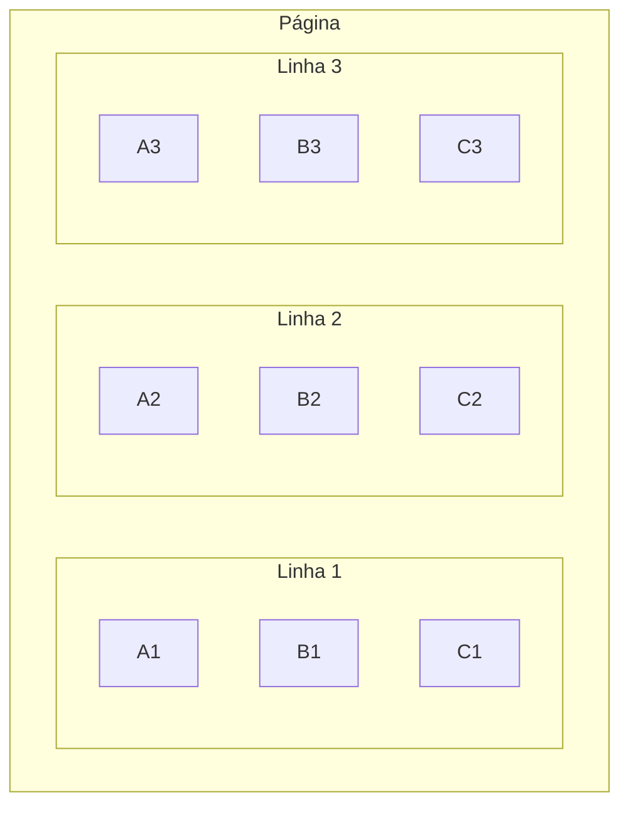
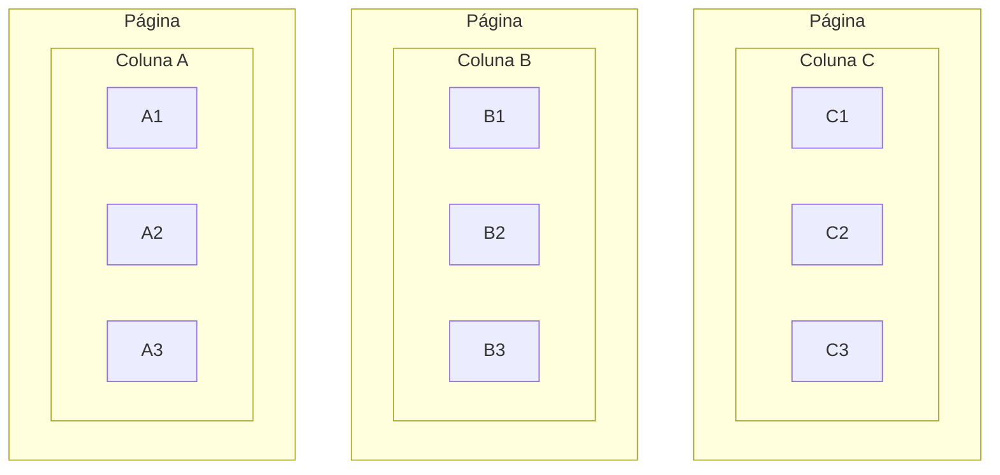

## Introdução

A linguagem SQL, em inglês, *Structured Query Language*, surgiu pela primeira vez em 1974 e é uma das principais linguagens até hoje, em se tratando de bancos de dados.

O SQL evoluiu muito ao longo dos anos e principalmente nas duas últimas décadas, com novas técnicas de organização de dados, que surgiram diante de novos competidores (NoSQL) e novas necessidades (analytics, data warehouse, computação na nuvem).

Este artigo é uma lista de trapaças do SQL, abordando desde comandos comuns até aqueles raros e com aplicações muito interessantes. Procurei fazer aqui uma lista fácil de entender tanto para iniciantes como para quem já tem familiaridade com a linguagem.

Os exemplos aqui são em Microsoft SQL Server, porém, a maioria deles existe de forma igual ou semelhante em outros bancos de dados, como o PostgreSQL, MySQL e Oracle.

<br>



<br>

[**Antes de começar**](#antes-de-começar)

  * [Instalação](#instalação)
  * [Tabelas de exemplo](#tabelas-de-exemplo)

[**Leituras e consultas**](#leituras-e-consultas)

  * [SELECT](#select)
  * [LEFT, RIGHT, INNER JOINS](#left%2C-right%2C-inner-joins)
  * [VIEWS](#views)
  * [GROUP BY, HAVING](#group-by%2C-having)
  * [UNION, INTERSECT, EXCEPT](#union%2C-intersect%2C-except)
  * [SUBQUERIES](#subqueries)
  * [SELF JOIN](#self-join)
  * [CROSS JOIN](#cross-join)
  * [PIVOT](#pivot)
  * [ROLLUP, CUBE, GROUPING SETS](#rollup%2C-cube%2C-grouping-sets)
  * [WINDOW FUNCTION](#window-function)
  * [NOLOCK](#nolock)

[**Alterações de dados**](#alterações-de-dados)

  * [INSERT, UPDATE, DELETE](#insert%2C-update%2C-delete)
  * [STORED PROCEDURES](#stored-procedures)
  * [MERGE](#merge)
  * [BULK INSERT](#bulk-insert)

[**Formação de tabelas**](#formação-de-tabelas)

  * [PRIMARY KEY, FOREIGN KEY](#primary-key%2C-foreign-key)
  * [INDEXES](#indexes)
  * [UNIQUE](#unique)
  * [SPARSE](#sparse)
  * [COLUMNSTORE](#columnstore)

[**Especiais**](#especiais)

  * [IMPORT DLLs](#import-dlls)
  * [JSON](#json)
  * [APPLOCKS](#applocks)
  * [VIEW EXECUTION PLAN](#view-execution-plan)

[**Conclusões finais**](#conclusões-finais)

<br>

# Antes de começar

## Instalação

Para testar os exemplos do artigo, recomendo ter instalados o SQL Server ([download](https://go.microsoft.com/fwlink/?LinkID=866662)) e o SQL Server Management Studio (SSMS) ([download](https://aka.ms/ssmsfullsetup)).

Após as instalações, entrar no SSMS e logar na sua instância:
* Autenticação do Windows
* Nome do servidor: `.` (ponto)
* Marcar *Certificado do Servidor Confiável*

Essas opções podem mudar conforme a configuração durante a instalação.

Depois, escolher um banco de dados no painel esquerdo; se não houver um, clicar com o botão direito do mouse em *Bancos de Dados* e criar um.

Para escrever um script SQL, clicar em *Nova Consulta*, no menu superior. Para executar, apertar F5 ou clicar em *Executar*.

## Tabelas de exemplo

Vamos começar com duas tabelas que vão servir de base para nossos exemplos: tabela **Fruta** e tabela **Familia**.

Tabela `[dbo].[Fruta]`:

| Id | Nome | IdFamília | Calorias\* |
|:-:|:-:|:-:|:-:|
| 1 | Côco | 1 | 354 |
| 2 | Tâmara | 1 | 282 |
| 3 | Morango | 3 | 32 |
| 4 | Melancia | 2 | 30 |
| 5 | Maracujá | 4 | 97 |
| 6 | Cereja | 3 | 64 |
| 7 | Abacaxi | 5 | 48 |
| 8 | Maçã | 3 | 52 |

\* Quantidade de calorias por 100g. Fonte: [Mundo Boa Forma](https://www.mundoboaforma.com.br/tabela-de-calorias-das-frutas/).

Tabela `[dbo].[Familia]`:

| Id | Família |
|:-:|:-:|
| 1 | Arecaceae |
| 2 | Cucurbitaceae |
| 3 | Rosaceae |
| 4 | Passifloraceae |
| 5 | Bromeliaceae |
| 6 | Malvaceae |

Para criá-las, executar o script SQL abaixo no seu banco.

```sql
CREATE TABLE [dbo].[Familia](
  [Id] INT NOT NULL IDENTITY(1,1) PRIMARY KEY CLUSTERED,
  [Nome] NVARCHAR(64) NOT NULL)
GO

INSERT INTO [dbo].[Familia] VALUES
  ('Arecaceae'), ('Cucurbitaceae'), ('Rosaceae'),
  ('Passifloraceae'), ('Bromeliaceae'), ('Malvaceae');
GO

CREATE TABLE [dbo].[Fruta](
  [Id] INT NOT NULL IDENTITY(1,1) PRIMARY KEY CLUSTERED,
  [Nome] NVARCHAR(64) NOT NULL,
  [IdFamilia] INT NOT NULL FOREIGN KEY REFERENCES [dbo].[Familia](Id),
  [Calorias] INT NOT NULL)
GO

INSERT INTO [dbo].[Fruta] VALUES 
  ('Côco', 1, 354), ('Tâmara', 1, 282), ('Morango', 3, 32),
  ('Melancia', 2, 30), ('Maracujá', 4, 97), ('Cereja', 3, 64),
  ('Abacaxi', 5, 48), ('Maçã', 3, 52);
GO
```

<br>

# Leituras e consultas

## SELECT

Obtém dados devolvendo em forma de tabela.

```sql
SELECT [Nome], [Calorias]
FROM [dbo].[Fruta]
WHERE [Calorias] < 50
```

Retorna:

| Nome | Calorias |
|:-:|:-:|
| Morango | 32 |
| Melancia | 30 |
| Abacaxi | 48 |

`*` significa retornar todas as colunas:

```sql
SELECT *
FROM [dbo].[Fruta]
WHERE [Calorias] < 50
```

| Id | Nome | IdFamilia | Calorias |
|:-:|:-:|:-:|:-:|
| 3 | Morango | 3 | 32 |
| 4 | Melancia | 2 | 30 |
| 7 | Abacaxi | 5 | 48 |

## LEFT, RIGHT, INNER JOINS

Entrelaça duas ou mais tabelas com base em colunas de referência; esse entrelaçamento pode ser usado em consultas, inserções, alterações e exclusões.

Aqui vamos focar apenas no INNER JOIN e no LEFT JOIN.



### INNER JOIN

O `INNER JOIN` é uma intersecção perfeita, ou seja, os valores de entrelaçamento devem existir em ambas as tabelas. Se existir em uma linha da tabela X, mas sem linha correspondente em outra tabela Y, a linha da tabela X não é considerada. Exemplo:

Tabela `[dbo].[Fruta]`:

| Id | Nome | **<mark>IdFamília</mark>** | Calorias |
|:-:|:-:|:-:|:-:|
| 3 | Morango | **<mark>3</mark>** | 32 |
| 4 | Melancia | **<mark>2</mark>** | 30 |
| 7 | Abacaxi | **<mark>5</mark>** | 48 |

Tabela `[dbo].[Familia]`:

| **<mark>Id</mark>** | Família |
|:-:|:-:|
| **<mark>2</mark>** | Cucurbitaceae |
| **<mark>3</mark>** | Rosaceae |
| **<mark>5</mark>** | Bromeliaceae |

Comando SQL:

```sql
SELECT
    fr.[Nome] AS [Nome],
    fa.[Nome] AS [Família]
FROM [dbo].[Fruta] fr
INNER JOIN [dbo].[Familia] fa ON fr.[IdFamilia] = fa.[Id]
WHERE fr.[Calorias] < 50
```

Retorna:

| Nome | Família |
|:-:|:-:|
| Morango | Rosaceae |
| Melancia | Cucurbitaceae |
| Abacaxi | Bromeliaceae |

### LEFT / RIGHT JOIN

O `LEFT JOIN` e o `RIGHT JOIN` são intersecções imperfeitas, de modo que o valor de referência pode não existir em uma das tabelas; se não existir, então os valores vindos da tabela sem linha correspondente virão nulos.

Nas tabelas acima, a família *Malvaceae* (id = 6) não tem nenhuma fruta cadastrada.

```sql
SELECT
    fa.[Nome] AS [Família],
    fr.[Nome] AS [Fruta]
FROM [dbo].[Familia] fa
LEFT JOIN [dbo].[Fruta] fr ON fr.[IdFamilia] = fa.[Id]
```

| Família | Fruta |
|:-:|:-:|
| Arecaceae | Côco |
| Arecaceae | Tâmara |
| Cucurbitaceae | Melancia |
| Rosaceae | Morango |
| Rosaceae | Cereja |
| Rosaceae | Maçã |
| Passifloraceae | Maracujá |
| Bromeliaceae | Abacaxi |
| Malvaceae | `NULL` |

## VIEWS

As VIEWS são consultas encapsuladas: ao invés de executar toda vez uma consulta SQL que é complexa, você pode "apelidar" essa consulta através de uma view, o que simplifica a chamada. Essa técnica é boa para abstrair lógica e para controlar permissões de acesso, por exemplo, um usuário pode chamar a view, mas ficar impedido de acessar as tabelas do banco.

Criação da view:

```sql
CREATE OR ALTER VIEW [dbo].[ViewObterFrutas] AS

  SELECT
    fr.[Nome] AS [Fruta],
    fa.[Nome] AS [Família]
  FROM [dbo].[Fruta] fr
  INNER JOIN [dbo].[Familia] fa ON fr.[IdFamilia] = fa.[Id]

GO
```

Para executá-la:

```sql
-- a view age como se fosse uma tabela
SELECT * FROM [dbo].[ViewObterFrutas]
```

## GROUP BY, HAVING

O GROUP BY é uma instrução de agrupamento e o HAVING é um filtro que se aplica a grupos.

As colunas retornadas por um SELECT com agrupamento precisam estar especificadas no GROUP BY, ou então estarem em funções de agregação, como contagens, somas, médias, etc.

Exemplo:

```sql
SELECT fr.[IdFamilia], COUNT(fr.[Id]) AS QuantidadeDeFrutas
FROM [dbo].[Fruta] fr
GROUP BY fr.[IdFamilia]
```

| IdFamília | QuantidadeDeFrutas |
|:-:|:-:|
| 1 |	2 |
| 2 |	1 |
| 3 |	3 |
| 4 |	1 |
| 5 |	1 |

Com inner join e filtro sobre os grupos:

```sql
SELECT fa.[Nome] AS [Família], COUNT(fr.[Id]) AS QuantidadeDeFrutas
FROM [dbo].[Fruta] fr
INNER JOIN [dbo].[Familia] fa ON fr.[IdFamilia] = fa.[Id]
GROUP BY fa.[Nome]
HAVING COUNT(fr.[Id]) >= 2 -- família c/ 2 ou mais frutas
```

| Família | QuantidadeDeFrutas |
|:-:|:-:|
| Arecaceae | 2 |
| Rosaceae | 3 |

## UNION, INTERSECT, EXCEPT

São operadores de conjuntos (ver [teoria dos conjuntos](https://brasilescola.uol.com.br/matematica/conjunto.htm) na matemática). São diferentes do entrelaçamento que acontece nos JOINS — enquanto que nos JOINS o entrelaçamento é com colunas, nos conjuntos o entrelaçamento é com linhas. Os exemplos abaixo mostram visualmente.

* UNION: Retorna elementos que pertencem a um conjunto **ou** outro. 
* INTERSECT: Retorna elementos que pertencem a um conjunto **e** a outro, ao mesmo tempo.
* EXCEPT: Retorna elementos que pertencem a um conjunto, **mas não a** outro.

```sql
DECLARE @a TABLE (X INT);
INSERT INTO @a VALUES (1),(2),(3),(4),(5);

DECLARE @b TABLE (X INT);
INSERT INTO @b VALUES (2),(4),(6);

SELECT * FROM @a

UNION -- INTERSECT, EXCEPT

SELECT * FROM @b
```

| A | B | UNION | INTERSECT | EXCEPT |
|:-:|:-:|:-:|:-:|:-:|
| 1 | 2 | 1 | 2 | 1 |
| 2 | 4 | 2 | 4 | 3 |
| 3 | 6 | 3 | - | 5 |
| 4 | - | 4 | - | - |
| 5 | - | 5 | - | - |
| - | - | 6 | - | - |

> Por que usar um UNION se posso simplesmente escrever `WHERE critério1 OR critério2` ?

Às vezes queremos unir linhas vindas de tabelas diferentes:

```sql
SELECT * FROM Tabela1 WHERE criterio
UNION
SELECT * FROM Tabela2 WHERE criterio
```

> O que é UNION ALL?

Na teoria dos conjuntos, um conjunto nunca tem elementos repetidos. Porém, nas consultas em SQL, às vezes queremos que uma união permita duplicações, para isso, usamos UNION ALL ao invés de só UNION.

## SUBQUERIES

São consultas que ocorrem dentro de outras. Podem ser úteis em algumas operações mais complexas, porém, sempre que possível, é melhor substituir uma subquery por um join, pois este tem execução mais rápida.

No exemplo abaixo, o nome da família da fruta é obtido através de subquery:

```sql
SELECT
    fr.[Nome] AS [Nome],
    (SELECT fa.[Nome] FROM [dbo].[Familia] fa WHERE fa.[Id] = fr.[IdFamilia]) AS [Família]
FROM [dbo].[Fruta] fr
WHERE fr.[Calorias] < 50
```

## SELF JOIN

É um join de uma tabela consigo mesma. Muito usado para operações em árvores.

Abaixo, temos uma tabela Funcionários, sendo que um funcionário pode ser chefe de outros:

```sql
DECLARE @funcionarios TABLE (Id INT, Nome NVARCHAR(32), IdChefe INT);
INSERT INTO @funcionarios VALUES
(1, 'Marco', 4),
(2, 'Antônio', NULL),
(3, 'Fernando', 2),
(4, 'Luciana', 2),
(5, 'Fabiana', 4);

SELECT
  f1.[Nome] AS [Funcionário],
  f2.[Nome] AS [SubordinadoA]
FROM @funcionarios f1
LEFT JOIN @funcionarios f2 ON f1.[IdChefe] = f2.[Id]
ORDER BY f2.[Id] ASC
```

| Funcionário | SubordinadoA |
|:-:|:-:|
| Antônio | `NULL` |
| Fernando | Antônio |
| Luciana | Antônio |
| Fabiana | Luciana |
| Marco | Luciana |

## CROSS JOIN

É o produto cartesiano entre tabelas, basicamente, faz todas as combinações possíveis dos elementos de uma com a outra.

Considere duas tabelas, Sorvete e Cobertura, e queremos ver quais são as combinações.

```sql
DECLARE @sorvete TABLE (Id INT, Nome NVARCHAR(32));
INSERT INTO @sorvete VALUES
(1, 'Morango'), (2, 'Flocos'), (3, 'Chocolate');

DECLARE @cobertura TABLE (Id INT, Nome NVARCHAR(32));
INSERT INTO @cobertura VALUES
(1, 'Calda de chocolate'), (2, 'Nozes');

SELECT s.[Nome] AS Sorvete, c.[Nome] AS Cobertura
FROM @sorvete s CROSS JOIN @cobertura c
ORDER BY s.[Id] ASC, c.[Id] ASC
```

| Sorvete | Cobertura |
|:-:|:-:|
| Morango | Calda de chocolate |
| Morango | Nozes |
| Flocos | Calda de chocolate |
| Flocos | Nozes |
| Chocolate | Calda de chocolate |
| Chocolate | Nozes |

## PIVOT



A instrução PIVOT é muito interessante. Ela transforma linhas em colunas, ou seja, rotaciona em 90º uma parte da tabela. Ela é muito boa para cruzar duas ou mais colunas de uma mesma tabela.

No exemplo abaixo, temos uma tabela Vendas em que cada linha dela é a quantidade de um produto vendida em um determinado dia. Queremos ver esses dados de uma forma mais clara, transformando as datas de vendas em colunas, e para isso, usaremos o PIVOT.

```sql
DECLARE @vendas TABLE (IdProduto INT, Quantidade INT, DataVenda DATE);
INSERT INTO @vendas VALUES
(5, 52, '2024-08-05'),
(3, 902, '2024-08-05'),
(1, 196, '2024-08-06'),
(4, 212, '2024-08-06'),
(3, 488, '2024-08-07'),
(4, 384, '2024-08-07'),
(1, 1121, '2024-08-08'),
(2, 49, '2024-08-08'),
(3, 88, '2024-08-09'),
(2, 12, '2024-08-09'),
(5, 98, '2024-08-09');

SELECT * FROM
(
  SELECT [DataVenda], [IdProduto], [Quantidade]
  FROM @vendas
) t
PIVOT(
  SUM([Quantidade]) FOR [DataVenda] IN ([2024-08-05],[2024-08-06],[2024-08-07],[2024-08-08],[2024-08-09])
) AS pvt;
```

| IdProduto | 2024-08-05 | 2024-08-06 | 2024-08-07 | 2024-08-08 | 2024-08-09 |
|:-:|:-:|:-:|:-:|:-:|:-:|
| 1 | NULL | 196 | NULL | 1121 | NULL |
| 2 | NULL | NULL | NULL | 49 | 12 |
| 3 | 902 | NULL | 488 | NULL | 88 |
| 4 | NULL | 212 | 384 | NULL | NULL |
| 5 | 52 | NULL | NULL | NULL | 98 |

> E se eu quiser gerar as colunas dinamicamente, sem especificar valores fixos para elas?

Você pode gerar dinamicamente o texto do comando SQL e então rodá-lo. [Este artigo](https://www.sqlshack.com/dynamic-pivot-tables-in-sql-server/) mostra como fazer isso dentro de uma procedure:

```sql
CREATE PROCEDURE dbo.GerarBoletinsAlunos
  @ColunaParaPivotar  NVARCHAR(255),
  @ListaParaPivotar   NVARCHAR(255)
AS
BEGIN
 
  DECLARE @SqlStatement NVARCHAR(MAX)
  SET @SqlStatement = N'
    SELECT * FROM (
      SELECT [Estudante], [Matéria], [NotaProva]
      FROM [Notas]
    ) x
    PIVOT (
      AVG([NotaProva]) -- média das provas
      FOR ['+@ColunaParaPivotar+']
      IN ('+@ListaParaPivotar+')
    ) AS pvt'; 
  EXEC(@SqlStatement)
 
END
```

Para executar:

```sql
EXEC dbo.GerarBoletinsAlunos
  N'Matéria',
  N'[Português],[Matemática],[Ciências]'
```

## ROLLUP, CUBE, GROUPING SETS

São tipos de GROUP BY que analisam também os subgrupos possíveis.

```sql
DECLARE @vendas TABLE (IdProduto INT, Quantidade INT, DataVenda DATE);
INSERT INTO @vendas VALUES
(5, 52, '2024-08-05'),
(3, 902, '2024-08-05'),
(1, 196, '2024-08-06'),
(4, 212, '2024-08-06'),
(3, 488, '2024-08-07'),
(4, 384, '2024-08-07');

SELECT [DataVenda], [IdProduto], SUM([Quantidade]) AS [Quantidade]
FROM @vendas
GROUP BY ROLLUP([DataVenda],[IdProduto]) -- CUBE, GROUPING SETS
```

### ROLLUP

Monta subgrupos em pirâmide, da direita para a esquerda na declaração. Ex.: `GROUP BY ROLLUP([ColA], [ColB])` vai analisar:
  * [ColA], [ColB] (subgrupo de A e B)
  * [ColA], NULL (subgrupo de A para todos os valores de B)
  * NULL, NULL (grupo geral)

| DataVenda | IdProduto | Quantidade |
|:-:|:-:|:-:|
| 2024-08-05 | 3 | 902 |
| 2024-08-05 | 5 | 52 |
| 2024-08-05 | NULL | 954 |
| 2024-08-06 | 1 | 196 |
| 2024-08-06 | 4 | 212 |
| 2024-08-06 | NULL | 408 |
| 2024-08-07 | 3 | 488 |
| 2024-08-07 | 4 | 384 |
| 2024-08-07 | NULL | 872 |
| NULL | NULL | 2234 |

### CUBE

Monta todos os subgrupos possíveis. Ex.: `GROUP BY CUBE([ColA], [ColB])` gerará:
  * [ColA], [ColB] (subgrupo de A e B)
  * [ColA], NULL (subgrupo de A para todos os valores de B)
  * NULL, [ColB] (subgrupo de B para todos os valores de A)
  * NULL, NULL (grupo geral)

| DataVenda | IdProduto | Quantidade |
|:-:|:-:|:-:|
| 2024-08-06 | 1 | 196 |
| NULL | 1 | 196 |
| 2024-08-05 | 3 | 902 |
| 2024-08-07 | 3 | 488 |
| NULL | 3 | 1390 |
| 2024-08-06 | 4 | 212 |
| 2024-08-07 | 4 | 384 |
| NULL | 4 | 596 |
| 2024-08-05 | 5 | 52 |
| NULL | 5 | 52 |
| NULL | NULL | 2234 |
| 2024-08-05 | NULL | 954 |
| 2024-08-06 | NULL | 408 |
| 2024-08-07 | NULL | 872 |

### GROUPING SETS

Junta os subgrupos possíveis de cada coluna em análise, mas não cruza colunas entre si. Ex.: `GROUP BY GROUPING SETS([ColA], [ColB])` produz:
  * [ColA], NULL (subgrupo de A para todos os valores de B)
  * NULL, [ColB] (subgrupo de B para todos os valores de A)

| DataVenda | IdProduto | Quantidade |
|:-:|:-:|:-:|
| NULL | 1 | 196 |
| NULL | 3 | 1390 |
| NULL | 4 | 596 |
| NULL | 5 | 52 |
| 2024-08-05 | NULL | 954 |
| 2024-08-06 | NULL | 408 |
| 2024-08-07 | NULL | 872 |

## WINDOW FUNCTION

São funções que atribuem valores olhando para fatias (ou janelas) da tabela. São muito úteis para fazer paginação, por exemplo, em pesquisas de produtos.

É um tema extenso e com várias possibilidades, por isso, não vou entrar em detalhes aqui, contudo, recomendo [este artigo](https://www.sqlshack.com/use-window-functions-sql-server/) que explica muito bem como as window functions funcionam.

## NOLOCK

NOLOCK, ou READ UNCOMMITTED, é um modo de leitura que, como o nome sugere, ignora locks.

Uma consulta normal usa o nível de isolamento padrão, READ COMMITTED, que lê apenas dados commitados na tabela. Em uma tabela com tráfego intenso (muitas operações simultâneas), uma consulta pode enfrentar problemas de concorrência com inserts, updates e deletes.

Com a opção NOLOCK, a leitura não compete com essas operações. Porém, esse tipo de leitura inclui registros não-commitados, tal que *dados inconsistentes podem aparecer nos resultados*. De forma geral, NOLOCK deve ser usado apenas se houver de fato um problema de concorrência, e se eventuais inconsistências forem toleráveis. Um exemplo de uso é a extração de relatórios analíticos.

```sql
SELECT *
FROM [dbo].[Fruta] WITH (NOLOCK)
WHERE [Calorias] < 50
```

<br>

# Alterações de dados

## INSERT, UPDATE, DELETE

Adiciona, modifica e exclui registros em uma tabela.

```sql
DECLARE @pessoas TABLE (Id INT, Nome NVARCHAR(32));

-- inserindo com VALUES
INSERT INTO @pessoas VALUES
(1, 'Cláudio'), (2, 'Carolina');

-- inserindo com SELECT
INSERT INTO @pessoas SELECT 3, 'Josias';

-- alterando nome
UPDATE @pessoas
SET [Nome] = 'Cláudia'
WHERE [Id] = 1;

-- excluindo pessoa
DELETE FROM @pessoas
WHERE [Nome] = 'Josias';

-- resultado final
SELECT * FROM @pessoas
```

## STORED PROCEDURES

São scripts que aceitam parâmetros e executam ações no banco de dados; podem devolver resultados em tabela e retornar valores.

A procedure abaixo pode ser usada para cadastrar frutas (considerando exemplo [do início](#tabelas-de-exemplo)).

```sql
CREATE OR ALTER PROCEDURE [dbo].[ProcCadastrarFruta]
  @fruta NVARCHAR(32),
  @familia NVARCHAR(32),
  @calorias INT
AS
BEGIN

  -- verifica se fruta já está cadastrada
  IF EXISTS (SELECT 1 FROM [dbo].[Fruta] WHERE [Nome] = @fruta)
  BEGIN
    RAISERROR('Fruta já cadastrada!', 16, 1)
    RETURN 1; -- interromper execução
  END

  -- cadastra família se não existir
  IF NOT EXISTS (SELECT 1 FROM [dbo].[Familia] WHERE [Nome] = @familia)
  BEGIN
    INSERT INTO [dbo].[Familia] VALUES (@familia);
  END

  -- pega o id da família
  DECLARE @idFamilia INT = (SELECT [Id] FROM [dbo].[Familia] WHERE [Nome] = @familia)

  -- cadastra a fruta
  INSERT INTO [dbo].[Fruta] VALUES (@fruta, @idFamilia, @calorias);

  RETURN 0; -- tudo certo

END
GO
```

Para executar:

```sql
EXECUTE [dbo].[ProcCadastrarFruta]
  @fruta = 'Laranja',
  @familia = 'Rutaceae',
  @calorias = 37
```

## MERGE

Permite executar simultaneamente inserções, modificações e exclusões, comparando uma tabela de origem com outra de destino. Essa instrução é usada para sincronização entre fontes de dados diferentes. Se as sincronizações são sempre INSERTS, ou sempre UPDATES, usar estas operações específicas resulta em performance melhor.

Também não vou entrar em detalhes aqui, porém, recomendo [este artigo](https://dirceuresende.com/blog/sql-server-como-utilizar-o-comando-merge-para-inserir-atualizar-e-apagar-dados-com-apenas-1-comando/) para quem interessar.

```sql
MERGE target_table USING source_table
ON merge_condition
WHEN MATCHED THEN update_statement
WHEN NOT MATCHED THEN insert_statement
WHEN NOT MATCHED BY SOURCE THEN DELETE;
```

## BULK INSERT

O BULK INSERT é uma inserção em massa de dados vindos de um arquivo, geralmente em formato CSV, XML ou então arquivo posicional (*flat file*).

Essa é uma estratégia para mover uma grande quantidade de registros de um lugar para outro, principalmente se forem usados arquivos posicionais, pois eles são muito "sucintos" e têm altas taxas de compressão quando zipados (exemplo: um arquivo posicional de 900MB, quando zipado, pode ser reduzido a 30MB, dependendo do caso).

Considere o arquivo posicional a seguir. Repare que as posições de início de cada campo são sempre as mesmas — nome da fruta (0..16), nome da família (16..32), calorias (32..35):

```
Graviola        Annonaceae      66 
Mamão Papaya    Caricaceae      46 
Cambucá         Myrtaceae       66 
Bacuri          Clusiaceae      105
Cupuaçu         Malvaceae       49 
```

Para importar um arquivo com BULK INSERT, recomendo 1) usar um arquivo formatador e 2) inserir primeiro em uma tabela intermediária, pois muitas vezes precisamos polir os dados antes de passar para a tabela final, por exemplo, remover espaços em branco ou converter datas. O arquivo a seguir é um *format file* em XML.

```xml
<?xml version="1.0"?>
<BCPFORMAT xmlns="http://schemas.microsoft.com/sqlserver/2004/bulkload/format" xmlns:xsi="http://www.w3.org/2001/XMLSchema-instance">
	<RECORD>
		<FIELD ID="F1" xsi:type="CharFixed" LENGTH="16"/><!-- Nome da fruta -->
		<FIELD ID="F2" xsi:type="CharFixed" LENGTH="16"/><!-- Nome da família -->
		<FIELD ID="F3" xsi:type="CharFixed" LENGTH="3"/><!-- Calorias -->
		<FIELD ID="F4" xsi:type="CharTerm" TERMINATOR="\r\n" MAX_LENGTH="6"/><!-- Fim de linha -->
	</RECORD>
	<ROW>
		<COLUMN SOURCE="F1" NAME="NomeFruta" xsi:type="SQLVARYCHAR" LENGTH="16" NULLABLE="NO"/>
		<COLUMN SOURCE="F2" NAME="NomeFamilia" xsi:type="SQLVARYCHAR" LENGTH="16" NULLABLE="NO"/>
		<COLUMN SOURCE="F3" NAME="Calorias" xsi:type="SQLINT"/>
	</ROW>
</BCPFORMAT>
```

Para executar um BULK INSERT em SQL:

```sql
-- tabela temporária
CREATE TABLE #entrada
(Fruta NVARCHAR(16), Família NVARCHAR(16), Calorias INT);

BULK INSERT #entrada 
FROM 'C:\MinhaPasta\arquivo_posicional.txt' 
WITH 
(
  CODEPAGE = '65001', -- codificação UTF-8 com BOM
  FORMATFILE = 'C:\MinhaPasta\arquivo_formatador.xml', 
  BATCHSIZE = 4000
);

-- polimento (remover espaços em branco)
UPDATE #entrada
SET [Fruta] = TRIM([Fruta]),
    [Família] = TRIM([Família])

SELECT * FROM #entrada

DROP TABLE #entrada
```

Confira mais nas documentações oficiais:

* [Comando BULK INSERT](https://learn.microsoft.com/en-us/sql/t-sql/statements/bulk-insert-transact-sql?view=sql-server-ver16)
* [Usar um arquivo de formato para importar em massa](https://learn.microsoft.com/en-us/sql/relational-databases/import-export/use-a-format-file-to-bulk-import-data-sql-server?view=sql-server-ver16)
* [Arquivos de formato, em XML](https://learn.microsoft.com/en-us/sql/relational-databases/import-export/xml-format-files-sql-server?view=sql-server-ver16)

### Exportando arquivos posicionais

Infelizmente, não existem maneiras práticas de se gerar arquivos diretamente do banco; no caso do SQL Server, há apenas o *Import / Export Wizard*, que é uma interface gráfica dentro do SSMS.

Todavia, é possível criar um programa que lê linhas do banco de dados e gera um arquivo posicional a partir delas; pode ser um programa console simples.

<br>

# Formação de tabelas

## PRIMARY KEY, FOREIGN KEY

A chave primária é um identificador exclusivo para cada linha da tabela e determina qual é a principal coluna de pesquisa, estruturando a tabela em uma [árvore B](https://pt.wikipedia.org/wiki/%C3%81rvore_B); isto torna a leitura muito mais rápida.

Uma chave estrangeira é uma ligação entre a coluna de uma tabela com a chave primária de outra. Isso aumenta a performance dos JOINs entre essas tabelas e serve como validação de entradas, pois um valor só é válido se estiver cadastrado na tabela estrangeira.

Retomando o exemplo do início:

```sql
CREATE TABLE [dbo].[Fruta](
  [Id] INT NOT NULL IDENTITY(1,1) PRIMARY KEY CLUSTERED,
  [Nome] NVARCHAR(64) NOT NULL,
  [IdFamilia] INT NOT NULL FOREIGN KEY REFERENCES [dbo].[Familia](Id),
  [Calorias] INT NOT NULL)
```

## INDEXES

São trilhas adicionais de pesquisa em uma tabela que servem para percorrer ela, em paralelo à chave primária. São úteis em tabelas que terão mais de um critério de busca.

Imagine uma tabela Pessoa, com as colunas Id, CPF e Nome: é comum querermos pesquisar uma pessoa pelo CPF ou pelo nome, porém, essas colunas não são a chave primária, o que torna a pesquisa através desses campos mais lenta. Nesses casos, a pesquisa é feita individualmente registro por registro, na tabela inteira; além disso, é uma comparação textual, e não numérica, porque CPF e nome são textos. Comparações textuais são mais lentas do que as numéricas, como é o caso do Id.

Para melhorar a velocidade de pesquisa, criamos índices. O tipo mais comum de índice é o *hash index*, que atribui um número aleatório para cada valor indexado e salva esse número junto à tabela. Sempre que houver uma pesquisa com esse critério, a comparação será numérica e com performance melhor do que verificar cada linha e campo individualmente.

Criação de índice:

```sql
-- uma coluna
CREATE INDEX IX_Pessoa_CPF ON [dbo].[Pessoa]([CPF]);

-- mais de uma coluna
CREATE INDEX IX_Endereco_CidadeEstadoPais
ON [dbo].[Endereco]([Cidade],[Estado],[País]);
```

## UNIQUE

É um tipo especial de *constraint* que impede valores repetidos em uma coluna. Na maioria dos bancos de dados, criar uma unique constraint também cria um índice para essa coluna.

```sql
CREATE TABLE [dbo].[Pessoa] (  
  Id INT NOT NULL PRIMARY KEY CLUSTERED,
  CPF CHAR(11) NOT NULL,
  Nome NVARCHAR(64) NOT NULL,
  CONSTRAINT CT_Unique_Pessoa_CPF UNIQUE([CPF])
);
```

## SPARSE

É um modificador de coluna que otimiza o armazenamento quando há muitos valores nulos.

No armazenamento tradicional, um campo tem um tamanho reservado para ele na linha mesmo quando o valor é nulo, acarretando em desperdício.

Usando colunas esparsas, um campo com valor nulo ocupa zero bytes na linha e campos não-nulos ocupam o tamanho original acrescido de 4 bytes.

Exemplo prático, coluna `NVARCHAR(16)` precisa de 32 bytes. Com sparse, se o valor for nulo, ocupará 0 bytes; se for não-nulo, ocupará 36 bytes.

| Percentagem de nulos | Diferença de tamanho da coluna<br>com SPARSE |
|:-:|:-:|
| 0% | +12,5% |
| 25% | -15,6% |
| 75% | -71,9% |

Fórmula matemática: `1 - ((T+4)/T) * (1-N)`
  * **T** : tamanho original do campo
  * **N** : percentagem de nulos

Se praticamente não houver nulos, não há vantagem em usar colunas esparsas, mas elas economizam armazenamento se a taxa de nulabilidade for média ou alta.

```sql
CREATE TABLE [dbo].[Pessoa] (  
  Id INT NOT NULL PRIMARY KEY CLUSTERED,
  CPF CHAR(11) NOT NULL,
  Nome NVARCHAR(64) NOT NULL,
  CorPreferida NVARCHAR(32) SPARSE NULL);
```

## COLUMNSTORE

*Columnstore* é uma estratégia de armazenamento.

O modo padrão de armazenamento de uma tabela é linear, por linhas, que ficam dentro de páginas. A, B e C são colunas:



No armazenamento colunar, uma página é exclusiva de uma coluna:



Qual é a vantagem dessa abordagem? O armazenamento colunar tem compressão por padrão, e se os valores se repetem muito nas colunas, consegue-se reduzir o tamanho de armazenamento.

Veja a seguir como funciona a compressão colunar:

| Coluna sem compressão | Coluna com compressão |
|:-:|:-:|
| A | **5 x A** |
| A | **2 x B** |
| A | **3 x A** |
| A |  |
| A |  |
| B |  |
| B |  |
| A |  |
| A |  |
| A |  |

Segundo a [documentação do SQL Server](https://learn.microsoft.com/en-us/sql/relational-databases/indexes/columnstore-indexes-overview?view=sql-server-ver16), o tamanho de armazenamento pode ser até 10x menor e a velocidade de leitura 10x maior, comparado a um armazenamento linear.

### Quando usar columnstore

* Alto número de repetições de valores na direção vertical.
* Baixa cardinalidade (variações possíveis de valores).
* Volume grande de dados (mais de 500 mil linhas).
* Cargas analíticas: somas, médias, contagens.

### Quando não usar columnstore

* Registros que sofrem muitas atualizações e exclusões, pois a compactação é desfeita quando há mudanças.
* Registros que são entidades, pois **tabelas columnstore não têm chave primária**.
* Contra-indicado se precisar de muitos JOINs com essa tabela.

### Clusterizado vs não-clusterizado

Um índice columnstore **clusterizado** é quando a tabela usa armazenamento colunar. Um índice columnstore **não-clusterizado** é quando a tabela usa armazenamento linear e o columnstore é um índice auxiliar, paralelo; essa é uma opção quando se quer os benefícios do columnstore (performance em cargas analíticas) sem perder as propriedades de uma tabela linear (chaves primárias).

### Comando SQL

```sql
CREATE TABLE [dbo].[EntradaArquivoFruta](
	Fruta NVARCHAR(16) NOT NULL,
	Família NVARCHAR(16) NOT NULL,
	Calorias INT NOT NULL,
	INDEX CCI_EntradaArquivoFruta CLUSTERED COLUMNSTORE);
```

<br>

# Especiais

## IMPORT DLLs

Sim, é possível importar DLLs para executar no SQL Server.

DLLs customizadas podem ser interessantes no SQL para casos em que não há funcionalidade nativa, como: ler e escrever arquivos no sistema; efetuar chamadas HTTP; gerar e validar *hashes*.

As DLLs precisam estar em .NET Framework e serem assinadas com um *strong name*.

O processo é um pouco complexo e me baseei [neste artigo](https://www.c-sharpcorner.com/article/assembly-in-ms-sql-server/) do C-Sharp Corner. Seguem os passos:

1. Criar um projeto Class Library em .NET Framework
2. Exemplo de código C# abaixo:

```cs
using System;

namespace MinhaLibDotnetSql
{
    public static class Class1
    {
        public static double CalcularHipotenusa(double cateto1, double cateto2) =>
            Math.Sqrt(Math.Pow(cateto1, 2) + Math.Pow(cateto2, 2));
    }
}
```

3. No Visual Studio, clicar com o botão direito do mouse no projeto, *Propriedades*, *Assinatura*, marcar **Assinar o assembly**. Escolher ou gerar um arquivo de chave de nome forte. Se for criar, pode desmarcar *Proteger o arquivo de chaves com senha*.
4. Compilar o projeto.
5. Agora, precisamos importar a chave assimétrica de assinatura, criar um login no banco `master` e conceder permissão de UNSAFE ASSEMBLY para ele:

```sql
USE [master]
GO

CREATE ASYMMETRIC KEY ChaveAssimetrica1
FROM EXECUTABLE FILE = 'C:\Projetos\MinhaLibDotnetSql\bin\Debug\MinhaLibDotnetSql.dll';
GO

CREATE LOGIN LoginChaveAssimetrica1
FROM ASYMMETRIC KEY ChaveAssimetrica1;
GO

GRANT UNSAFE ASSEMBLY TO LoginChaveAssimetrica1;
GO
```

6. No seu banco de dados de aplicação, criar um usuário para o login anterior, importar o assembly e habilitar a execução de código CLR:

```sql
USE [SeuBancoDB];
GO

CREATE USER UserLoginChaveAssimetrica1
FOR LOGIN LoginChaveAssimetrica1;
GO

CREATE ASSEMBLY AssemblyMinhaLib
FROM 'C:\Projetos\MinhaLibDotnetSql\bin\Debug\MinhaLibDotnetSql.dll'
WITH PERMISSION_SET = SAFE;
GO

sp_configure 'clr enabled', 1;
GO
RECONFIGURE;
GO
```

7. Vamos agora criar uma FUNCTION que executa o código da DLL:

```sql
USE [SeuBancoDB];
GO

-- para string, usar parâmetro NVARCHAR
CREATE FUNCTION [dbo].[CalcularHipotenusa] (@cateto1 FLOAT, @cateto2 FLOAT)
RETURNS FLOAT
AS
  EXTERNAL NAME [AssemblyMinhaLib].[MinhaLibDotnetSql.Class1].[CalcularHipotenusa];
GO
```

8. Para executar a função:

```sql
-- retorna 5
SELECT [dbo].[CalcularHipotenusa] (3.0, 4.0) as [Hipotenusa];

-- retorna 13
SELECT [dbo].[CalcularHipotenusa] (5.0, 12.0) as [Hipotenusa];
```

## JSON

Para lidar com JSONs no banco de dados.

```sql
DECLARE @json NVARCHAR(100) =
'{"cidades": ["Aracaju", "João Pessoa", "Maceió"]}';

-- retorna 3 linhas com as cidades
SELECT * FROM OPENJSON(@json, '$.cidades')

-- retorna uma linha com a cidade escolhida
SELECT JSON_VALUE(@json, '$.cidades[1]')
```

Ver mais na [documentação completa](https://learn.microsoft.com/pt-br/sql/relational-databases/json/json-data-sql-server?view=sql-server-ver16).

## APPLOCKS

São trancas de aplicação dentro do banco de dados. São diferentes de locks em linhas de uma tabela.

Podem ser usadas para controle de concorrência, por exemplo, para leitura de mensagens com múltiplos consumidores simultâneos.

As funções no SQL Server são `sp_getapplock` e `sp_releaseapplock`.

Confira mais no artigo sobre [arquitetura assíncrona sem filas](/posts/2024/06/arquitetura-assincrona-sem-filas/#mensagens-em-bancos-de-dados).

## VIEW EXECUTION PLAN

O plano de execução detalha quais são as etapas que o banco de dados precisa percorrer para executar um comando ou uma consulta.

No SSMS, basta habilitar a opção *Incluir plano de execução* no menu superior para que o plano seja exibido junto com os resultados.

Ao analisar o custo de cada etapa, você pode entender quais são os gargalos de performance e a partir daí implementar melhorias, tais como criar índices, refazer os critérios de WHERE e JOIN nas consultas, entre outras.



<br>

# Conclusões finais



O SQL é uma ferramenta extremamente poderosa e completa, e adquiriu novas capacidades ao longo dos anos. Não é à toa que é o *mainstream* de banco de dados até hoje — ele é a base de desenvolvimento de sistemas complexos.

Esse artigo cobriu funções comuns e desconhecidas do SQL, e ainda assim existem inúmeras outras que poderiam ser abordadas aqui e com aplicações na vida real, por isso, vale a pena "fuçar" a documentação do seu banco de dados, pois muitas vezes ela tem a resposta para o desafio que você tem.