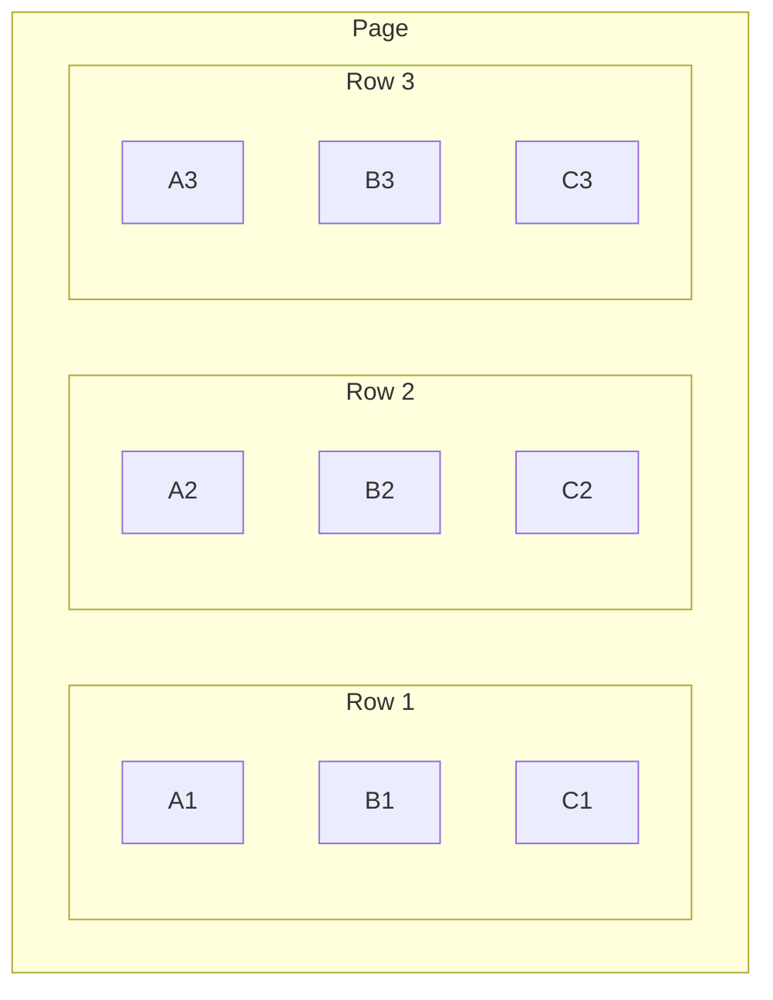
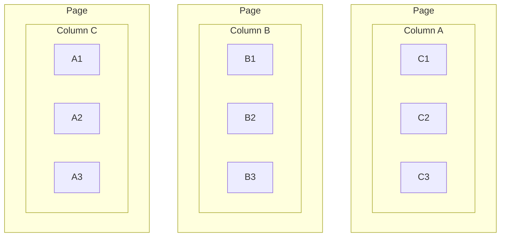

## Introduction

The SQL language, *Structured Query Language*, first emerged in 1974 and is one of the leading languages to this day, when it comes to databases.

SQL evolved a lot throughout the years and especially over the last two decades, with modern data organization techniques, that came up as a response to new competitors (NoSQL) and new needs (analytics, data warehouse, cloud computing).

This article is a SQL cheatsheet, covering some of the most common commands to those that are rare and have interesting uses. This list tries to be easy to understand for beginners and for those who already have some familiarity with the language.

The examples here are for Microsoft SQL Server, but most of them apply in a similar or equal way for other databases, such as PostgreSQL, MySQL and Oracle.
<br>



<br>

[**Before we begin**](#before-we-begin)

  * [Installation](#installation)
  * [Sample tables](#sample-tables)

[**Reads and queries**](#reads-and-queries)

  * [SELECT](#select)
  * [LEFT, RIGHT, INNER JOINS](#left%2C-right%2C-inner-joins)
  * [VIEWS](#views)
  * [GROUP BY, HAVING](#group-by%2C-having)
  * [UNION, INTERSECT, EXCEPT](#union%2C-intersect%2C-except)
  * [SUBQUERIES](#subqueries)
  * [SELF JOIN](#self-join)
  * [CROSS JOIN](#cross-join)
  * [PIVOT](#pivot)
  * [ROLLUP, CUBE, GROUPING SETS](#rollup%2C-cube%2C-grouping-sets)
  * [WINDOW FUNCTION](#window-function)

[**Data changes**](#data-changes)

  * [INSERT, UPDATE, DELETE](#insert%2C-update%2C-delete)
  * [STORED PROCEDURES](#stored-procedures)
  * [MERGE](#merge)
  * [BULK INSERT](#bulk-insert)

[**Table structuring**](#table-structuring)

  * [PRIMARY KEY, FOREIGN KEY](#primary-key%2C-foreign-key)
  * [INDEXES](#indexes)
  * [UNIQUE](#unique)
  * [SPARSE](#sparse)
  * [COLUMNSTORE](#columnstore)

[**Special**](#special)

  * [IMPORT DLLs](#import-dlls)
  * [JSON](#json)
  * [APPLOCKS](#applocks)
  * [VIEW EXECUTION PLAN](#view-execution-plan)

[**Final conclusions**](#final-conclusions)

<br>

# Before we begin

## Installation

To test the examples of this article, I recommend installing SQL Server ([download](https://go.microsoft.com/fwlink/?LinkID=866662)) and SQL Server Management Studio (SSMS) ([download](https://aka.ms/ssmsfullsetup)).

After the installations, enter SSMS and login in your instance:
* Windows Authentication
* Server name: `.` (dot)
* Check *Trust server certificate*

These options may differ according to the configuration during setup.

Then, choose a database in the left panel; if there are none, click with the mouse right button on *Databases* and create one.

To write a SQL script, click on *New query*, in the top menu. To run, press F5 or click on *Execute*.

## Sample tables

Let's start with two tables that will be used in our examples: tables **Fruit** and **Family**.

Table `[dbo].[Fruit]`:

| Id | Name | IdFamily | Calories\* |
|:-:|:-:|:-:|:-:|
| 1 | Coconut | 1 | 354 |
| 2 | Date | 1 | 282 |
| 3 | Strawberry | 3 | 32 |
| 4 | Watermelon | 2 | 30 |
| 5 | Passionfruit | 4 | 97 |
| 6 | Cherry | 3 | 64 |
| 7 | Pineapple | 5 | 48 |
| 8 | Apple | 3 | 52 |

\* Calories per 100g. Source: [Mundo Boa Forma](https://www.mundoboaforma.com.br/tabela-de-calorias-das-frutas/).

Table `[dbo].[Family]`:

| Id | Family |
|:-:|:-:|
| 1 | Arecaceae |
| 2 | Cucurbitaceae |
| 3 | Rosaceae |
| 4 | Passifloraceae |
| 5 | Bromeliaceae |
| 6 | Malvaceae |

To create them, run the following SQL script in your database.

```sql
CREATE TABLE [dbo].[Family](
  [Id] INT NOT NULL IDENTITY(1,1) PRIMARY KEY CLUSTERED,
  [Name] NVARCHAR(64) NOT NULL)
GO

INSERT INTO [dbo].[Family] VALUES
  ('Arecaceae'), ('Cucurbitaceae'), ('Rosaceae'),
  ('Passifloraceae'), ('Bromeliaceae'), ('Malvaceae');
GO

CREATE TABLE [dbo].[Fruit](
  [Id] INT NOT NULL IDENTITY(1,1) PRIMARY KEY CLUSTERED,
  [Name] NVARCHAR(64) NOT NULL,
  [IdFamily] INT NOT NULL FOREIGN KEY REFERENCES [dbo].[Family](Id),
  [Calories] INT NOT NULL)
GO

INSERT INTO [dbo].[Fruit] VALUES 
  ('Coconut', 1, 354), ('Date', 1, 282), ('Strawberry', 3, 32),
  ('Watermelon', 2, 30), ('Passionfruit', 4, 97), ('Cherry', 3, 64),
  ('Pineapple', 5, 48), ('Apple', 3, 52);
GO
```

<br>

# Reads and queries

## SELECT

Gets data in a tabular structure.

```sql
SELECT [Name], [Calories]
FROM [dbo].[Fruit]
WHERE [Calories] < 50
```

Returns:

| Name | Calories |
|:-:|:-:|
| Strawberry | 32 |
| Watermelon | 30 |
| Pineapple | 48 |

`*` means all columns:

```sql
SELECT *
FROM [dbo].[Fruit]
WHERE [Calories] < 50
```

| Id | Name | IdFamily | Calories |
|:-:|:-:|:-:|:-:|
| 3 | Strawberry | 3 | 32 |
| 4 | Watermelon | 2 | 30 |
| 7 | Pineapple | 5 | 48 |

## LEFT, RIGHT, INNER JOINS

Interlaces two or more tables by reference columns; this interlacing can be used for queries, insertions, updates and deletions.

Here we'll focus only on INNER JOIN and LEFT JOIN.

<picture class="my-4">
  <source type="image/avif" srcset="/assets/img/posts/2024_08_sql_joins.avif" alt="Different types of JOINs on SQL" />
  
</picture>

### INNER JOIN

`INNER JOIN` is a perfect intersecction, that is, the interlaced values must exist in both tables. If it exists in a line of table X, but with no corresponding line in another table Y, the line of table X is not considered. Example:

Table `[dbo].[Fruit]`:

| Id | Name | **<mark>IdFamily</mark>** | Calories |
|:-:|:-:|:-:|:-:|
| 3 | Strawberry | **<mark>3</mark>** | 32 |
| 4 | Watermelon | **<mark>2</mark>** | 30 |
| 7 | Pineapple | **<mark>5</mark>** | 48 |

Table `[dbo].[Family]`:

| **<mark>Id</mark>** | Family |
|:-:|:-:|
| **<mark>2</mark>** | Cucurbitaceae |
| **<mark>3</mark>** | Rosaceae |
| **<mark>5</mark>** | Bromeliaceae |

SQL query:

```sql
SELECT
    fr.[Name] AS [Name],
    fa.[Name] AS [Family]
FROM [dbo].[Fruit] fr
INNER JOIN [dbo].[Family] fa ON fr.[IdFamily] = fa.[Id]
WHERE fr.[Calories] < 50
```

Returns:

| Name | Family |
|:-:|:-:|
| Strawberry | Rosaceae |
| Watermelon | Cucurbitaceae |
| Pineapple | Bromeliaceae |

### LEFT / RIGHT JOIN

`LEFT JOIN` and `RIGHT JOIN` are imperfect intersecctions, such that the correspondence value is allowed to not exist in one of the tables; if it doesn't exist, then values from the table with no correspondence will come null.

In the tables above, the *Malvaceae* family (id = 6) has no registered fruit.

```sql
SELECT
    fa.[Name] AS [Family],
    fr.[Name] AS [Fruit]
FROM [dbo].[Family] fa
LEFT JOIN [dbo].[Fruit] fr ON fr.[IdFamily] = fa.[Id]
```

| Family | Fruit |
|:-:|:-:|
| Arecaceae | Coconut |
| Arecaceae | Date |
| Cucurbitaceae | Watermelon |
| Rosaceae | Strawberry |
| Rosaceae | Cherry |
| Rosaceae | Apple |
| Passifloraceae | Passionfruit |
| Bromeliaceae | Pineapple |
| Malvaceae | `NULL` |

## VIEWS

VIEWS are encapsulated queries: instead of always typing a complex query, you can "alias" this query with a view, which simplifies the call. This technique is good for abstracting logic and to control access permissions - an user can call the view, but be blocked from querying the source tables.

View creation:

```sql
CREATE OR ALTER VIEW [dbo].[ViewGetFruits] AS

  SELECT
    fr.[Name] AS [Fruit],
    fa.[Name] AS [Family]
  FROM [dbo].[Fruit] fr
  INNER JOIN [dbo].[Family] fa ON fr.[IdFamily] = fa.[Id]

GO
```

To run:

```sql
-- the view behaves like a table
SELECT * FROM [dbo].[ViewGetFruits]
```

## GROUP BY, HAVING

GROUP BY is a grouping instruction and HAVING is a filter applied over groups.

Columns returned by a SELECT with grouping must be specified on the GROUP BY, or be in aggregation functions, like counts, sums, averages, etc.

Example:

```sql
SELECT fr.[IdFamily], COUNT(fr.[Id]) AS NumberOfFruits
FROM [dbo].[Fruit] fr
GROUP BY fr.[IdFamily]
```

| IdFamily | NumberOfFruits |
|:-:|:-:|
| 1 |	2 |
| 2 |	1 |
| 3 |	3 |
| 4 |	1 |
| 5 |	1 |

With inner join and filter over the groups:

```sql
SELECT fa.[Name] AS [Family], COUNT(fr.[Id]) AS NumberOfFruits
FROM [dbo].[Fruit] fr
INNER JOIN [dbo].[Family] fa ON fr.[IdFamily] = fa.[Id]
GROUP BY fa.[Name]
HAVING COUNT(fr.[Id]) >= 2 -- family w/ 2 or more fruits
```

| Family | NumberOfFruits |
|:-:|:-:|
| Arecaceae | 2 |
| Rosaceae | 3 |

## UNION, INTERSECT, EXCEPT

These are set operators (see [set theory](https://en.wikipedia.org/wiki/Set_theory) in mathematics). They are different from the interlacing that happens in JOINs - while in JOINs the interlacing is between columns, with sets the interlacing is between lines. The examples below show this visually.

* UNION: Returns elements that belong to one set **or** another. 
* INTERSECT: Returns elements that belong to one set **and** another, at the same time.
* EXCEPT: Returns elements that belong to one set, **but not to** another.

```sql
DECLARE @a TABLE (X INT);
INSERT INTO @a VALUES (1),(2),(3),(4),(5);

DECLARE @b TABLE (X INT);
INSERT INTO @b VALUES (2),(4),(6);

SELECT * FROM @a

UNION -- INTERSECT, EXCEPT

SELECT * FROM @b
```

| A | B | UNION | INTERSECT | EXCEPT |
|:-:|:-:|:-:|:-:|:-:|
| 1 | 2 | 1 | 2 | 1 |
| 2 | 4 | 2 | 4 | 3 |
| 3 | 6 | 3 | - | 5 |
| 4 | - | 4 | - | - |
| 5 | - | 5 | - | - |
| - | - | 6 | - | - |

> Why use an UNION when I can just write `WHERE criterion1 OR criterion2` ?

Sometimes we want to unite lines from different tables:

```sql
SELECT * FROM Table1 WHERE criterion1
UNION
SELECT * FROM Table2 WHERE criterion2
```

> What is UNION ALL?

In set theory, a set cannot have repeated elements. However, in SQL queries, sometimes we want to allow duplications in a union, for that, we use UNION ALL, instead of just UNION.

## SUBQUERIES

These are queries that run inside others. They can be useful in more complex operations, however, whenever possible, it is best to pick joins over subqueries, for better performance.

In the example below, the fruit family's name is obtained through a subquery:

```sql
SELECT
    fr.[Name] AS [Name],
    (SELECT fa.[Name] FROM [dbo].[Family] fa WHERE fa.[Id] = fr.[IdFamily]) AS [Family]
FROM [dbo].[Fruit] fr
WHERE fr.[Calories] < 50
```

## SELF JOIN

Is a join of table with itself. Useful for tree operations.

Below, we have a Employee table and an employee can be someone else's boss.

```sql
DECLARE @employee TABLE (Id INT, [Name] NVARCHAR(32), IdBoss INT);
INSERT INTO @employee VALUES
(1, 'Mark', 4),
(2, 'John', NULL),
(3, 'Michael', 2),
(4, 'Rachel', 2),
(5, 'Jessica', 4);

SELECT
  f1.[Name] AS [Employee],
  f2.[Name] AS [Boss]
FROM @employee f1
LEFT JOIN @employee f2 ON f1.[IdBoss] = f2.[Id]
ORDER BY f2.[Id] ASC
```

| Employee | Boss |
|:-:|:-:|
| John | `NULL` |
| Michael | John |
| Rachel | John |
| Jessica | Rachel |
| Mark | Rachel |

## CROSS JOIN

It is the cartesian product between tables, basically, it makes all possible combinations of elements of one table to another.

Consider two tables, IceCream and Topping, and we want to know what combinations we can have.

```sql
DECLARE @icecream TABLE (Id INT, [Name] NVARCHAR(32));
INSERT INTO @icecream VALUES
(1, 'Strawberry'), (2, 'Flake'), (3, 'Chocolate');

DECLARE @topping TABLE (Id INT, [Name] NVARCHAR(32));
INSERT INTO @topping VALUES
(1, 'Chocolate syrup'), (2, 'Nuts');

SELECT i.[Name] AS IceCream, t.[Name] AS Topping
FROM @icecream i CROSS JOIN @topping t
ORDER BY i.[Id] ASC, t.[Id] ASC
```

| IceCream | Topping |
|:-:|:-:|
| Strawberry | Chocolate syrup |
| Strawberry | Nuts |
| Flake | Chocolate syrup |
| Flake | Nuts |
| Chocolate | Chocolate syrup |
| Chocolate | Nuts |

## PIVOT

<picture class="my-4">
  <source type="image/avif" srcset="/assets/img/posts/2024_08_friends_pivot.avif" alt="Ross asking to rotate the couch - Friends" />
  
</picture>

The PIVOT instruction is very interesting. It transforms lines into columns, by rotating part of the table in 90º. It is very good for crossing two or more columns of a table.

In the example below, we have a table Sales with each line being the quantity of a product sold on a certain day. We want to visualize this in a better way, with date columns, and for that we will use PIVOT.

```sql
DECLARE @sales TABLE (IdProduct INT, Quantity INT, SalesDate DATE);
INSERT INTO @sales VALUES
(5, 52, '2024-08-05'),
(3, 902, '2024-08-05'),
(1, 196, '2024-08-06'),
(4, 212, '2024-08-06'),
(3, 488, '2024-08-07'),
(4, 384, '2024-08-07'),
(1, 1121, '2024-08-08'),
(2, 49, '2024-08-08'),
(3, 88, '2024-08-09'),
(2, 12, '2024-08-09'),
(5, 98, '2024-08-09');

SELECT * FROM
(
  SELECT [SalesDate], [IdProduct], [Quantity]
  FROM @sales
) t
PIVOT(
  SUM([Quantity]) FOR [SalesDate] IN ([2024-08-05],[2024-08-06],[2024-08-07],[2024-08-08],[2024-08-09])
) AS pvt;
```

| IdProduct | 2024-08-05 | 2024-08-06 | 2024-08-07 | 2024-08-08 | 2024-08-09 |
|:-:|:-:|:-:|:-:|:-:|:-:|
| 1 | NULL | 196 | NULL | 1121 | NULL |
| 2 | NULL | NULL | NULL | 49 | 12 |
| 3 | 902 | NULL | 488 | NULL | 88 |
| 4 | NULL | 212 | 384 | NULL | NULL |
| 5 | 52 | NULL | NULL | NULL | 98 |

> What if I want to generate columns dynamically, with no fixed values for them?

You can generate the command's text at runtime and then run it. [This article](https://www.sqlshack.com/dynamic-pivot-tables-in-sql-server/) shows how to do it inside a procedure:

```sql
CREATE PROCEDURE dbo.GenerateStudentsReportCards
  @ColumnToPivot  NVARCHAR(255),
  @ListToPivot   NVARCHAR(255)
AS
BEGIN
 
  DECLARE @SqlStatement NVARCHAR(MAX)
  SET @SqlStatement = N'
    SELECT * FROM (
      SELECT [Student], [Subject], [Marks]
      FROM [Grades]
    ) StudentResults
    PIVOT (
      SUM([Marks])
      FOR ['+@ColumnToPivot+']
      IN ('+@ListToPivot+')
    ) AS PivotTable'; 
  EXEC(@SqlStatement)
 
END
```

To run:

```sql
EXEC dbo.GenerateStudentsReportCards
  N'Subject'
  ,N'[Mathematics],[Science],[Geography]'
```

## ROLLUP, CUBE, GROUPING SETS

These are types of groupings that also analyze subgroups.

```sql
DECLARE @sales TABLE (IdProduct INT, Quantity INT, SalesDate DATE);
INSERT INTO @sales VALUES
(5, 52, '2024-08-05'),
(3, 902, '2024-08-05'),
(1, 196, '2024-08-06'),
(4, 212, '2024-08-06'),
(3, 488, '2024-08-07'),
(4, 384, '2024-08-07');

SELECT [SalesDate], [IdProduct], SUM([Quantity]) AS [Quantity]
FROM @sales
GROUP BY ROLLUP([SalesDate],[IdProduct]) -- CUBE, GROUPING SETS
```

### ROLLUP

Analyzes subgroups on a pyramid, from the right to left in the declaration. `GROUP BY ROLLUP([ColA], [ColB])` will check:
  * [ColA], [ColB] (subgroup of A and B)
  * [ColA], NULL (subgroup of A for all values of B)
  * NULL, NULL (general group)

| SalesDate | IdProduct | Quantity |
|:-:|:-:|:-:|
| 2024-08-05 | 3 | 902 |
| 2024-08-05 | 5 | 52 |
| 2024-08-05 | NULL | 954 |
| 2024-08-06 | 1 | 196 |
| 2024-08-06 | 4 | 212 |
| 2024-08-06 | NULL | 408 |
| 2024-08-07 | 3 | 488 |
| 2024-08-07 | 4 | 384 |
| 2024-08-07 | NULL | 872 |
| NULL | NULL | 2234 |

### CUBE

Analyzes all possible subgroups. `GROUP BY CUBE([ColA], [ColB])` will check:
  * [ColA], [ColB] (subgroup of A and B)
  * [ColA], NULL (subgroup of A for all values of B)
  * NULL, [ColB] (subgroup of B for all values of A)
  * NULL, NULL (general group)

| SalesDate | IdProduct | Quantity |
|:-:|:-:|:-:|
| 2024-08-06 | 1 | 196 |
| NULL | 1 | 196 |
| 2024-08-05 | 3 | 902 |
| 2024-08-07 | 3 | 488 |
| NULL | 3 | 1390 |
| 2024-08-06 | 4 | 212 |
| 2024-08-07 | 4 | 384 |
| NULL | 4 | 596 |
| 2024-08-05 | 5 | 52 |
| NULL | 5 | 52 |
| NULL | NULL | 2234 |
| 2024-08-05 | NULL | 954 |
| 2024-08-06 | NULL | 408 |
| 2024-08-07 | NULL | 872 |

### GROUPING SETS

Analyzes the subgroups of each column, but without crossing them. `GROUP BY GROUPING SETS([ColA], [ColB])` checks:
  * [ColA], NULL (subgroup of A for all values of B)
  * NULL, [ColB] (subgroup of B for all values of A)

| SalesDate | IdProduct | Quantity |
|:-:|:-:|:-:|
| NULL | 1 | 196 |
| NULL | 3 | 1390 |
| NULL | 4 | 596 |
| NULL | 5 | 52 |
| 2024-08-05 | NULL | 954 |
| 2024-08-06 | NULL | 408 |
| 2024-08-07 | NULL | 872 |

## WINDOW FUNCTION

They are functions that generate values looking over slices (or windows) of a table. They are very useful for pagination, like product searches.

This is a lengthy subject and with many possibilities, which is why I will not cover it here, but, I recommend [this article](https://www.sqlshack.com/use-window-functions-sql-server/) that explains very well how window functions work.

<br>

# Data changes

## INSERT, UPDATE, DELETE

Adds, modifies and excludes lines from a table.

```sql
DECLARE @person TABLE (Id INT, [Name] NVARCHAR(32));

-- inserting with VALUES
INSERT INTO @person VALUES
(1, 'Mario'), (2, 'Caroline');

-- inserting with SELECT
INSERT INTO @person SELECT 3, 'James';

-- changing name
UPDATE @person
SET [Name] = 'Maria'
WHERE [Id] = 1;

-- deleting person
DELETE FROM @person
WHERE [Name] = 'James';

-- final result
SELECT * FROM @person
```

## STORED PROCEDURES

They are scripts that accept parameters and execute actions in the database; they can return table-valued results and numerical values.

The procedure below can be used to add fruits (considering the example [from the beginning](#sample-tables)).

```sql
CREATE OR ALTER PROCEDURE [dbo].[ProcAddFruit]
  @fruit NVARCHAR(32),
  @family NVARCHAR(32),
  @calories INT
AS
BEGIN

  -- checks if the fruit is already registered
  IF EXISTS (SELECT 1 FROM [dbo].[Fruit] WHERE [Name] = @fruit)
  BEGIN
    RAISERROR('Fruit already registered!', 16, 1)
    RETURN 1; -- stop execution
  END

  -- adds fruit family if it doesn't exist
  IF NOT EXISTS (SELECT 1 FROM [dbo].[Family] WHERE [Name] = @family)
  BEGIN
    INSERT INTO [dbo].[Family] VALUES (@family);
  END

  -- get family id
  DECLARE @idFamily INT = (SELECT [Id] FROM [dbo].[Family] WHERE [Name] = @family)

  -- adds fruit
  INSERT INTO [dbo].[Fruit] VALUES (@fruit, @idFamily, @calories);

  RETURN 0; -- everything OK

END
GO
```

To run:

```sql
EXECUTE [dbo].[ProcAddFruit]
  @fruit = 'Orange',
  @family = 'Rutaceae',
  @calories = 37
```

## MERGE

Allows simultaneous execution of insertions, updates and deletions, comparing a source table to a target table. This instruction is used for sincronizing different data sources. If the sincronizations are always of the same type (insertions, updates, deletes), then using these specific operations offers better performance.

I will not enter into details here, but, I recommend [this article](https://www.sqlservertutorial.net/sql-server-basics/sql-server-merge/) for those interested.

```sql
MERGE target_table USING source_table
ON merge_condition
WHEN MATCHED THEN update_statement
WHEN NOT MATCHED THEN insert_statement
WHEN NOT MATCHED BY SOURCE THEN DELETE;
```

## BULK INSERT

BULK INSERT is a mass insertion of data coming from a file, usually in CSV or XML formats, or a flat file.

This is a strategy to move large volumes of data from one place to another, especially if flat files are chosen, because they are very compact and have very high compression rates (example: a 900MB flat file, when zipped, can be reduced to 30MB, depending on the situation).

Consider the flat file below. Note that the starting positions of each field are always the same on a line - fruit name (0..16), family name (16..32), calories (32..35):

```
Graviola        Annonaceae      66 
Mamão Papaya    Caricaceae      46 
Cambucá         Myrtaceae       66 
Bacuri          Clusiaceae      105
Cupuaçu         Malvaceae       49 
```

To import a file using BULK INSERT, I recommend 1) using a format file and 2) first insert into an intermediary table, because many times we need to polish data, by trimming whitespaces or converting dates. The following is a XML format file.

```xml
<?xml version="1.0"?>
<BCPFORMAT xmlns="http://schemas.microsoft.com/sqlserver/2004/bulkload/format" xmlns:xsi="http://www.w3.org/2001/XMLSchema-instance">
	<RECORD>
		<FIELD ID="F1" xsi:type="CharFixed" LENGTH="16"/><!-- Fruit name -->
		<FIELD ID="F2" xsi:type="CharFixed" LENGTH="16"/><!-- Family name -->
		<FIELD ID="F3" xsi:type="CharFixed" LENGTH="3"/><!-- Calories -->
		<FIELD ID="F4" xsi:type="CharTerm" TERMINATOR="\r\n" MAX_LENGTH="6"/><!-- Line break -->
	</RECORD>
	<ROW>
		<COLUMN SOURCE="F1" NAME="FruitName" xsi:type="SQLVARYCHAR" LENGTH="16" NULLABLE="NO"/>
		<COLUMN SOURCE="F2" NAME="FamilyName" xsi:type="SQLVARYCHAR" LENGTH="16" NULLABLE="NO"/>
		<COLUMN SOURCE="F3" NAME="Calories" xsi:type="SQLINT"/>
	</ROW>
</BCPFORMAT>
```

To run a BULK INSERT:

```sql
CREATE TABLE #temp1
(Fruit NVARCHAR(16), Family NVARCHAR(16), Calories INT);

BULK INSERT #temp1 
FROM 'C:\MyFolder\flat_file.txt' 
WITH 
(
  CODEPAGE = '65001', -- UTF-8 with BOM encoding
  FORMATFILE = 'C:\MyFolder\format_file.xml', 
  BATCHSIZE = 4000
);

-- polishing
UPDATE #temp1
SET [Fruit] = TRIM([Fruit]),
    [Family] = TRIM([Family])

SELECT * FROM #temp1

DROP TABLE #temp1
```

Read more on the official docs:

* [BULK INSERT command](https://learn.microsoft.com/en-us/sql/t-sql/statements/bulk-insert-transact-sql?view=sql-server-ver16)
* [Use a format file to bulk import data](https://learn.microsoft.com/en-us/sql/relational-databases/import-export/use-a-format-file-to-bulk-import-data-sql-server?view=sql-server-ver16)
* [XML Format Files](https://learn.microsoft.com/en-us/sql/relational-databases/import-export/xml-format-files-sql-server?view=sql-server-ver16)

### Exporting flat files

Unfortunately, there are no easy ways of generating files straight from the database; for SQL Server, there is only the *Import / Export Wizard*, which is a graphical interface inside SSMS.

However, a simple console application could read lines from the database and output a flat file from them.

<br>

# Table structuring

## PRIMARY KEY, FOREIGN KEY

The primary key uniquely identifies each row of a table and determines what is the main search column, structuring the table in a [B-tree](https://en.wikipedia.org/wiki/B-tree); this makes reading it much faster.

The foreign key is a link between the column of one table to the primary key of another. This increases performance of joins between those tables and is also a form of validation, because a value is only valid if it exists in the foreign table.

Taking the initial example:

```sql
CREATE TABLE [dbo].[Fruit](
  [Id] INT NOT NULL IDENTITY(1,1) PRIMARY KEY CLUSTERED,
  [Name] NVARCHAR(64) NOT NULL,
  [IdFamily] INT NOT NULL FOREIGN KEY REFERENCES [dbo].[Family](Id),
  [Calories] INT NOT NULL)
```

## INDEXES

They are additional search rails on a table that run parallel to the primary key. They are useful for tables with more than one search criteria.

Imagine a Person table, with columns Id, NationalIdentifier and Name: it's common to search a person by its national identifier or name, but, these columns are not the primary key, which makes searching by them slower. In these cases, the search is done individually line by line, over the whole table; moreover, it's a textual comparison, because NationalIdentifier and Name are texts. Textual comparisons are slower than numerical comparisons, which is the case of Id.

To speed the search, we can create indexes. The most common type is the *hash index*, which attributes a random number to each indexed value and saves this number next to the record. Whenever a search comes to use this criterion, the comparison will be numerical and with better performance than checking the field's value on every line.

Index creation:

```sql
-- one column
CREATE INDEX IX_Person_NationalIdentifier ON [dbo].[Person]([NationalIdentifier]);

-- more than one column
CREATE INDEX IX_Address_CityStateCountry
ON [dbo].[Address]([City],[State],[Country]);
```

## UNIQUE

It's a special type of constraint that blocks repeated values in a column. In most databases, creating an unique constraint also creates an index for this column.

```sql
CREATE TABLE [dbo].[Person] (  
  Id INT NOT NULL PRIMARY KEY CLUSTERED,
  NationalIdentifier CHAR(11) NOT NULL,
  [Name] NVARCHAR(64) NOT NULL,
  CONSTRAINT CT_Unique_Person_NationalIdentifier UNIQUE([NationalIdentifier])
);
```

## SPARSE

Sparse is a column modifier that optimizes storage when there are many null values.

In traditional storage, a field has a reserved amount of bytes for it in the line even when its value is null, which is a waste.

With sparse columns, a null value occupies zero bytes on the line and a non-null value occupies the original size plus 4 bytes.

Practical example, `NVARCHAR(16)` column needs 32 bytes on each line. With sparse, if null, 0 bytes will be used; if not null, 36 bytes.

| Percentage of nulls | Column size difference<br>with SPARSE |
|:-:|:-:|
| 0% | +12.5% |
| 25% | -15.6% |
| 75% | -71.9% |

Formula: `1 - ((T+4)/T) * (1-N)`
  * **T** : original field size
  * **N** : percentage of nulls

If there are not many nulls, there is no advantage in using sparse columns, but they save space if the percentage of nullability is high.

```sql
CREATE TABLE [dbo].[Person] (  
  Id INT NOT NULL PRIMARY KEY CLUSTERED,
  NationalIdentifier CHAR(11) NOT NULL,
  [Name] NVARCHAR(64) NOT NULL,
  FavouriteColour NVARCHAR(32) SPARSE NULL);
```

## COLUMNSTORE

*Columnstore* is a storage strategy.

The default storage mode of a table is linear, with rows laid inside pages. A, B and C are columns:



With columnar storage, a page is exclusive for a column:



What is the advantage of this approach? Columnar storage has compression by default and if values frequently repeat in columns, the storage size can be greatly reduced.

See below how columnar compression works:

| Uncompressed column | Compressed column |
|:-:|:-:|
| A | **5 x A** |
| A | **2 x B** |
| A | **3 x A** |
| A |  |
| A |  |
| B |  |
| B |  |
| A |  |
| A |  |
| A |  |

According to SQL Server [docs](https://learn.microsoft.com/en-us/sql/relational-databases/indexes/columnstore-indexes-overview?view=sql-server-ver16), the storage size can be up to 10x smaller and the reading speed up to 10x higher, compared to a linear storage.

### When to use columnstore

* High number of repetitions of values in vertical directions.
* Low cardinality (possible variations of values).
* High volume of data (over 500k lines).
* Analytical processes: sums, averages, counts.

### When not to use columnstore

* Records that have many updates and deletes, because compression is lost when there are changes.
* Records that are entities, because **columnstore tables have no primary keys**.
* If this table is used for many joins.

### Clustered vs nonclustered

A **clustered** columnstore index is when the table uses columnar storage. A **nonclustered** columnstore index is when the table uses linear storage and columnstore is an auxiliary index; this is an option when you want the benefits of columnstore (analytical performance) without losing the benefits of linear tables (primary keys).

### Table creation

```sql
CREATE TABLE [dbo].[EntryFruitFile](
	Fruit NVARCHAR(16) NOT NULL,
	Family NVARCHAR(16) NOT NULL,
	Calories INT NOT NULL,
	INDEX CCI_EntryFruitFile CLUSTERED COLUMNSTORE);
```

<br>

# Special

## IMPORT DLLs

Yes, it is possible to import DLLs to execute on SQL Server.

Custom DLLs are interesting for use cases where there is no native similar, like: read and write files; HTTP calls; generate and validate hashes.

DLLs must be .NET Framework source code and signed with a strong name.

The process is a bit complex and the steps here are based on [this article](https://www.c-sharpcorner.com/article/assembly-in-ms-sql-server/) from C-Sharp Corner.:

1. Create a Class Library project in .NET Framework
2. C# code example below:

```cs
using System;

namespace MyDotnetSqlProj
{
    public static class Class1
    {
        public static double CalculateHypotenuse(double side1, double side2) =>
            Math.Sqrt(Math.Pow(side1, 2) + Math.Pow(side2, 2));
    }
}
```

3. On Visual Studio, click with the mouse right button on the project, *Properties*, *Signing*, check **Sign the assembly**. Choose or make a new strong name key file. If you are creating, you can uncheck *Protect my key file with a password*.
4. Build the project.
5. Now, we must import the assymetric signing key, create a login in the `master` database and concede UNSAFE ASSEMBLY permission to it:

```sql
USE [master]
GO

CREATE ASYMMETRIC KEY AssymetricKey1
FROM EXECUTABLE FILE = 'C:\Projects\MyDotnetSqlProj\bin\Debug\MyDotnetSqlProj.dll';
GO

CREATE LOGIN LoginAssymetricKey1
FROM ASYMMETRIC KEY AssymetricKey1;
GO

GRANT UNSAFE ASSEMBLY TO LoginAssymetricKey1;
GO
```

6. In the application database, create an user for the recently created login, import the assembly and enable CLR execution:

```sql
USE [YourDB];
GO

CREATE USER UserLoginAssymetricKey1
FOR LOGIN LoginAssymetricKey1;
GO

CREATE ASSEMBLY AssemblyMyLib
FROM 'C:\Projects\MyDotnetSqlProj\bin\Debug\MyDotnetSqlProj.dll'
WITH PERMISSION_SET = SAFE;
GO

sp_configure 'clr enabled', 1;
GO
RECONFIGURE;
GO
```

7. Let's create a FUNCTION that calls the DLL's code:

```sql
USE [YourDB];
GO

-- for string, use NVARCHAR parameters
CREATE FUNCTION [dbo].[CalculateHypotenuse] (@side1 FLOAT, @side2 FLOAT)
RETURNS FLOAT
AS
  EXTERNAL NAME [AssemblyMyLib].[MyDotnetSqlProj.Class1].[CalculateHypotenuse];
GO
```

8. To execute the function:

```sql
-- returns 5
SELECT [dbo].[CalculateHypotenuse] (3.0, 4.0) as [Hypotenuse];

-- returns 13
SELECT [dbo].[CalculateHypotenuse] (5.0, 12.0) as [Hypotenuse];
```

## JSON

To handle JSONs inside the database.

```sql
DECLARE @json NVARCHAR(100) =
'{"cities": ["Aracaju", "João Pessoa", "Maceió"]}';

-- returns 3 lines with the cities
SELECT * FROM OPENJSON(@json, '$.cities')

-- returns 1 line with the selected city
SELECT JSON_VALUE(@json, '$.cities[1]')
```

Check more in the [docs](https://learn.microsoft.com/en-us/sql/relational-databases/json/json-data-sql-server?view=sql-server-ver16).

## APPLOCKS

They are application locks inside the database. They are different from row locks.

Can be used for concurrency control, such as for reading messages with multiple simultaneous consumers.

The SQL Server functions are `sp_getapplock` and `sp_releaseapplock`.

Learn more in the article about [asynchronous architecture without queues](https://alexandrehtrb.github.io/posts/2024/06/asynchronous-architecture-without-queues/#messages-in-databases).

## VIEW EXECUTION PLAN

The execution plan describes which steps the database engine needs to perform to execute a command or query.

On SSMS, enabling the *Include execution plan* on the top menu will include the plan along with query results.

By analyzing the cost of each step, you can understand which performance bottlenecks exist and from there improve your query, by creating indexes, rewriting WHERE and JOIN criteria, and others.



<br>

# Final conclusions



SQL is an extremely powerful and complete tool, and acquired new capabilities over the years. It is no wonder that remains being the mainstream for databases up to today; it is the basis for complex systems.

This article covered common and less known SQL features, and still there are many others that could be addressed here with real world applications, therefore, it is worth it to explore the documentation of your database, because for many times it has the answer for a challenge you might be facing.