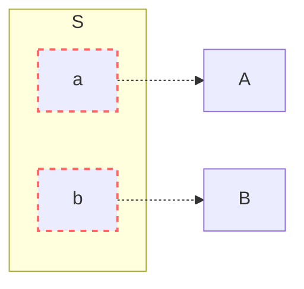

An interface is how two different things communicate with each other.

In the field of engineering, interfaces are very useful for abstracting the macro logic of a system. With them, components can focus on specific tasks, and interfaces define how they connect to each other.



Let's analyse here some benefits of interfaces.

### Reuse

Interfaces enable a component to be designed to support multiple systems.

### Repurposing

It's similar to reuse, but reuse is about designing a component to support many use cases; repurposing is about using an existing component, instead of creating a new one.

### Interchangeability

Parts can be replaced with equivalent ones — from a different supplier, for example.

### Work parallelism

Different teams can work in parallel on each component, resulting in a faster final product delivery.

### Risk mitigation

It's related to work parallelism. Problems on one work front do not affect other work fronts.

### Machinery costs

The production of a part requires machines, that cost money. Delegating this production to other teams or companies avoids this cost.

### Specialization

Teams and companies with specific knowledge of a type of component produce them with higher quality.

### Unit tests

Interfaces enable isolated testing of a component, such that external dependencies are ***mocked***, i.e., replaced with simulations or imitations. Because these are individualized tests, there is a higher level of attention and focus on the component itself, and it's not necessary for the entire system to be finished in order to test the component.

This also contributes to ***shift-left testing***, which is the anticipation of quality assurance on the workflow — unit tests highlight problems earlier in the process.





## Examples of interfaces in engineering

### Computers

The hardware of a computer is extremely modular, making it easy to swap parts during repairs or upgrades.





- Any processor with the same socket as the motherboard can be used;
- Any RAM memory stick with the same socket (e.g. DIMM, SO-DIMM) and the same class (e.g. DDR3, DDR4, DDR5) as the motherboard is accepted;
- Any SATA device is accepted: hard drives, CD/DVD drives.
- Any power supply can be used, as long as it provides power through the motherboard's corresponding connector (e.g. ATX);
- And last but not least, a motherboard can be changed while keeping other parts.

### Plumbing and electrical systems



Plumbing and electrical systems are also highly modularized.

- Circuit breakers and valves enable subsytems to be isolated and repaired without affecting others.
- Parts can be easily replaced.
  - For electrical: outlets, lamps, switches, circuit breakers; parts just need to comply with voltage and maximum current specifications.
  - For plumbing: siphons, faucets, shower heads; parts just need to comply with the plumbing diameter.
- The exception is repairs on conduits and pipes, usually located inside walls and under floors, but issues with those parts tend to be rarer.

 

# Possible drawbacks

### Energy and material efficiency

Connections consume energy and materials during construction and operation phases. In condensed or directly linked components, these losses are mitigated or even eliminated.

### System cohesion

In every connection, there is the risk of component mismatch. Reducing the number of intermediaries makes the system more cohesive.

### Freedom of innovation

Interfaces defined by third parties may not fulfill a use case in the best possible way. In these situations, it may be beneficial to deviate from existing standards and create your own interfaces.

## Case study: Aviation fuel in airports

Airports need aviation fuel (usually kerosene) to refill aircrafts' tanks.

At small and medium-sized airports, kerosene is delivered by tanker trucks to storage tanks. At large airports with high fuel demand, however, kerosene is supplied via pipelines, directly from refineries.

These pipelines are expensive to build, but the high demand justifies their cost, and the operation is cheaper and more efficient than relying on tanker trucks.

During the 2018 Brazil truck drivers' strike, airports that relied on tanker trucks suffered from fuel shortages and some of them had their operations paralysed. On the other hand, airports served by pipelines (Cumbica and Galeão) kept their operations as usual.



 

# Conclusion

The concept of interfaces originates from the idea of interchangeable parts, and their use results in better, more reliable systems, that are cheaper, easier to maintain, and quicker to build. Moreover, interfaces contribute to the reuse of parts, preventing the need to replace entire systems.

In some cases, nevertheless, creating your own interfaces, or "cutting out the middleman", can make your system more cohesive and efficient.

 

# Sources and interesting reads

- [Mermaid diagrams](https://mermaid.live)
- [Wikipedia - Interchangeable parts](https://en.wikipedia.org/wiki/Interchangeable_parts)
- [One Day Testing Blog - Shift Left Testing: A prática de teste que antecipa problemas e acelera entregas](https://blog.onedaytesting.com.br/shift-left-testing/)
- [Lightrun - Shift Left Testing: 6 Essentials for Successful Implementation](https://lightrun.com/shift-left-testing/)
- [How Stuff Works - How Motherboards Work](https://computer.howstuffworks.com/motherboard1.htm)
- [Wikipedia - 2018 Brazil truck drivers' strike](https://en.wikipedia.org/wiki/2018_Brazil_truck_drivers%27_strike)
- [G1 - Só 8 aeroportos no país estão sendo reabastecidos regularmente, entre eles Guarulhos, Congonhas, Galeão e Santos Dumont (05/25/2018)](https://g1.globo.com/economia/noticia/so-8-aeroportos-no-pais-estao-sendo-reabastecidos-regularmente-entre-eles-guarulhos-congonhas-galeao-e-santos-dumont.ghtml)
- [Confederação Nacional do Transporte - Saiba como funciona o abastecimento em dois dos maiores aeroportos do Brasil](https://www.cnt.org.br/agencia-cnt/saiba-como-funciona-abastecimento-maiores-aeroportos)