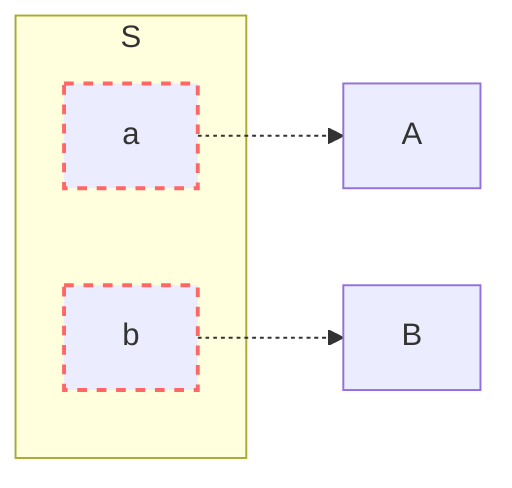

Uma interface é o modo como duas coisas diferentes se comunicam.

Em engenharia, interfaces são muito úteis para abstrair a lógica macro de um sistema. Com elas, componentes podem focar em funções específicas e as interfaces definem como eles se conectam.



Vamos analisar aqui benefícios das interfaces com um olhar para produtos de engenharia de modo geral.

### Reúso

Interfaces permitem que um componente seja projetado para atender mais de um sistema.

### Reaproveitamento

O raciocínio é parecido com o do reúso, porém, o reúso trata da concepção de um componente visando atender vários casos de uso; reaproveitamento trata-se de usar um componente já existente, ao invés de criar um novo.

### Intercambialidade

Partes podem ser trocadas por outras equivalentes.

### Paralelismo de trabalho

Times distintos podem trabalhar em paralelo nas partes, entregando mais rapidamente o produto final.

### Dissipação de risco

Está relacionado ao paralelismo de trabalho. Problemas em uma frente de trabalho não afetam outras frentes.

### Custos de maquinário

A produção de uma peça requer máquinas, que custam dinheiro. Repassar a produção para outros evita esse custo.

### Especialização

Times e empresas com conhecimentos específicos sobre um tipo de componente os produzem com melhor qualidade.

### Testes unitários

Interfaces possibilitam testes de forma isolada no componente, tal que as dependências externas são substituídas por simulações ou imitações - em inglês, ***mocks***. Por serem testes individualizados, há mais atenção e foco no componente em si, além de não ser necessário ter todo o sistema pronto para então validá-lo.

Isso também contribui para o ***shift-left testing***, que é a idéia de antecipar validações no fluxo de trabalho: ao realizar testes isoladamente, problemas ficam visíveis mais cedo no processo.





## Exemplos de interfaces em engenharia

### Computadores

O *hardware* dos computadores é extremamente modular, o que facilita trocar partes em manutenções e *upgrades*.





- Qualquer processador que tenha o mesmo soquete que a placa-mãe pode ser usado;
- Qualquer pente de memória RAM que tenha o mesmo soquete (ex.: DIMM, SO-DIMM) e mesma classe (ex.: DDR3, DDR4, DDR5) que a placa-mãe é aceito;
- Qualquer dispositivo com interface SATA é aceito: discos rígidos, leitoras de CD/DVD.
- Qualquer fonte de energia pode ser usada, desde que forneça através do conector correspondente da placa-mãe (ex.: ATX).
- Por fim, uma placa-mãe pode ser trocada reaproveitando as demais partes.

### Redes elétricas e hidráulicas



Instalações elétricas e hidráulicas também são altamente modularizadas.

- Disjuntores elétricos e registros hidráulicos permitem que subsistemas sejam isolados e reparados sem afetar outros.
- Terminais podem ser substituídos com facilidade.
  - Para elétrica: tomadas, lâmpadas, interruptores, disjuntores; basta atender à tensão (voltagem) e corrente máxima (amperagem).
  - Para hidráulica: sifões, torneiras, chuveiros - basta atender ao tamanho das conexões.
- A exceção é reparos dentro da alvenaria, como em conduítes e encanamentos, porém, problemas neles tendem a ser mais raros.

 

# Possíveis contrapartidas

### Eficiência energética e material

Conexões consomem energia e material, na construção e na operação. Em componentes condensados ou com ligações diretas, essas perdas são mitigadas ou até mesmo eliminadas.

### Coesão do sistema

Em toda conexão, há o risco de descasamento entre as partes. Diminuir o número de intermediários torna o sistema mais coeso.

### Liberdade de inovação

Interfaces definidas por terceiros podem não atender da melhor forma possível um caso de uso em questão. Nessas situações, pode ser interessante romper padrões de mercado e criar suas próprias interfaces.

## Caso de estudo: Querosene de aviação em aeroportos

Aeroportos precisam de querosene de aviação (QAV) para abastecer as aeronaves.

Em aeroportos pequenos e médios, o QAV chega aos reservatórios via caminhões-tanque, que saem das distribuidoras. Porém, em aeroportos grandes e com alto consumo de combustível, o QAV chega via dutos que saem diretamente das refinarias, chamados de querodutos.

Os querodutos são caros de serem construídos, porém a demanda elevada justifica e a operação acaba sendo mais barata e eficiente do que usar caminhões-tanque.

Durante a greve dos caminhoneiros de 2018, aeroportos brasileiros que dependiam de caminhões-tanque sofreram com escassez de combustível e alguns tiveram suas atividades paralisadas. Já os aeroportos servidos por querodutos, Cumbica e Galeão, continuaram funcionando normalmente.



 

# Conclusão

O conceito de interfaces vem da idéia de partes intercambiáveis e sua utilização resulta em sistemas melhores, mais confiáveis, mais baratos, de manutenção mais fácil e mais rápidos de serem desenvolvidos. Além disso, contribuem para o reúso de partes, evitando que sistemas precisem ser trocados por inteiro.

Em alguns casos, contudo, desenhar sua própria interface, ou então "cortar o intermediário", pode tornar o sistema mais coeso e eficiente.

 

# Fontes e leituras interessantes

- [Diagramas Mermaid](https://mermaid.live)
- [Wikipédia - Partes intercambiáveis](https://en.wikipedia.org/wiki/Interchangeable_parts) (em inglês)
- [One Day Testing Blog - Shift Left Testing: A prática de teste que antecipa problemas e acelera entregas](https://blog.onedaytesting.com.br/shift-left-testing/)
- [Lightrun - Shift Left Testing: 6 Essentials for Successful Implementation](https://lightrun.com/shift-left-testing/)
- [How Stuff Works - How Motherboards Work](https://computer.howstuffworks.com/motherboard1.htm)
- [Wikipédia - Greve dos caminhoneiros no Brasil em 2018](https://pt.wikipedia.org/wiki/Greve_dos_caminhoneiros_no_Brasil_em_2018)
- [G1 - Só 8 aeroportos no país estão sendo reabastecidos regularmente, entre eles Guarulhos, Congonhas, Galeão e Santos Dumont (25/05/2018)](https://g1.globo.com/economia/noticia/so-8-aeroportos-no-pais-estao-sendo-reabastecidos-regularmente-entre-eles-guarulhos-congonhas-galeao-e-santos-dumont.ghtml)
- [Confederação Nacional do Transporte - Saiba como funciona o abastecimento em dois dos maiores aeroportos do Brasil](https://www.cnt.org.br/agencia-cnt/saiba-como-funciona-abastecimento-maiores-aeroportos)