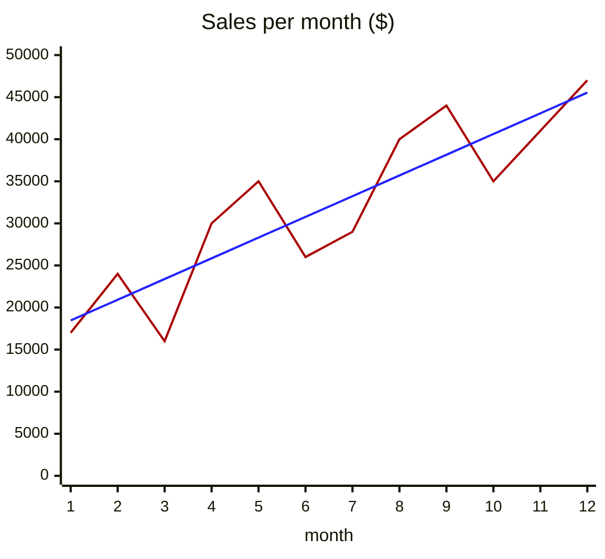
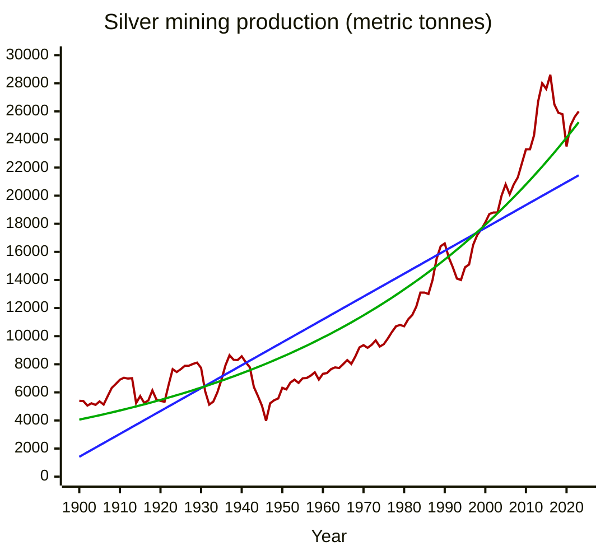

Let's suppose you have a dataset of numerical values and you would like to make a future estimate based on them. Some real-life applications include:

- Product pricing;
- Historical production and demand;
- Financial assets valuation;
- Calibration of a machine through time;
- Concentration of chemical reagents and products;
- Disease transmission rates;
- Water reservoir levels;
- Electricity demand;
- Fuel consumption.

The least squares fitting is a mathematical tool that generates an equation close to existing measurements. Many types of curves can be used, such as linear, polynomial, exponential, logarithmic, and many others.

Consider the graph below, sales per month. The blue line is the linear approximation and the red line corresponds to the real values.



<br/>

# Theory

Consider **f(x)** the equation we want to generate and **(x<sub>i</sub>, y<sub>i</sub>)** the measurements we have. The best equation is the one where the differences between approximations and measurements are the smallest possible; in other words:
  - **|f(x<sub>i</sub>) - y<sub>i</sub>|** is the distance between approximation and reality;
  - **Σ** is the summation.
  - **Σ|f(x<sub>i</sub>) - y<sub>i</sub>|** should be the closest to zero.



In order to find the equation parameters, partial derivatives are applied over the summation. In this article, we won't go deep into the theory, but if you are interested and want to understand better how it works, I recommend this [lesson by Stan Brown](https://brownmath.com/stat/leastsq.htm).

<br/>

# Functional programming

Functional programming is a paradigm that focuses on data transformations - like in a mathematical function, a value `x` is transformed by `f(x)`. In functional code, transformations are often chained, e.g., `f(g(h(x)))`.

In this article, we will use the F# language, that uses the [.NET runtime](https://dotnet.microsoft.com).

This [post](/posts/2024/06/introduction-to-functional-programming/#f%23-language) explains how to set up your environment and contains tips on the language syntax.

<br/>

# Linear approximation

The equation will be `f(x) = a * x + b`.

From a set of values (x<sub>i</sub>, y<sub>i</sub>), a and b are determined by:

<br/>



<br/>



<br/>

The F# code below calculates the linear approximation.

- `x` and `y` are the input values.
- `Seq.sumBy` sums the results of a function applied over elements of a sequence:
    - `x = [1, 2, 3]`
    - `x |> Seq.sumBy(fun i -> i * 2) = 12` (2\*1 + 2\*2 + 2\*3 = 12)
- `Seq.zip` makes a sequence of pairs coming from two other sequences:
  - `x = [1, 2, 3]`
  - `y = [9, 8, 7]`
  - `Seq.zip(x)(y) = [ (1, 9), (2, 8), (3, 7) ]`.

```fs
// s = sum
let s(v: double[]): double =
    v |> Seq.sum

// sm = sum of multiplications
let sm(v1: double[])(v2: double[]): double =
    Seq.zip(v1)(v2)
    |> Seq.sumBy (fun (x, y) -> x * y)

let linearApproximation(x: double[])(y: double[]): (double * double) =
    let n = x.Length |> double
    let sx = s(x)
    let sx2 = sm(x)(x)
    let sy = s(y)
    let sxy = sm(x)(y)
    let d = n*sx2 - sx**2
    let a = (n*sxy - sx*sy)/d
    let b = (sx2*sy - sxy*sx)/d
    (a,b)
```

<br/>

# Exponential approximation

The equation will be `f(x) = A * e^(B * x)`. **e** is the [natural base](https://en.wikipedia.org/wiki/E_(mathematical_constant)), approximately equal to 2.71828.

From a set of values (x<sub>i</sub>, y<sub>i</sub>), a and b are determined by:

<br/>



<br/>



<br/>

The F# code below calculates the exponential approximation.

- `ln` is the natural logarithm, on base **e**.
- `A = e^a`.
- `Seq.zip3` follows the same logic as `Seq.zip`, but forms a sequence of groups of three, coming from three other sequences.
- **Important**: the values of y need to be all greater than 0, because there is no logarithm of zero or negative numbers.

```fs
// s = sum
let s(v: double[]): double =
    v |> Seq.sum

// sm = sum of multiplications
let sm(v1: double[])(v2: double[]): double =
    Seq.zip(v1)(v2)
    |> Seq.sumBy (fun (x, y) -> x * y)

let ln = System.Math.Log

// smm = sum(v1 * v2 * v3)
let smm(v1: double[])(v2: double[])(v3: double[]): double =
    Seq.zip3(v1)(v2)(v3)
    |> Seq.sumBy (fun (a,b,c) -> a * b * c)

// smln = sum(v1 * ln(v2))
let smln(v1: double[])(v2: double[]): double =
    Seq.zip(v1)(v2)
    |> Seq.sumBy (fun (a,b) -> a * ln(b))

// smmln = sum(v1 * v2 * ln(v3))
let smmln(v1: double[])(v2: double[])(v3: double[]): double =
    Seq.zip3(v1)(v2)(v3)
    |> Seq.sumBy (fun (a,b,c) -> a * b * ln(c))

// exponential: y = A * e^(b*x)
let exponentialApproximation(x: double[])(y: double[]): (double * double) =
    let sx2y = smm(x)(x)(y)
    let sylny = smln(y)(y)
    let sxy = sm(x)(y)
    let sxylny = smmln(x)(y)(y)
    let sy = s(y)
    let d = sy*sx2y - sxy**2
    let a = (sx2y*sylny - sxy*sxylny)/d
    let b = (sy*sxylny - sxy*sylny)/d
    let A = System.Math.Exp(a)
    (A, b)
```

<br/>

# Case study: Silver mining





Let's extract data from the [Our World in Data](https://ourworldindata.org/metals-minerals) website on world silver mining production, between 1900 and 2023, and let's make the linear and exponential approximations.

CSV data available [here](/assets/misc/1900-2023-silver_mining_production.csv).

Results:

- `f(x)` is the mining production in metric tonnes, x is the year.
- Linear: `f(x) = 162.897 * x - 308090.816`
- Exponential: `f(x) = 0.000000002257 * e^(x * 0.01485166)`





<br/>

# Sources and interesting reads

- [Stan Brown - Least Squares — the Gory Details](https://brownmath.com/stat/leastsq.htm) ([backup](/assets/misc/least_squares_fitting_lesson.html))
- [Princeton University - Data Modeling and Least Squares Fitting](https://www.cs.princeton.edu/courses/archive/fall11/cos323/notes/cos323_f11_lecture07_lsq.pdf)
- [University of Regina - Linear Regression and Least Squares](https://uregina.ca/~kozdron/Teaching/Regina/252Winter05/Handouts/least_squares.pdf)
- [Wolfram MathWorld - Least Squares Fitting, Linear](https://mathworld.wolfram.com/LeastSquaresFitting.html) ([WebArchive](https://web.archive.org/web/20250228131909/https://mathworld.wolfram.com/LeastSquaresFitting.html))
- [Wolfram MathWorld - Least Squares Fitting, Exponential](https://mathworld.wolfram.com/LeastSquaresFittingExponential.html) ([WebArchive](https://web.archive.org/web/20250212183347/https://mathworld.wolfram.com/LeastSquaresFittingExponential.html))
- [Wolfram MathWorld - Least Squares Fitting, Power Law](https://mathworld.wolfram.com/LeastSquaresFittingPowerLaw.html) ([WebArchive](https://web.archive.org/web/20250212183356/https://mathworld.wolfram.com/LeastSquaresFittingPowerLaw.html))
- [Wolfram MathWorld - Least Squares Fitting, Logarithmic](https://mathworld.wolfram.com/LeastSquaresFittingLogarithmic.html) ([WebArchive](https://web.archive.org/web/20250212183349/https://mathworld.wolfram.com/LeastSquaresFittingLogarithmic.html))
- [MathJax - LaTeX renderer](https://www.mathjax.org/)
- [Our World In Data - Metals and Minerals](https://ourworldindata.org/metals-minerals)
- [Mining.com - World’s top 10 silver mines](https://www.mining.com/worlds-top-10-silver-mines/)
- Graphs made with [Mermaid.js XY Charts](https://mermaid.live/).
